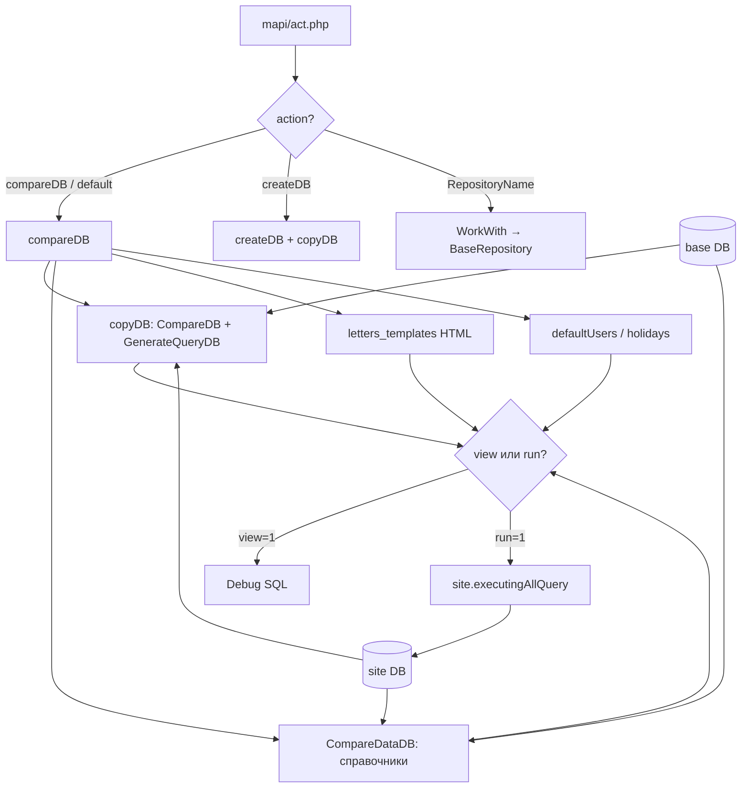

# Стратегия миграции баз данных к общему эталону

## Обзор

В инфраструктуре Active Court развёрнуто **200+ сайтов** с отдельными базами данных, несколько вариантов кодовой базы (преимущественно незначительные отличия) и **эталонная база** с начальными данными, в которую сводятся все структурные изменения. На одном хосте MySQL/MariaDB могут находиться и **сторонние базы**, не относящиеся к проекту.

Документ описывает:

- **текущий** механизм приведения сайтовой БД к эталону через `mapi/act.php`;
- **целевую** архитектуру массового rollout на 200+ сайтов с журналом миграций и реестром.

**Связанные материалы:**

- [Подсистема работы с базой данных](../core/database-system.md) — назначение всех классов `core/system/db/`
- [Установка и настройка](../installation/setup.md) — первичная настройка БД
- [Реестр сайтов и секреты](site-registry-and-secrets.md) — списки сайтов, FTP, `mapi/upd-list`, хранение паролей
- [Примеры InstallTableIfNotExist](table-installation-examples.md) — создание отсутствующих таблиц при загрузке кода
- [Руководство разработчика](developer-guide.md) — общие практики разработки

---

## Текущий механизм: `mapi/act.php`

Приведение базы данных к эталону **сейчас выполняется через HTTP-запросы** к `mapi/act.php` и связанные классы. Это основной рабочий инструмент, а не устаревший `CopySiteOnNewBase`.

### Точка входа

| Файл | Назначение |
|------|------------|
| `mapi/act.php` | Класс `AC\mapi\act` — маршрутизация action, `compareDB`, `createDB`, `copyDB` |
| `mapi/act/repositories/WorkWith.php` | Загрузка репозиториев по имени action |
| `mapi/act/repositories/BaseRepository.php` | Базовый класс: site + base DB, накопление `$query`, `run` / `view` |

При вызове без `action` или с неизвестным action по умолчанию вызывается **`compareDB()`** (режим просмотра).

### Ключевые классы сравнения и генерации SQL

| Класс | Расположение | Назначение |
|-------|--------------|------------|
| `CompareDB` | `core/system/db/CompareDB.php` | Сравнение двух БД / двух таблиц по структуре |
| `CompareDataDB` | `core/system/db/CompareDataDB.php` | Сравнение **данных** справочных таблиц по primary key |
| `GenerateQueryDB` | `core/system/db/GenerateQueryDB.php` | Генерация `ALTER`, `CREATE`, `INSERT`, `UPDATE` из результата сравнения |
| `DB` | `core/system/db/DB.php` | Подключения `site`, `base`, `newDB`; `executingAllQuery()` |

> **Устаревшее:** `core/system/CopySiteOnNewBase.php` — ранняя реализация той же идеи (diff site ↔ base). Логика перенесена в `CompareDB` + `GenerateQueryDB` + `mapi/act.php`. Новый код и документация должны опираться на актуальный стек.

### Подключение к эталону

```php
$base = DB::instance('base', true, [
    'dbname'      => Service::request()->_get('dbBaseName') ?? 'at_base_active_court',
    'prefixTable' => Service::request()->_get('dbBaseName')
        ? Service::request()->_get('dbBaseName') . '_'
        : 'at_base_active_court_',
]);
$site = DB::instance(); // текущая сайтовая БД из конфигурации
```

Параметр `dbBaseName` позволяет указать другую эталонную базу без смены конфига.

---

## Основной сценарий: `compareDB`

Метод `compareDB()` в `mapi/act.php` — центральная операция синхронизации сайта с эталоном.

### Алгоритм

```
1. copyDB(base → site)     — структурные изменения (таблицы, колонки, индексы)
2. CompareDataDB           — недостающие строки в справочниках
3. Доп. обработка          — config (особый случай PK), letters_templates (HTML)
4. Репозитории             — defaultUsers (опционально), holidays
5. view / run              — просмотр SQL или выполнение
```

### Шаг 1: структура — `copyDB()`

```php
$compare = CompareDB::compareTwoDB($receiverDB, $sourceDB, $config);
$gQDBS   = new GenerateQueryDB($receiverDB);
// для каждой таблицы: GenerateQueryDB::renderCompareOnTableName()
// при create_table — копирование данных из base, если они есть
```

В `compareDB` передаётся конфиг:

```php
[
    'dropColumn' => ['config'],           // удалить лишние колонки только в таблице config
    'replaceColumn' => [
        'all' => [
            'door_code' => ['doorcodes'],
            'address'   => ['adres', 'adress'],
        ],
    ],
]
```

**Опции `CompareDB`:**

| Параметр | Тип | Описание |
|----------|-----|----------|
| `dropColumn` | `bool` | Удалить все колонки на сайте, которых нет в эталоне (по всем таблицам) |
| `dropColumn` | `array` | Список таблиц без префикса — удаление только в них |
| `dropColumn` | `array[table => columns]` | Удаление конкретных колонок в конкретной таблице |
| `replaceColumn` | `array` | Маппинг «новое имя эталона → старые имена на сайте» для `CHANGE COLUMN` вместо `ADD` |

`CompareDB::compareTwoDB()` сравнивает **все таблицы эталона** с сайтом: создаёт недостающие таблицы, добавляет/меняет колонки, дополняет индексы.

### Шаг 2: справочные данные — `CompareDataDB`

Для таблиц `config`, `config_text`, `registration_fields`, `letters_templates`:

```php
$compareData = CompareDataDB::compareTableSetBase($tableName, $site, $base);
// INSERT строк, которые есть в base, но отсутствуют на сайте (по PK)
```

**Особый случай `config`:** если primary key на сайте не совпадает со структурой эталона — `TRUNCATE` + пересборка с сохранением значений `value` по `alias` (и `alias_type`).

### Шаг 3: дополнительная логика в `compareDB`

- **`letters_templates`** — приведение `content` к HTML через `TextHelper::autoParagraph()`.
- **`users=1`** — подключение репозитория `defaultUsers` (создание/обновление служебных админов).
- **Репозиторий `holidays`** — синхронизация структуры `holidays` и миграция `sunday` → `sunday_prices`.

### HTTP-параметры `compareDB`

| Параметр | Эффект |
|----------|--------|
| *(нет параметров)* | Сравнение без вывода (запросы собираются, но не показываются и не выполняются) |
| `view=1` | Вывести сгенерированные SQL (`Debug::dE($query)`) **без выполнения** |
| `run=1` | Выполнить все запросы на сайтовой БД |
| `action=compareDBRun` | То же, что `run=1` (жёсткий запуск) |
| `dbBaseName=...` | Имя эталонной БД (префикс таблиц = `{dbBaseName}_`) |
| `users=1` | Включить запросы репозитория `defaultUsers` |

**Примеры URL** (подставить хост конкретного сайта):

```
# Просмотр pending-изменений (dry-run)
/mapi/act.php?view=1

# Применить изменения
/mapi/act.php?run=1

# Другой эталон
/mapi/act.php?dbBaseName=at_base_active_court&view=1

# С обновлением служебных пользователей
/mapi/act.php?users=1&view=1
/mapi/act.php?users=1&run=1
```

> **Безопасность:** endpoint должен быть доступен только авторизованным администраторам / из внутренней сети. Перед `run=1` на проде всегда выполнять `view=1` и резервное копирование.

---

## Создание новой базы: `createDB`

```php
// action=createDB
// Параметры: dbname, prefixTable, prefixDBName (default 'at'), copyDB (default 1)
```

1. Создаёт БД `{prefixDBName}_{dbname}` через `DB::instance('base')->createDB()`.
2. Выдаёт права `setGrantByDBName()`.
3. При `copyDB=1` вызывает `copyDB(base, newDB, [], $query, true)` — полная структура и данные таблиц из эталона.

Используется при развёртывании нового сайта, не для обновления существующих 200+ БД.

---

## Репозитории `WorkWith`

Дополнительные операции вынесены в `mapi/act/repositories/workWith/`. Вызов через `action`:

```
/mapi/act.php?action={RepositoryName}&view=1
/mapi/act.php?action={RepositoryName}&run=1
```

| Репозиторий | Файл | Назначение |
|-------------|------|------------|
| `defaultUsers` | `DefaultUsers.php` | Создание/обновление служебных админов (`ADVSMaster!`, `adminFM`, …) |
| `holidays` | `Holidays.php` | Синхронизация структуры `holidays`, миграция полей воскресных цен |
| `Translations` | `Translations.php` | Синхронизация переводов (`news_simplest`, `config_text`, `letters_templates`) |
| `2FA` | `2FA.php` | Массовые изменения, связанные с 2FA (по списку БД) |
| `getLight` | `getLight.php` | Работа со светом / конфигурацией площадок |
| `DeleteFakeClient` | `DeleteFakeClient.php` | Удаление тестовых клиентов |

Паттерн репозитория:

```php
class Example extends BaseRepository
{
    protected function process(): void
    {
        // наполнение $this->query
    }
}
// BaseRepository::run() → $this->db->executingAllQuery($this->query)
// BaseRepository::query(&$query) → merge в общий массив compareDB
```

Новые site-specific шаги миграции добавляются как репозитории и подключаются из `compareDB` или вызываются отдельным `action`.

---

## Вспомогательный механизм: `InstallTableIfNotExist`

Трейт `core/system/engine/InstallTableIfNotExist.php` создаёт **отсутствующие** таблицы из `base` при обращении к коду приложения.

| | `mapi/act.php` (`compareDB`) | `InstallTableIfNotExist` |
|--|------------------------------|---------------------------|
| Когда | Явный запуск админом / скриптом | При загрузке страницы / инициализации |
| ALTER существующих таблиц | Да | Нет |
| Справочные данные | Да (`CompareDataDB`) | Да (INSERT из base) |
| Аудит / журнал | Нет (пока) | Нет |
| Массовый rollout 200+ сайтов | Подходит как основа | Не подходит как единственный канал |

Использовать трейт как **дополнение** (dev, экстренное восстановление), не как замену `compareDB` на продакшене.

---

## Целевая архитектура для 200+ сайтов

Текущий `compareDB` решает задачу **одного сайта за один запрос**. Для массового приведения к эталону поверх него нужен оркестратор.

### Три слоя

```
┌─────────────────────────────────────────────────────────┐
│  ЭТАЛОН (base DB)                                       │
│  SQL модулей + изменения, проверенные через compareDB   │
└────────────────────┬────────────────────────────────────┘
                     │
┌────────────────────▼────────────────────────────────────┐
│  ОРКЕСТРАТОР (CLI / cron / внутренний сервис)           │
│  Для каждого сайта: act compareDB view → run + лог      │
└────────────────────┬────────────────────────────────────┘
                     │
┌────────────────────▼────────────────────────────────────┐
│  САЙТОВЫЕ БД + _schema_migrations (журнал прогонов)     │
└─────────────────────────────────────────────────────────┘
```

### Таблица учёта (рекомендуется добавить)

```sql
CREATE TABLE IF NOT EXISTS `_schema_migrations` (
  `version`     VARCHAR(64)  NOT NULL PRIMARY KEY,
  `applied_at`  DATETIME     NOT NULL DEFAULT CURRENT_TIMESTAMP,
  `checksum`    CHAR(64)     NULL,
  `duration_ms` INT UNSIGNED NULL,
  `source`      VARCHAR(32)  NULL COMMENT 'compareDB, repository name, manual'
) ENGINE=InnoDB DEFAULT CHARSET=utf8mb4 COLLATE=utf8mb4_unicode_ci;
```

Версия — дата/хеш прогона или имя репозитория: `compareDB_20240619`, `holidays_20240619`.

### Реестр сайтов (whitelist)

Не использовать `SHOW DATABASES` без фильтра — на хосте есть чужие БД.

Список сайтов, FTP-метаданные и хранение секретов описаны в **[site-registry-and-secrets.md](site-registry-and-secrets.md)**.  
Текущий инструмент — `mapi/upd-list` и CSV в `mapi/upd-list/csv/`; целевой формат — реестр + `secrets_ref` + файл секретов вне git.

Оркестратор для каждого сайта:

1. Подключается к сайтовой БД (смена конфига / vhost).
2. Вызывает логику `compareDB` (лучше вынести в сервис, общий для `act.php` и CLI).
3. `view` → сохранить diff в лог; при успешной проверке — `run`.
4. Записать результат в `_schema_migrations` и центральный журнал.

### Поэтапный rollout

```
Волна 0: staging-копии 3 прод-дампов → compareDB view + run
Волна 1: 5 простых сайтов (минимальный drift)
Волна 2: 20 сайтов, мониторинг 24 ч
Волна 3: 50 сайтов
Волна 4: остальные
```

Перед каждой волной: `mysqldump --single-transaction`, затем `view=1`, затем `run=1`.

---

## Workflow разработчика

### 1. Изменить эталон

- Обновить структуру в **base DB** и/или `core/modules/{module}/tables/sql/*.sql`.
- Убедиться, что `createDB` / чистая установка даёт корректную схему.

### 2. Проверить на одном сайте

```
/mapi/act.php?view=1
```

Проверить сгенерированный SQL: переименования, `dropColumn`, данные в `config`.

### 3. Применить на тестовом сайте

```
/mapi/act.php?run=1
```

### 4. Site-specific логика

Если нужен особый шаг (миграция данных, не покрытая `CompareDataDB`):

- создать репозиторий в `mapi/act/repositories/workWith/`;
- подключить из `compareDB()` или вызывать отдельным `action`.

### 5. Массовый прогон

Через оркестратор по реестру (см. выше). Пока оркестратор не реализован — скрипт обхода vhost/БД с HTTP-вызовом `act.php?run=1` или рефакторинг `compareDB` в переиспользуемый сервис.

---

## Обработка drift

| Ситуация | Поведение `compareDB` / `CompareDB` |
|----------|--------------------------------------|
| Нет таблицы на сайте | `CREATE TABLE` (+ данные из base при создании) |
| Нет колонки на сайте | `ADD COLUMN` (с `AFTER`) |
| Старое имя колонки | `replaceColumn` → `CHANGE COLUMN` |
| Разный тип/DEFAULT колонки | `CHANGE COLUMN` |
| Лишняя колонка на сайте | Только если задан `dropColumn` для этой таблицы |
| Лишняя таблица на сайте | **Не удаляется** |
| Нет строки в справочнике | `INSERT` через `CompareDataDB` |

Периодический отчёт: обход реестра с `view=1`, сохранение diff для анализа отстающих сайтов.

---

## Учёт вариантов кодовой базы

Поле `codebase` в реестре сайтов. Site-specific репозитории и ветки в `compareDB` вызываются только для нужной codebase:

```php
if (Service::request()->_get('codebase') === 'mc') {
    $this->workWith()?->getRepository('McArena')?->query($query);
}
```

Структурные отличия веток по возможности сводить в общий эталон; ветко-специфичное — в отдельные репозитории.

---

## Безопасность

| Мера | Описание |
|------|----------|
| Доступ к `mapi/act.php` | Только admin / VPN / IP whitelist |
| Whitelist БД | Реестр сайтов, не `SHOW DATABASES` + apply all |
| Dry-run | Всегда `view=1` перед `run=1` |
| Backup | Перед массовым прогоном |
| MySQL-права | Отдельный пользователь с доступом только к `at_*` базам сайтов |
| Логирование | `Service::logger('migration')` в оркестраторе |

---

## Антипаттерны

| Не делать | Вместо этого |
|-----------|--------------|
| Полный dump эталона поверх сайта | `compareDB` / `copyDB` точечно |
| `SHOW DATABASES` + apply all | Реестр сайтов |
| Только `InstallTableIfNotExist` на проде | `compareDB` с `view` / `run` |
| Ручные `mapi/sql/update.sql` per-site без фиксации в эталоне | Сначала эталон, потом `compareDB` |
| Опираться на `CopySiteOnNewBase` | `CompareDB` + `mapi/act.php` |
| `run=1` без предварительного `view=1` | Всегда dry-run |

---

## План развития

### Фаза 1

1. Вынести логику `compareDB` в сервис `DatabaseSyncService` (общий для `act.php` и CLI).
2. Таблица `_schema_migrations` + запись после успешного `run`.
3. Реестр сайтов — см. [site-registry-and-secrets.md](site-registry-and-secrets.md).
4. CLI: обход реестра, вызов sync, лог.

### Фаза 2

5. Центральный журнал прогонов и алерты.
6. Интеграция с деплоем: sync до выката кода, требующего новую схему.
7. Dashboard: % сайтов без drift (по последнему `view`).

### Фаза 3

8. Версионированные именованные миграции поверх `compareDB` для шагов, не выводимых автоматическим diff.

---

## Связь с обновлением системы

См. [setup.md](../installation/setup.md):

1. Backup файлов и БД.
2. Выкладка кода.
3. `/mapi/act.php?view=1` — проверка SQL.
4. `/mapi/act.php?run=1` — применение.
5. Smoke-тест бронирования, оплаты, входа.

Для массового обновления — оркестратор по реестру волнами.

---

## Глоссарий

| Термин | Значение |
|--------|----------|
| **Base / эталон** | `at_base_active_court` (или `dbBaseName`) — эталонная схема и справочники |
| **Site DB** | База текущего клиентского сайта (`DB::instance()`) |
| **compareDB** | Основной метод синхронизации в `mapi/act.php` |
| **Drift** | Расхождение схемы/данных сайта с эталоном |
| **view / run** | Dry-run (показ SQL) / выполнение на БД |
| **WorkWith** | Реестр репозиториев дополнительных шагов миграции |

---

## Схема потока данных



---

*Документ отражает актуальный механизм синхронизации через `mapi/act.php`, `CompareDB`, `CompareDataDB` и `GenerateQueryDB`. Класс `CopySiteOnNewBase` считается устаревшим.*
