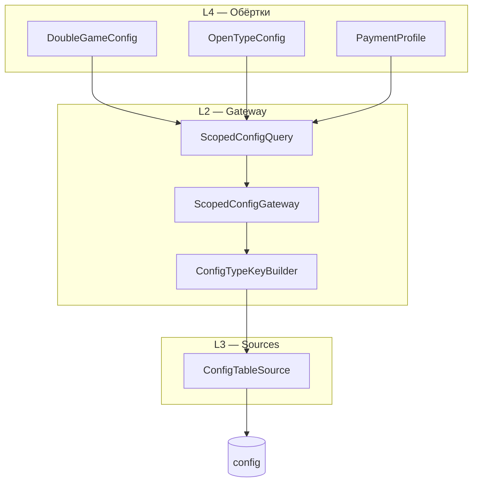

# Scoped-конфиг (`type|current_alias[_sport][_area]`)

## Обзор

Документ описывает **общую инфраструктуру** чтения настроек из таблицы `config` по контексту площадки:

- формат ключа `type` и единый `ConfigTypeKeyBuilder`;
- системную точку входа `ScopedConfigGateway` (L2);
- политики каскада `ScopedConfigPolicy`;
- обёртки double / OpenType / payment поверх gateway.

Ограничения клиента (`restriction`) — отдельно: [client-restriction.md](client-restriction.md).

Архив выполненной задачи: [scoped-config-implementation.md](../../archive/tasks/scoped-config-implementation.md).

---

## Цель

Ранее логика была размазана по `ConfigTypeKeyTrait`, `BindingConfigTypeHelper`, `ConfigDbValueSelector`, `*DbConfigModel`. **Фаза 1 закрыта:** чтение идёт через `ScopedConfigGateway`, ключи — через `ConfigTypeKeyBuilder`.

```
Параметры → [ScopedConfigGateway] → значение из источника
                    ↑
    DoubleGameConfig / OpenTypeConfig / PaymentProfile / ClientRestrictionConfig
                    ↓
           доменная логика (cast, const fallback, …)
```

**Выбранный вариант:** B — Gateway + Sources.

---

## Формат ключа `type`

```
{prefix}|{current_alias}[_{sport_id}][_{area_id}]
```

| Поле | Пример | Описание |
|------|--------|----------|
| `prefix` | `double`, `paypal`, `restriction` | Группа настроек |
| `current_alias` | `close`, `close_10`, `mc_arena` | `AreaTypeDto::getCurrentAlias()` по `type_id` |
| `sport_id` | `7` | Дописывается, если `> 0` |
| `area_id` | `10` | Дописывается, если `> 0` |

**Примеры** (`type_id=10`, `sport_id=7`, `area_id=10`, alias `close`, `type_count_alias > 1`):

```
double|close_10_7_10
restriction|close_10_7_10
paypal|close_10_7
options_PFP|open_3_5
```

Хвост после `|` **одинаков** для всех prefix при тех же `type_id/sport_id/area_id`. Политика влияет на **каскад чтения**, не на форму ключа.

Поле `alias` в таблице `config` — **имя параметра** (`DOUBLE_PLAYERS_TIME_COUNT`, `reservation_limit`, …).

### Global Domain Settings

Глобальные доменные настройки без площадки.

Если настройка не зависит от `type_id`, `sport_id` и `area_id`, но относится к конкретному домену/модулю, домен кладётся в `type` после `|`, а `alias` остаётся коротким именем параметра:

| Логический ключ | `config.type` | `config.alias` | Пояснение |
| --- | --- | --- | --- |
| `features.lockers.enabled` | `features\|lockers` | `enabled` | Сайт использует модуль шкафчиков. |
| `features.lockers.show_in_booking` | `features\|lockers` | `show_in_booking` | Показывать выбор ячеек в заказе. |
| `features.lockers.max_cells_per_booking` | `features\|lockers` | `max_cells_per_booking` | Ограничение количества ячеек в одном заказе. |
| `lockers.default_price` | `lockers` | `default_price` | Глобальная дефолтная цена шкафчиков без привязки к площадке. |
| `lockers.booking_time_mode` | `lockers` | `booking_time_mode` | Общий режим расчёта времени бронирования шкафчика. |

Не используем `type = features`, `alias = lockers__enabled` для таких флагов: `__` зарезервирован для alias-chain (`param__clubMark -> param`) и означает более специфичный вариант одного параметра, а не разделение домена и имени настройки.

Не используем `type = features`, `alias = lockers.enabled`: точка в alias не участвует в scoped-каскаде и хуже совпадает с будущим `ScopedConfigQuery(prefix: 'features', alias: 'enabled', dimensions/domain: lockers)`. Домен `lockers` должен быть частью `type`, а имя параметра — частью `alias`.

### Когда `close` vs `close_10`

`ConfigTypeKeyBuilder` / `AreaTypeDto::getCurrentAlias()`:

- один тип с данным `alias` → `close`;
- несколько (`type_count_alias > 1`) → `close_{type_id}`;
- далее `_sport_id`, `_area_id` при `> 0`.

**Миграция:** legacy `ConfigTypeKeyTrait` добавлял `type_id` отдельным сегментом (`open_10_7_10`). Новый формат — `open_7_10` или `open_10_7_10` (type_id внутри alias при disambiguation).

### Каскад чтения (`ConfigDbValueSelector`)

`ConfigDbValueSelector` **не знает семантики** сегментов (alias, sport, area) — только структуру строки:

1. первая `|` → `prefix` и `rest`;
2. `rest` режется по **каждому** `_` на сегменты;
3. каскад = префиксы сегментов слева направо от полного к короткому (усечение справа);
4. затем fallback по `ScopedConfigPolicy`: `{prefix}|default`, bare prefix `{prefix}`, `default`.

Согласованность с БД обеспечивает **сборщик** (`ConfigTypeKeyBuilder`), не селектор.

При `type = double|close_10_7_10`:

```
double|close_10_7_10
double|close_10_7
double|close_10
double|close
double|default
double                    (fallbackBarePrefix, если policy)
```

Для `OPEN_TYPE` включён `fallbackUnprefixedType`: перед глобальным `default` всё равно пробуется bare prefix.  
Например, при `type = options_PFP|open`:

```
options_PFP|open
options_PFP|default
options_PFP
default
```

**Файл:** `core/modules/config/models/ConfigDbValueSelector.php`

#### Алиас с подчёркиванием (`mc_arena`)

`ConfigTypeKeyBuilder` **не режет** alias — подчёркивание остаётся в `current_alias`.  
При `type_id=15`, `sport_id=7`, `area_id=10`, alias `mc_arena`, `type_count_alias = 1`:

```
restriction|mc_arena_7_10     ← сборка
```

Каскад режет `rest` = `mc_arena_7_10` на сегменты `[mc, arena, 7, 10]`:

```
restriction|mc_arena_7_10     ← полный scope
restriction|mc_arena_7        ← без area
restriction|mc_arena          ← «голый» alias (целевой fallback)
restriction|mc                ← побочный шаг: усечение внутри alias
restriction|default
restriction
```

При `type_count_alias > 1` (`current_alias` = `mc_arena_15`) для `double|mc_arena_15_7_10`:

```
double|mc_arena_15_7_10 → … → double|mc_arena_15 → double|mc_arena → double|mc → …
```

**Риск:** если в БД есть ключ `restriction|mc`, он может подхватиться на шаге после `mc_arena` (ложное совпадение по префиксу сегмента). Не хранить в `config.type` укороченные ключи, которые являются префиксом более длинного alias по `_`.

**Тесты:** `ConfigTypeKeyCascadeAlignmentTest` (`testMcArena*`), `ConfigTypeKeyBuilderTest` (`testMcArena*`), `ConfigTableSourceCascadeTest` (`testMcArenaAliasCascadeFindsScopedFallback`).

### Билдер ключей

| Компонент | Роль |
|-----------|------|
| `ConfigTypeKeyBuilder` | Единая сборка хвоста |
| `BindingConfigTypeHelper::prioritiesByTypeKeyInConfig()` | Тот же хвост без prefix (payment) |
| `ConfigTypeKeyTrait` | **@deprecated** |

---

## Карта файлов

### Формирование ключа

| Файл | Роль |
|------|------|
| `core/modules/config/scoped/ConfigTypeKeyBuilder.php` | Единая сборка |
| `core/modules/reservations/config/ConfigTypeKeyTrait.php` | **@deprecated** |
| `core/modules/config/helpers/BindingConfigTypeHelper.php` | Приоритеты type, админка |
| `core/modules/areas/entities/dto/AreaTypeDto.php` | `current_alias`, `type_count_alias` |

**Вызовы:** `DoubleGameConfig`, `OpenTypeConfig`, `ProfileContextModel`, `ClientRestrictionConfig`.

### Чтение с каскадом

| Файл | Роль |
|------|------|
| `core/modules/config/scoped/ScopedConfigGateway.php` | Точка входа L2 |
| `core/modules/config/scoped/sources/ConfigTableSource.php` | Обёртка селектора |
| `core/modules/config/models/ConfigDbValueSelector.php` | Ядро каскада |
| `core/system/service/Services.php` | `scopedConfig()` |

### Доменные обёртки (L4)

| Файл | Prefix |
|------|--------|
| `DoubleGameConfig.php` | `double` |
| `OpenTypeConfig.php` | `options_*` |

Подробнее про комбинации игроков, разделение с `ConfigOpenTypeModel` и API: [open-type-config.md](open-type-config.md).
| `ProfileContextModel.php` | `paypal`, `payone` |

---

## Архитектура (5 слоёв)

| Слой | Ответственность |
|------|-----------------|
| **L1 — Query** | `ScopedConfigQuery`: prefix, scope, alias, policy, dimensions |
| **L2 — Gateway** | Сборка ключей, каскад, `ScopedConfigResult` |
| **L3 — Sources** | `ConfigTableSource`, … |
| **L4 — Wrappers** | `*Config`, `*DbConfigModel`: cast, const |
| **L5 — Consumers** | Модели, контроллеры |



### Контракты

```php
// L1
final class ScopedConfigQuery
{
  public function __construct(
    public readonly string $prefix,
    public readonly string $alias,
    public readonly ?int $typeId = null,
    public readonly ?int $sportId = null,
    public readonly ?int $areaId = null,
    public readonly ScopedConfigPolicy $policy = ScopedConfigPolicy::DEFAULT,
    public readonly array $dimensions = [],
    public readonly mixed $default = null,
    public readonly bool $nullIfMissing = true,
  ) {}
}

// L2
interface ScopedConfigGatewayInterface
{
  public function resolve(ScopedConfigQuery $query): ScopedConfigResult;
}

Service::scopedConfig(): ScopedConfigGatewayInterface;
```

Gateway **не** подставляет `default` и **не** читает PHP-константы.

### Структура `core/modules/config/scoped/`

```
scoped/
├── ScopedConfigQuery.php
├── ScopedConfigResult.php
├── ScopedConfigPolicy.php
├── ScopedConfigGateway.php
├── ScopedConfigGatewayInterface.php
├── ConfigTypeKeyBuilder.php
├── AliasChainResolver.php
└── sources/
    ├── ConfigSourceInterface.php
    └── ConfigTableSource.php
```

---

## Политики каскада (`ScopedConfigPolicy`)

Влияют на **чтение** (fallback, alias chain), не на ключ.

| Policy | lower-case | bare prefix | unprefixed type | alias chain |
|--------|------------|-------------|-----------------|-------------|
| `DEFAULT` | нет | нет | да | нет |
| `DOUBLE` | да | да | нет | нет |
| `OPEN_TYPE` | нет | нет | да | нет |
| `RESTRICTION` | нет | да | нет | `param__clubMark` → `param` |

---

## Обёртки (паттерны L4)

### DoubleGame / OpenType

Поведение open и double game: [open-courts.md](../reservations/open-courts.md), [double-game.md](../reservations/double-game.md).

```php
return $this->resolveInt(
  $this->buildScopedConfigQuery('DOUBLE_PLAYERS_TIME_COUNT', $typeId, $sportId, $areaId, 'default', 'double'),
  'DOUBLE_PLAYERS_TIME_COUNT',
  2,
);
```

`ScopedConfigConstFallbackTrait`: DB → const → default метода.

### Payment

Чтение полей профиля — gateway с `ScopedConfigPolicy::DEFAULT`.  
`PaymentProfile::priorityTypeKey()` — выбор профиля (отдельно от одного параметра).

### DbConfigModel → фасад

```php
return Service::scopedConfig()->resolve($query);
```

---

## Варианты реализации (кратко)

| Вариант | Рекомендация |
|---------|--------------|
| A — Monolith Resolver | Временно |
| **B — Gateway + Sources** | **Основной** |
| C — `Service::configDB()` overload | Не целевой |
| D — Registry доменов | При росте числа prefix |

---

## Тестирование

Unit-тесты: `{git-path-tests}/tests/unit/ScopedConfig/` — см. [development/testing.md](../../development/testing.md).

В том числе: `OpenTypeConfigTest`, `DoubleGameConfigTypeKeyTest` — [open-type-config.md](open-type-config.md).

---

## Чеклист

- [ ] Новый scoped-код — только `Service::scopedConfig()->resolve()`.
- [ ] Ключи — только через `ConfigTypeKeyBuilder` (не вручную).
- [ ] `*DbConfigModel` — тонкие фасады gateway.
- [ ] Const fallback — в L4, не в gateway.

---

## Связанные документы

- [client-restriction.md](client-restriction.md) — домен `restriction`
- [scoped-config-implementation.md](../../archive/tasks/scoped-config-implementation.md) — выполненный план PR-1…PR-3
- [client-restriction-implementation.md](../../tasks/client-restriction-implementation.md) — план PR-4…PR-7

---

*Документ актуален для worktree `dev/`. Пути файлов сверять с рабочим worktree.*
