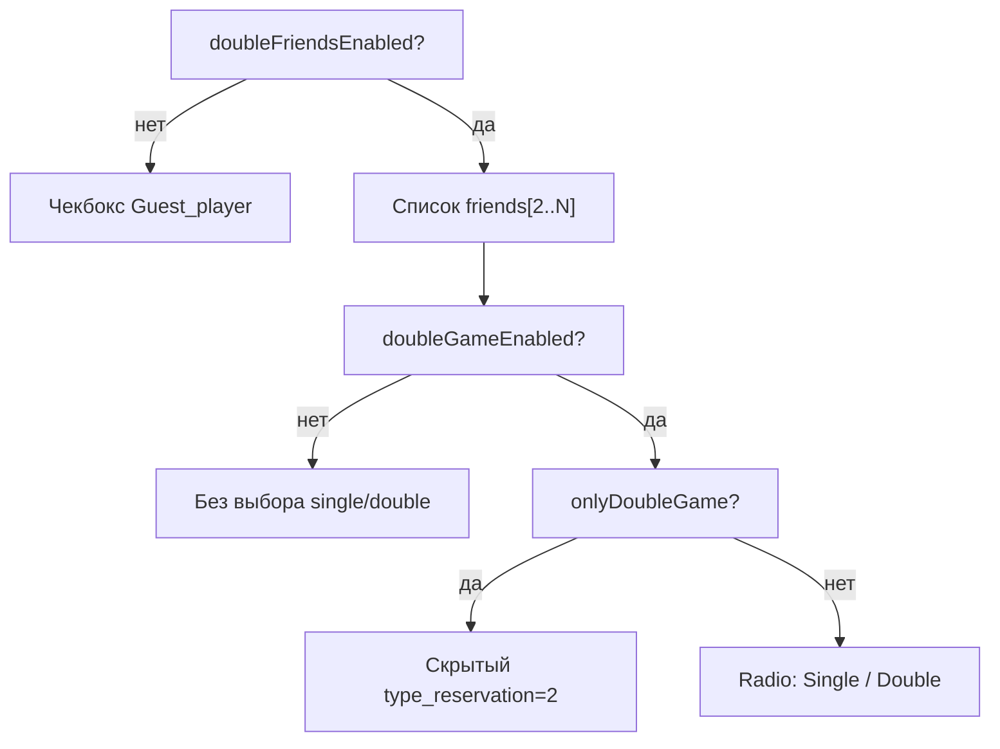

# Двойная игра на открытых кортах (Double Game)

## Обзор

Функциональность «двойной игры» расширяет бронирование открытых кортов (тип площадки с alias `open`):

- выбор нескольких игроков (друзья, гости) вместо простого чекбокса «гость»;
- выбор типа игры: одиночная (`type_reservation = 1`, 2 игрока) или парная (`type_reservation = 2`, до 4 игроков);
- расширенный расчёт цены и длительности по нескольким временным периодам.

Настройки хранятся в scoped-конфиге с prefix `double` (см. [scoped-config.md](../config/scoped-config.md)).  
Общий контекст открытых кортов: [open-courts.md](open-courts.md).  
Админка: `config.php?mode=open_type` → вкладка double game (`ConfigOpenTypeDoubleGameModel`).

---

## Маршрутизация и классы

При `doubleFriendsEnabled()` модуль переключается на отдельный контроллер и модель:

```
ReservationsModule::exec()
  doubleFriendsEnabled(type_id, sport_id, area_id)?
    да  → DoubleOpenControllerReservation + DoubleOrdersModelOpenReservation
    нет → OpenControllerReservation      + OrdersModelOpenReservation
```

| Файл | Роль |
|------|------|
| `ReservationsModule.php` | выбор контроллера по `doubleFriendsEnabled()` |
| `DoubleOpenControllerReservation.php` | UI выбора длительности (`numberOfPeriods`) |
| `DoubleOrdersModelOpenReservation.php` | игроки, проверки, цена, периоды |
| `DoubleGameConfig.php` | чтение scoped-настроек |
| `ConfigOpenTypeDoubleGameModel.php` | сохранение настроек в админке |
| `views/site|touch|admin/open/_choice_players.php` | форма выбора игроков |

---

## Параметры конфигурации

Ключи в БД: `double|{alias}[_{sport}][_{area}]`. Fallback: PHP-константы в `app/uses/defined.php` → дефолт метода в `DoubleGameConfig`.

### Флаги режима UI

| Alias (БД) | Константа | Метод | Default | Назначение |
|------------|-----------|-------|---------|------------|
| `double_friends_open_court` | `DOUBLE_FRIENDS_OPEN_COURT` | `doubleFriendsEnabled()` | `true` | Включить режим выбора друзей (новый UI). Выкл. → только чекбокс гостя; join второго игрока недоступен |
| `use_double_open_court` | `USE_DOUBLE_OPEN_COURT` | `doubleGameEnabled()` | `false` | Показать выбор Single / Double |
| `use_only_double_game` | `USE_ONLY_DOUBLE_GAME` | `onlyDoubleGame()` | `false` | Скрыть Single; всегда `type_reservation = 2` |

### Числовые параметры

| Alias (БД) | Константа | Метод | Default | Назначение |
|------------|-----------|-------|---------|------------|
| `double_friends_open_court_number_players` | `DOUBLE_FRIENDS_OPEN_COURT_NUMBER_PLAYERS` | `numberPlayers()` | `2` | Число слотов игроков (мин. 2). Цикл в `_choice_players.php` |
| `double_players_time_count` | `DOUBLE_PLAYERS_TIME_COUNT` | `getNumberOfPeriods()` | `2` | Базовое число периодов для парной игры |
| `double_players_time_count_max` | `DOUBLE_PLAYERS_TIME_COUNT_MAX` | `useMaximumPeriodValue()` / `getMaxNumberOfPeriods()` | `false` | Если > `time_count` — пользователь может выбрать длительность до max |
| `double_price_count_players` | `DOUBLE_PRICE_COUNT_PLAYERS` | `priceCountPlayers()` | `2` | Со скольких игроков считать оплату при `type_reservation = 2` |

Языковые ключи админки (`config_open_type`): `double_friends_open_court`, `use_double_open_court`, `use_only_double_game`, `double_friends_open_court_number_players`, …

---

## Логика UI (`_choice_players.php`)

Три флага — **уровни одной подсистемы**, не синонимы:



### Комбинации флагов

| friends | double | only double | Поведение |
|---------|--------|-------------|-----------|
| ✗ | — | — | Гость через checkbox; `DoubleOpen*` не используется |
| ✓ | ✗ | — | Выбор друзей, без Single/Double |
| ✓ | ✓ | ✗ | Друзья + radio Single/Double |
| ✓ | ✓ | ✓ | Друзья, всегда double, без single |

### Слоты игроков 3 и 4

- При `onlyDoubleGame` или `$use_double === true` (см. ниже) дополнительные слоты видны сразу.
- Иначе слоты 3+ скрыты (`client-hidden`) до выбора «Double» или при недоступности расширенной длительности.
- `$use_double` передаётся из `DoubleOrdersModelOpenReservation::getOrder()` → результат `checkMaxNumberPeriodsForDoublePlay()`.

### Длительность (`numberOfPeriods`)

Показывается, если `useMaximumPeriodValue()` = true и следующие периоды **доступны** для бронирования:

```php
// DoubleOpenControllerReservation::getContentShowOrder()
$checkMaxNumberPeriods = $model->checkMaxNumberPeriodsForDoublePlay();
$numberPeriodsEnd = $checkMaxNumberPeriods
  ? $doubleGame->getMaxNumberOfPeriods(...)
  : $doubleGame->getNumberOfPeriods(...); // только минимум, без выбора
```

Шаблон: `views/site/open/number_period.php`.

При создании индивидуального или онлайн-счёта время группы определяется по фактическим связанным бронированиям: от минимального `start` до максимального `finish` среди основной строки и строк с её `main_reservation_id`.
Фиксированная поправка в 30 минут не используется, поэтому в счёте корректно отображаются 2, 3, 4 и более периодов с любым шагом площадки.

### Клиентская валидация (JS)

- Смена `type_reservation` на `2` при недоступном double (`!$use_double`) — блокирует submit и показывает `message_not_count_time_period`.
- Запрет выбора одного и того же игрока в разных селектах (`_choice_players.php`, скрипт внизу).

---

## Проверки при бронировании

### 1. Доступность слотов для парной игры

`DoubleOrdersModelOpenReservation::checkMaxNumberPeriodsForDoublePlay()`:

- для каждого дополнительного периода (от 1 до `getNumberOfPeriods() - 1`) вызывает `engine->checkAreaDateTimeAvailable()`;
- если хотя бы один слот недоступен → `false` → в UI нельзя выбрать extended double (`$use_double = false`).

### 2. Список доступных друзей (`getOrder`)

Клиент попадает в список `friends`, если **все** условия выполнены:

| Проверка | Условие |
|----------|---------|
| Не супер-админ обход | `$client->super != '1'` |
| Не сам заказчик | `$client_id != current_client->client_id` |
| Лимит бронирований на день | нет записи в `$count_game` **или** `< max_count_reservation` |
| Клубные статусы | `checkPlayForPLayerByClubSate($client->club_state)` → `OpenTypeConfig::checkCombination()` |
| Лимит игр сегодня | `checkCountGameToday($client_id)` |

`checkPlayForPLayerByClubSate()` — матрица «кто с кем может играть» (`who_can_play_with_whom`). См. [open-type-config.md](../config/open-type-config.md#комбинации-игроков-who_can_play_with_whom).

### 3. Проверка заказа (`checkOrder`)

`DoubleOrdersModelOpenReservation::checkOrder()` наследует цепочку открытых кортов и добавляет проверку друзей:

1. `checkMaxForward` — горизонт бронирования по правилу
2. `checkOrderOnAllowedDevice` — устройство (pc / touch)
3. `checkOrderForUnavailableSports` — запрещённые виды спорта
4. `checkOrderForRangeClubState` — ранг клубного членства
5. **Лимит бронирований** — для заказчика и **каждого друга** (кроме `super` и `guest`):
   - `getCountReservationByClient()` + `getStreetFriendsReservationsById()`
   - сравнение с `reservation_limit` из правила или `max_count_reservation`
   - при превышении: `You have reached your limit of bookings!`
6. `checkOrderOfTimeRange` — временной диапазон

### 4. Обработка игроков (`renderFriendsPlayer`)

- POST: `friends[i]`, `guest_name[i]`, `guest_surname[i]`.
- Игрок учитывается только если `type_reservation * 2 >= $key` (при single — слоты > 2 игнорируются).
- Пустой гость без имени → имя с префиксом номера слота.
- Если выбран гость, но `second_player_id` пуст → в `checkSecondPlayer()` подставляется `guest`.

### 5. Статус бронирования

`OrdersModelOpenReservation::setStatus()` — если `second_player_id === 0`, статус `0` (неподтверждёно).

---

## Ценообразование

Зависит от системы цен `OpenType` и `type_reservation`:

| Условие | Логика |
|---------|--------|
| `price_for_player` (PFP) | `setOrderPriceForPlayers()` — тарифы по клубным статусам и числу игроков |
| `type_reservation == 2` и `priceCountPlayers > 2` | Цена по каждому из первых N игроков / периодов (`setPlayersByTime`, `timePeriodsForPlayers`) |
| `standard_for_players` (STP) | `chargeForAllPlayers()` — брать цену со всех игроков |
| `checkOpenTypeAsClose` + extended periods | доплата за периоды сверх `getNumberOfPeriods()` |
| `ALWAYS_PAY_AT_LEAST_FOR_ONE_GUEST` | если гость есть, но не попал в платящие периоды — минимум за одного гостя |

Редактирование цен для PFP при double friends: `areas.php` → `editAreasPrice()` → `getAreasPricesForPlayers()`.

### PFP: двойная игра, строки только за дополнительных игроков

Опция `double_count_other_players_only` хранится в `config` с prefix `options_PFP|…` и по умолчанию выключена. В админке: `config.php?mode=open_type`, блок опций PFP.

Если флаг выключен, `DoubleOrdersModelOpenReservation::setOrderPriceForPlayers()` использует старую логику: каждая строка `areas_prices_for_players` содержит готовую цену комбинации `main_player + other_player * count_player`, а модель суммирует найденные группы по членству.

Если флаг включен и `type_reservation = 2`, таблица PFP заполняется иначе:

1. Строка `main_player = current_client->club_state`, `other_player = current_client->club_state`, `count_player = 1` содержит цену одного главного игрока.
2. Остальные строки содержат цену только дополнительных игроков по членству и количеству, без главного игрока.
3. Итог считается как `цена главного игрока + сумма строк дополнительных игроков по countPlayersByClubSate`.

Формула runtime:

```php
$prices[2][$main][$main][1]['price']
+ $prices[2][$main][$otherClubState][$count]['price']
```

Пример для состава `V1, V1, V2, V2`:

| Часть расчёта | Значение |
|---------------|---------:|
| главный `V1`: `$prices[2][V1][V1][1]` | 7,00 |
| дополнительный `V1`, count 1 | 7,00 |
| дополнительные `V2`, count 2 | 15,00 |
| итог | 29,00 |

При базовых ставках `V1 = 7,00`, `V2 = 7,50`, `V3 = 0,00`, `Gast = 8,00` строки дополнительных игроков для каждого блока `Hauptspieler` должны быть одинаковыми:

| Weitere Spieler | +1 Spieler | +2 Spieler | +3 Spieler |
|-----------------|-----------:|-----------:|-----------:|
| V1 | 7,00 | 14,00 | 21,00 |
| V2 | 7,50 | 15,00 | 22,50 |
| V3 | 0,00 | 0,00 | 0,00 |
| Gast | 8,00 | 16,00 | 24,00 |

Одиночная игра (`type_reservation = 1`) не меняется: цена берётся как готовая цена пары из PFP-таблицы.

---

## Связь с join (присоединение второго игрока)

При `DOUBLE_FRIENDS_OPEN_COURT = true` система join для второго игрока **не используется** — бронь сразу создаётся с выбранными игроками/гостем (комментарий в `defined.php`).

В `_columns.php` колонки join скрываются, если `!doubleFriendsEnabled()`.

---

## Тестирование

Unit-тесты:

- scoped-ключи: `{git-path-tests}/tests/unit/ScopedConfig/DoubleGameConfigTypeKeyTest.php`;
- PFP-расчёт single/double с включенным и выключенным `double_count_other_players_only`: `{git-path-tests}/tests/unit/Reservations/DoubleOrdersModelOpenReservationPriceMockTest.php`.

Запуск: [development/testing.md](../../development/testing.md).

---

## Связанные документы

- [open-type-config.md](../config/open-type-config.md) — цены, матрица игроков, `checkCombination`
- [scoped-config.md](../config/scoped-config.md) — gateway, каскад `double|…`
- [reservations.md](reservations.md) — общий обзор модуля бронирований

---

*Документ актуален для worktree `dev/`. Пути файлов сверять с рабочим worktree.*
