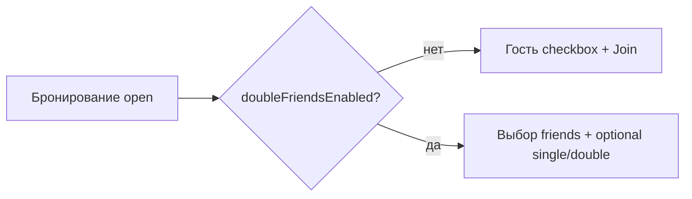

# Открытые корты (Open Courts)

## Обзор

Открытые корты — тип площадки в модуле `areas` с **alias `open`**. Числовой `type_id` зависит от инсталляции; в коде тип определяют по alias, а не по жёсткому id:

```php
config('reservations')->isOpenType($typeId); // AreaTypeDto->alias === 'open'
```

Функциональность бронирования живёт в модуле `reservations`: отдельный контроллер, модель заказа, шаблоны `views/*/open/` и scoped-настройки (`OpenTypeConfig`, `DoubleGameConfig`).

**См. также:**

- [open-type-config.md](../config/open-type-config.md) — системы цен, опции, матрица «кто с кем играет»
- [double-game.md](double-game.md) — выбор друзей, single/double, расширенные периоды

---

## Маршрутизация

`ReservationsModule::getReservationControllerClassName()` выбирает контроллер по **alias** типа площадки:

```php
$alias = module('areas')->useModel()?->getEngine()?->getAliasType($typeId);

return match ($alias) {
    'open'  => $openModelClassName,  // Open или DoubleOpen
    default => ucfirst(StringHelper::underscoreToCamelCase($alias)) . 'ControllerReservation',
};
```

Для alias `open`:

| Условие | Контроллер | Модель заказа |
|---------|------------|---------------|
| `doubleFriendsEnabled()` | `DoubleOpenControllerReservation` | `DoubleOrdersModelOpenReservation` |
| иначе | `OpenControllerReservation` | `OrdersModelOpenReservation` |

`OpenControllerReservation` наследует `CloseControllerReservation` (общая логика заказа), но использует шаблон `open` и модель открытых кортов.

---

## Структура файлов

```
core/modules/reservations/
├── ReservationsModule.php
├── config/
│   ├── ReservationsConfig.php      # isOpenType(), isOpenCourtForPrices()
│   ├── OpenTypeConfig.php          # цены, комбинации игроков
│   └── DoubleGameConfig.php        # double game (prefix double)
├── controllers/
│   ├── OpenControllerReservation.php
│   └── DoubleOpenControllerReservation.php
├── models/
│   ├── OrdersModelOpenReservation.php
│   └── DoubleOrdersModelOpenReservation.php
└── views/
    ├── site/open/     # сайт
    ├── touch/open/    # тачскрин
    └── admin/open/    # админка
```

Админка настроек: `config.php?mode=open_type` (`ConfigOpenTypeControllerAdmin`).

---

## Два режима выбора второго игрока



### Классический режим (`DOUBLE_FRIENDS_OPEN_COURT = false`)

- В форме заказа — чекбокс «гость» (`Guest_player`) и поля имени.
- В расписании доступен **Join** (присоединение ко второму слоту) — легенда «Connect» в `_columns.php`.
- Второй период брони может остаться пустым; join заполняет его позже.
- `OrdersModelOpenReservation::checkSecondPlayer()` требует явного выбора гостя или игрока (без auto-guest).

### Режим double friends (`DOUBLE_FRIENDS_OPEN_COURT = true`)

- Список друзей в селектах, опционально single/double.
- Join **отключён** — состав указывается при создании брони.
- Подробно: [double-game.md](double-game.md).

---

## Системы цен

Задаются в админке (`type_pricing_system`, prefix `open|…`). Чтение: `config('OpenType')->getPricingSystemId()`.

| ID | Alias | Кратко |
|----|-------|--------|
| `ST` | `standard` | Стандартная: член — extra-тариф, гость — базовая + extra нечлена |
| `STP` | `standard_for_players` | Цена со всех игроков (`chargeForAllPlayers()`) |
| `GT` | `guest` | Гость платит базовую цену, член — extra |
| `PFP` | `price_for_player` | Тариф по клубным статусам и числу игроков; цены в `areas.php` → `getAreasPricesForPlayers()` |
| `PV` | `as_close` | Как закрытые корты (`checkOpenTypeAsClose()`) |

Расчёт в `OrdersModelOpenReservation::getOrderPriceByClientId()` и `setOrderPrice()`. Для PFP и double game — см. [double-game.md#ценообразование](double-game.md#ценообразование).

Опции PFP (`guest_as_no_member`, `main_no_member_price_for_no_member`) — prefix `options_PFP|…`. Подробнее: [open-type-config.md](../config/open-type-config.md).

---

## Проверки при бронировании

### Базовые (`OrdersModelReservation::checkData`)

Специфика для open:

| Проверка | Условие |
|----------|---------|
| Час бронирования | Для open без ticket/join/admin действует `RESERVATION_ONLY_POSSIBLE_FROM_FULL_HOUR` |
| Права на тип площадки | `current_client->area_type` совпадает с `type_id`, или bar-клиент + `USE_GUEST_OPEN`, или `USE_OPEN_PP` |
| Действия join | `joinForm`, `join`, `unJoin` — отдельная ветка в `checkData` |

### Цепочка `OrdersModelOpenReservation::checkOrder`

1. `checkMaxForward` — горизонт бронирования по правилу (`rules->rulePriority`)
2. `checkOrderOnAllowedDevice` — pc vs touch (`rule.show_on`, `areas.online_reservation`)
3. `checkOrderForUnavailableSports` — запрещённые виды спорта у клиента
4. `checkOrderForRangeClubState` — ранг клубного членства
5. Лимит бронирований на день — `getCountReservationByClient` + `getStreetFriendsReservationsByIdOld`, сравнение с `rule.reservation_limit` или `OPEN_MANY_HOURS`
6. `checkCountGameToday` — лимит игр сегодня
7. `checkOrderOfTimeRange` — допустимый временной интервал

В режиме double friends к цепочке добавляется проверка каждого друга — см. [double-game.md#проверки-при-бронировании](double-game.md#проверки-при-бронировании).

### Матрица клубных статусов

`checkPlayForPLayerByClubSate()` → `OpenTypeConfig::checkCombination()` — можно ли главному игроку играть с партнёром данного статуса. Влияет на:

- видимость опции «гость» в `viewGuestForm()`;
- список друзей в `DoubleOrdersModelOpenReservation::getOrder()`.

### Гость: дополнительные ограничения

**`viewGuestForm()`** — показ формы гостя:

- `checkCombination(main, guest=0)` должен разрешать пару;
- для `club_state == 2` (V1): если задан `OPEN_TIME_INTERVAL_IN_MINUTE_IN_WHICH_CAN_RESERVATION_V1_PLUS_GUEST`, бронь «член + гость» только в пределах этого интервала от «сейчас».

**`checkBlockedGuest()`** — правило `rule_type = blockGuest` из `rules` (дни недели, время).

### Статус бронирования

`setStatus()` — при `second_player_id === 0` статус `0` (ожидание второго игрока). При `CONFIRMATION_OF_RESERVATIONS_VIA_TOUCH_FOR_OPEN` — отдельная логика подтверждения на таче в день игры.

### Доступность периодов (double)

`checkMaxNumberPeriodsForDoublePlay()` — все слоты для расширенной парной игры свободны. Результат → `$use_double` в UI.

---

## Join (присоединение второго игрока)

Только при **`!doubleFriendsEnabled()`**.

| Метод / action | Назначение |
|----------------|------------|
| `joinForm` | Форма присоединения (`OpenControllerReservation::joinForm`) |
| `join` | Сохранение (`joinProceed`) |
| `unJoin` / `unJoinForm` | Отсоединение |

**`checkJoin()`** — лимит бронирований заказчика (аналогично `checkOrder`, без полной цепочки).

Визуализация: слот «половина» (`half`) в легенде `_columns.php`; клик ведёт на join, если `doubleFriendsEnabled` — легенда скрыта.

---

## Создание брони: периоды и игроки

Классическая модель (`OrdersModelOpenReservation`):

- `times` — обычно 2 периода (основной + второй игрок);
- `setPlayersByTime()` — `playersByTime[times[0]]` = заказчик, `playersByTime[times[1]]` = второй;
- `runProceed()` — создаёт **две** записи в `reservations` (второй период с `main_client_id`).

Double-модель расширяет периоды и состав — [double-game.md](double-game.md).

---

## Глобальные константы (`app/uses/defined.php`)

| Константа | Назначение |
|-----------|------------|
| `USE_GUEST_OPEN` | Гость на открытых кортах |
| `USE_OPEN_PP` | Онлайн-оплата (PP) для open |
| `OPEN_MANY_HOURS` | Лимит бронирований в день (модель: `max_count_reservation`) |
| `OPEN_TIME_INTERVAL_IN_MINUTE_IN_WHICH_CAN_RESERVATION` | Окно «можно бронировать сейчас» |
| `OPEN_TIME_INTERVAL_IN_MINUTE_AFTER_WHICH_RESERVATION_IS_POSSIBLE` | Минимальный отступ от текущего времени |
| `OPEN_TIME_INTERVAL_IN_MINUTE_IN_WHICH_CAN_RESERVATION_V1_PLUS_GUEST` | Окно для V1 + гость |
| `OPEN_RESERVATION_ON_DEVICE` | Разрешённые устройства |
| `OPEN_STREET_PER_PAGE` | Столбцов в тач-расписании |
| `CONFIRMATION_OF_RESERVATIONS_VIA_TOUCH_FOR_OPEN` | Подтверждение брони на таче в день игры |
| `DOUBLE_FRIENDS_OPEN_COURT` | Переключение classic ↔ double friends |

Scoped-настройки в БД перекрывают константы через `DoubleGameConfig` / `OpenTypeConfig` (каскад `double|open_…`, `open|open_…`).

---

## UI-шаблоны (site)

| Файл | Назначение |
|------|------------|
| `show_order.php` | Форма заказа |
| `_choice_players.php` | Игроки / гость / single-double |
| `_columns.php` | Колонки расписания, легенда, join |
| `_price_block.php` | Блок цены |
| `join_form.php` / `un_join_form.php` | Join / unjoin |
| `number_period.php` | Выбор длительности (double + max periods) |

Аналоги в `touch/open/` и `admin/open/`.

---

## Тестирование

- `OpenTypeConfigTest` — ключи, `checkCombination`
- `DoubleGameConfigTypeKeyTest` — ключи double

Запуск: [development/testing.md](../../development/testing.md).

---

## Связанные документы

- [open-type-config.md](../config/open-type-config.md) — scoped-настройки open, матрица игроков
- [double-game.md](double-game.md) — double friends, single/double, проверки друзей
- [scoped-config.md](../config/scoped-config.md) — gateway, формат ключей
- [reservations.md](reservations.md) — общий обзор модуля бронирований

---

*Документ актуален для worktree `dev/`. Пути файлов сверять с рабочим worktree.*
