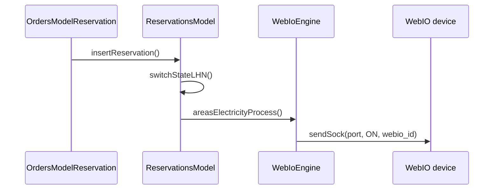

# WebIO: управление портами через iCal

**Дата создания:** 2026-06-09  
**Статус:** справочный документ  
**Связанные модули:** `webIo`, `config`, `reservations`, `areas`  
**Связанные задачи:** [locker-system-plan.md](../../tasks/lockers/locker-system-plan.md)

---

## 1. Принцип работы

По умолчанию **ни бронирования, ни шкафчики не управляют устройством WebIO напрямую** для расписания.

Инициатор — **само устройство WebIO**: оно периодически запрашивает календарь (iCal) по URL или с FTP. Наша система **только отвечает на запрос** или **заранее кладёт файл** на FTP. Содержимое iCal формируется из актуальных данных (брони, блокировки, абонементы, шкафчики и т.д.).

```
┌─────────────┐     запрос iCal      ┌──────────────────┐
│   WebIO     │ ──────────────────►  │  Active Court    │
│ (устройство)│ ◄──────────────────  │  (генератор)     │
└─────────────┘     .ics / .ical     └──────────────────┘
       │
       ▼
  Output N ON/OFF по DTSTART/DTEND
```

Исключение — **мгновенное включение** при создании брони на уже идущий слот (см. раздел 4).

---

## 2. Два режима доставки iCal

Оба режима могут сосуществовать (параллельно или с замещением — в зависимости от настройки конкретного порта на устройстве).

### 2.1. Основной режим: URL на сайте (on-demand)

**Приоритетный и исторически основной.**

На каждом порту WebIO в админке прописывается URL вида:

```
{BASE_HREF}at/ical_webio_generate.php?area_id={area_id}&type={type}
```

Пример:

```
https://mc.loc/at/ical_webio_generate.php?area_id=1&type=1
```

| Параметр | Описание |
|----------|----------|
| `area_id` | ID площадки (корт). Несколько через запятую: `area_id=1,2` |
| `type` | `1` — свет (licht), `2` — тепло (heizen), `3` — сеть (netz) |
| `day` | Опционально, число дней вперёд (по умолчанию `1`) |

**Поток:**

1. WebIO по расписанию опрашивает URL порта.
2. `at/ical_webio_generate.php` вызывает `reservation_light::runtimeLightDirection()`.
3. Система собирает события из броней, блокировок, абонементов, билетов на освещение.
4. Отдаётся файл `.ics` в ответе HTTP.

**Файлы:**

| Файл | Роль |
|------|------|
| `at/ical_webio_generate.php` | Точка входа для устройства |
| `engines/reservation.light.php` | `runtimeLightDirection()`, `generateIcalCode()` |
| `core/modules/config/views/admin/webIo/output.php` | Админка: порты, area, тип, **быстрые ссылки** URL |

В админке портов (`output.php`) для каждого Output показываются готовые ссылки (**Default**, **Old**, **File**) — их копируют в настройки WebIO.

Эндпоинт в whitelist: `app/config/AuthConfig.php` → `at/ical_webio_generate.php`.

### 2.2. Параллельный / замещающий режим: FTP

Развитие той же логики: WebIO запрашивает **не сайт**, а **FTP-сервер**, где лежит заранее сгенерированный файл.

**Именование файлов (корты):**

```
{site}_{type_alias}_{area_id}.ical
```

Примеры:

```
mc_licht_2.ical
mc_heizen_2.ical
mc_netz_5.ical
```

Дополнительно создаётся датированная копия:

```
{site}_{type_alias}_{area_id}_{Y_m_d}.ical
```

`{site}` — первая часть `HOST_NAME` (например, `mc` из `mc.loc`).

**Когда обновляется:**

| Триггер | Механизм |
|---------|----------|
| Создание / изменение / отмена брони | `WebIoEngine::sendFTPCurrentIcal()` |
| Абонемент, билет, блокировка | то же (в соответствующих моделях) |
| Раз в сутки (полная регенерация) | `app/cron/Ical.php` → `process()` |

**Условия работы FTP-режима:**

- Константа `SEND_FTP_ICAL_FILE` = true
- Заданы `FTP_HOST`, учётные данные FTP
- `sendFTPCurrentIcal()` генерирует те же данные, что и URL-режим (`runtimeLightDirection`), и загружает через `FTPClient`

**Файлы:**

| Файл | Роль |
|------|------|
| `core/engines/WebIoEngine.php` | `sendFTPCurrentIcal()`, `createArray()` |
| `app/cron/Ical.php` | Ежедневная выгрузка всех area |
| `core/modules/reservations/models/OrdersModelReservation.php` | Вызов FTP при бронировании |

На порту WebIO в админке рядом с URL показывается имя FTP-файла (**File**), если включён `MC_ARENA`.

### 2.3. JSON: все события одним запросом

Помимо iCal по отдельному порту, система может отдать **сводку событий в JSON** — по всем площадкам и всем активным событиям, которые участвуют в WebIO-расписании.

**URL:**

```
{BASE_HREF}at/ical_webio_generate.php?json
```

Пример:

```
https://mc.loc/at/ical_webio_generate.php?json
```

Параметры `area_id` и `type` **не нужны** — достаточно наличия `json` в query string.

**Поток:**

1. WebIO или внешняя система запрашивает URL с `?json`.
2. `ical_webio_generate.php` вызывает `reservation_light::runtimeLightDirectionJSON()`.
3. Метод обходит **все площадки** (`getAllAreasData`) и собирает события через тот же `runtimeLightDirection()`, что и iCal.
4. Ответ: `Content-Type: application/json`, массив событий.

**Источники событий** (те же, что и для iCal):

- бронирования;
- блокировки с `use_webIo`;
- абонементы;
- билеты на освещение (через `insertLightHeatingTicket`).

**Формат одного события:**

```json
{
  "court_id": "12",
  "start": "2026-06-09T14:00:00Z",
  "end": "2026-06-09T15:00:00Z",
  "blocked": false,
  "name": "Иванов Петр"
}
```

| Поле | Описание |
|------|----------|
| `court_id` | `area_id` площадки |
| `start` / `end` | Интервал события (ISO-подобный формат) |
| `blocked` | `true` — блокировка, `false` — бронь/абонемент |
| `name` | Клиент или название блокировки |

**Пример ответа:**

```json
[
  {
    "court_id": "1",
    "start": "2026-06-09T10:00:00Z",
    "end": "2026-06-09T11:00:00Z",
    "blocked": false,
    "name": "Müller Hans"
  },
  {
    "court_id": "2",
    "start": "2026-06-09T14:00:00Z",
    "end": "2026-06-09T15:00:00Z",
    "blocked": true,
    "name": "Wartung"
  }
]
```

**iCal vs JSON — как это соотносится с портами:**

| | iCal (раздел 2.1) | JSON (этот раздел) |
|--|-------------------|---------------------|
| Запрос | Один порт: `area_id` + `type` | Все площадки сразу |
| Формат | `.ics` / `.ical` | JSON-массив |
| Привязка к порту | Явная (URL прописан на Output N) | Через `court_id` → `webio_outputs` (`getOutput(area_id, type)`) |
| Типы устройств | `type=1/2/3` (свет, тепло, сеть) | Сейчас в JSON попадают события **освещения** (`type=1`); тепло и сеть — через iCal per-port |

То есть JSON — **агрегированный экспорт** той же логики расписания: удобен для устройств/интеграций, которые сами распределяют события по портам, или для мониторинга всех событий одним запросом.

**Файлы:**

| Файл | Роль |
|------|------|
| `at/ical_webio_generate.php` | Ветка `?json` |
| `engines/reservation.light.php` | `runtimeLightDirectionJSON()`, `$jsonArray` |

Эндпоинт в whitelist: `app/config/AuthConfig.php` → `at/ical_webio_generate.php`.

---

## 3. Привязка портов (корты)

Таблица `webio_outputs`:

| Поле | Описание |
|------|----------|
| `webio_id` | Устройство WebIO |
| `port` | Номер выхода 0–11 |
| `area_id` | Площадка (корт) |
| `webio_type_id` | Тип: свет / тепло / сеть |
| `pre_start_time` | Минуты до слота (включить раньше) |

Один порт → один `area_id` + один `type`. Несколько area на одном порту — через массив в URL (`area_id=1,2`).

Таблица `webio` — физические устройства (IP, port HTTP, password, `count_ports`).

**Модуль reservations не хранит webio_id** — связь area → порт разрешается через `WebIOStateConfig` / `getOutput($area_id, $type)`.

---

## 4. Мгновенное включение (текущий слот)

Если бронь создаётся на время, **которое уже наступило** (сегодня, `start <= now`), система **сразу** шлёт ON на устройство — не дожидаясь следующего опроса iCal.



| Метод | Роль |
|-------|------|
| `ReservationsModel::switchStateLHN()` | Проверка: слот уже идёт + выбран свет/тепло/сеть |
| `reservation_light::areasElectricityProcess()` | ON/OFF по area + type |
| `reservation_light::sendSock()` | HTTP `outputaccess{N}?State=ON` |

То же для ручного управления и мониторинга: `at/ajax_light_monitor.php`, `at/light_monitor.php`.

---

## 5. Сравнение режимов

| | URL / iCal | JSON | FTP |
|--|------------|------|-----|
| Кто запрашивает | WebIO → наш сайт (per-port) | WebIO / интеграция → наш сайт | WebIO → FTP |
| Актуальность | При каждом опросе URL | При каждом опросе URL | После события + cron |
| Охват | Один порт (`area_id` + `type`) | Все площадки, все события освещения | Все area × типы (по файлам) |
| Формат | `.ics` / `.ical` | JSON-массив | `.ical` на FTP |
| Генератор | `runtimeLightDirection()` | `runtimeLightDirectionJSON()` | `runtimeLightDirection()` |
| Настройка | URL на каждом Output | Один URL `?json` | Имя файла на FTP |

**Приоритет:** URL/iCal on-demand per-port — основной режим. JSON — агрегированный экспорт для всех событий одним запросом. FTP — дополнение для снижения нагрузки или автономной работы устройства.

---

## 6. Шкафчики: интеграция без знания WebIO

Модуль `lockers` **не хранит** `webio_id` и `webio_port`. Привязка ячейки к порту — зона ответственности модуля `webIo` (таблица `webio_outputs`).

### 6.1. Расширение `webio_outputs`

| Поле | Изменение |
|------|-----------|
| `area_id` | nullable (для портов шкафчиков) |
| `locker_cell_id` | **новое**, FK → `locker_cells.id` |
| `webio_type_id` | новый тип `4` = locker (alias `locker`) |

Правило: на одной строке либо `area_id` + тип 1/2/3, либо `locker_cell_id` + тип locker.

### 6.2. URL-режим для ячейки (по аналогии с кортами)

Новый эндпоинт (план):

```
at/ical_locker_generate.php?cell_id={cell_id}
```

WebIO на порту ячейки:

```
https://mc.loc/at/ical_locker_generate.php?cell_id=5
```

Генератор: `LockerIcalService::runtimeLockerDirection($cell_id)` — данные из `locker_reservations`, без обращения к таблицам `webio` из модуля lockers.

### 6.3. FTP-режим для ячейки

```
{site}_locker_{cell_id}.ical
```

Обновление при create/cancel `locker_reservations` + cron (расширение `app/cron/Ical.php`).

### 6.4. Мгновенное открытие ячейки

Если бронь + locker_reservation создаются на уже идущий слот — аналог `switchStateLHN`:

```
LockersEngine → ReservServiceLocator::webIo()
  → getOutputByLockerCell(cell_id)
  → sendSock(port, ON, webio_id)
```

Модуль `lockers` передаёт только `cell_id`; WebIO-слой сам находит порт.

### 6.5. Разделение ответственности

| Модуль | Знает про WebIO? | Ответственность |
|--------|------------------|-----------------|
| `reservations` | Нет (только вызов `sendFTPCurrentIcal` / `switchStateLHN`) | Бронь, флаги свет/тепло |
| `lockers` | **Нет** | Шкафчики, ячейки, предметы, `locker_reservations` |
| `webIo` | Да | Устройства, порты, URL/FTP, `sendSock` |

---

## 7. Одно устройство на корты и шкафчики

Один физический WebIO может обслуживать и корты, и шкафчики:

```
WebIO #1
├── Output 0  → area_id=1, type=licht     (webio_outputs)
├── Output 1  → area_id=1, type=heizen
├── Output 4  → locker_cell_id=12         (webio_outputs)
└── Output 5  → locker_cell_id=13
```

Конфликта нет: одна таблица `webio_outputs`, один `webio_id`, разные порты и назначения.

---

## 8. Связанные файлы

| Файл | Роль |
|------|------|
| `at/ical_webio_generate.php` | iCal по запросу WebIO (корты) |
| `at/ical_locker_generate.php` | iCal по запросу WebIO (шкафчики, план) |
| `engines/reservation.light.php` | Генерация iCal, `sendSock` |
| `core/engines/WebIoEngine.php` | FTP-выгрузка |
| `app/cron/Ical.php` | Ежедневная FTP-регенерация |
| `core/modules/webIo/models/WebIoOutputsModel.php` | Привязки портов |
| `core/modules/config/views/admin/webIo/output.php` | Админка портов и быстрые ссылки |
| `core/modules/reservations/models/ReservationsModel.php` | `switchStateLHN()` |

---

## 9. История изменений

| Дата | Изменение |
|------|-----------|
| 2026-06-09 | Первая версия: URL-режим, FTP-режим, мгновенное включение, интеграция шкафчиков без webio в lockers |
| 2026-06-09 | Добавлен JSON-режим: `?json` — агрегированный экспорт событий по всем площадкам |
