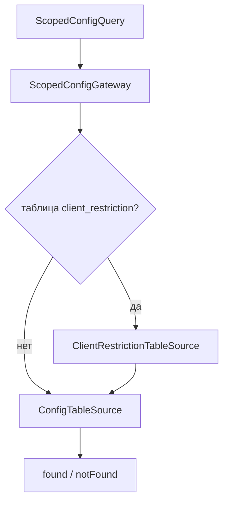

# Задачи: ограничения клиента (Client Restriction)

> **Статус:** PR-4 и PR-5 завершены; PR-7 отложен  
> **Область:** модули `config` и `clients`  
> **Последняя проверка:** 2026-08-24  
> **Связанный код:** `core/modules/config/`, `core/modules/clients/`

**Приоритет:** high  
**Создана:** 2025-06-24  
**Обновлена:** 2026-06-26  
**Теги:** config, client-restriction, refactoring

## Связанная документация

- [client-restriction.md](../modules/config/client-restriction.md) — архитектура домена
- [scoped-config.md](../modules/config/scoped-config.md) — gateway, ключи (общее)
- [scoped-config-implementation.md](../archive/tasks/scoped-config-implementation.md) — PR-1…PR-3

---

## Цель

Рефакторинг `ClientRestrictionConfig` на `ScopedConfigGateway`:

- prefix `restriction`, type-ключ scoped-формата;
- клуб в alias chain (`reservation_limit__club_rate2`);
- `nullIfMissing`, валидный `limit=0`;
- фаза 2 — таблица `client_restriction`.

Зависит от PR-1 (ядро gateway).

---

## Прогресс

| PR | Содержание | Статус |
|----|------------|--------|
| **PR-4** | `RestrictionContext`, `ClientRestrictionConfig` | ✅ |
| **PR-5** | `OrdersModelReservation`, админка, mapi | ✅ |
| **PR-7** | DDL `client_restriction`, второй source | отложено |

---

## Семантика (не 1:1 со старым кодом)

`getRestrictionValue()` — единая логика для всех типов:

| Ситуация | Результат |
|----------|-----------|
| Строка в БД | значение из gateway |
| Нет строки, `adminRequiresDbRow=false`, есть `defaultValue` | `defaultValue` из PHP `$rules` |
| Нет строки, `adminRequiresDbRow=true` или нет `defaultValue` | `null` → не применяем / L5 fallback |
| `limit = 0` в БД | `0` (валидное значение) |

Приоритет L5: **restriction (БД или defaultValue) → TableRules → `$max_count_reservation`**.

---

## L4: ClientRestriction

```php
// getRestrictionValue() внутри:
$result = Service::scopedConfig()->resolve($ctx->toQuery(...));
if ($result->found) {
  return castValue($result->value, ...);
}
return resolveDefaultValue($restrictionType); // null, если adminRequiresDbRow или нет defaultValue
```

`defaultValue` в PHP `$rules` — только при `adminRequiresDbRow=false`. Иначе нет строки → `null`.

### Кодирование в `config` (фаза 1)

```
type  = restriction|close_10_7_10
alias = reservation_limit__club_rate2
value = 2
```

Клуб — в **alias**, не в type.

---

## AliasChainResolver

- Только `ScopedConfigPolicy::RESTRICTION`
- `reservation_limit__club_rate2` → `reservation_limit`
- `device` в фазе 1 не в alias (зарезервировано)

---

## Цепочка gateway (restriction)

| Шаг | Источник |
|-----|----------|
| 1 | `client_restriction` (если таблица есть, PR-7) |
| 2 | `config` (`ConfigTableSource`) |
| 3 | L5: `TableRules` |



---

## Этап 1.4 — Client Restriction (PR-4, PR-5)

| # | Задача | Статус |
|---|--------|--------|
| 4.1 | `RestrictionContext` | ✅ |
| 4.2 | Рефакторинг `ClientRestrictionConfig` | ✅ |
| 4.3 | API: `resolveReservationLimit`, `isBookingDenied`, … | ✅ |
| 4.5 | `OrdersModelReservation` | ✅ |
| 4.6 | Админка read | ✅ |
| 4.7 | Админка write (`restriction\|…[alias]`) | ✅ |
| 4.8 | Mapi-sync | ✅ |

Критерий: tennis-tcj — `limit=0`, нет строки, `defaultValue` для `possibility_booking`.

---

## Фаза 2 — `client_restriction` (PR-7)

**Условие:** мигратор схемы для 200+ БД.

### DDL

См. [client-restriction.md](../modules/config/client-restriction.md#фаза-2-таблица-client_restriction).

### Задачи

| # | Задача |
|---|--------|
| 6.1 | `RestrictionScopeResolver` — `scopePriority()` |
| 6.2 | `ClientRestrictionTableSource` |
| 6.3 | `table_exists()` / feature-flag в gateway |
| 6.4 | Миграция config → table |
| 6.5 | Deprecate строк в `config` |
| 6.6 | `device` в `RestrictionContext` |

### Измерение `device`

| Фаза | Поведение |
|------|-----------|
| 1 | Поле зарезервировано; gateway игнорирует |
| 2 | Колонка + `RestrictionScopeResolver` |

---

## Тестирование (restriction)

| Уровень | Что | PR |
|---------|-----|-----|
| Unit | `ClientRestrictionConfigTest` | PR-4 |
| Unit | `ConfigLegacyRestrictionReaderTest` (RestrictionContext → query) | PR-4 |
| Smoke | tennis-tcj: лимит, запрет, админка | PR-5 |

---

## Риски

| Риск | Митигация |
|------|-----------|
| Смена семантики (default, limit=0) | Таблица было/стало; smoke |
| Потеря club при fallback type | Членство только в alias chain |
| Дубли с `TableRules` | Явный приоритет в L5 |
| UNIQUE + NULL в DDL | Sentinel на этапе мигратора |

---

## Definition of Done (restriction)

- [x] `ClientRestrictionConfig` на prefix `restriction`
- [x] `limit=0` валиден
- [x] `defaultValue` / `adminRequiresDbRow` в `$rules`; единый `getRestrictionValue()`
- [x] Админка read/write + mapi
- [ ] PR-7 DDL + второй source

---

## Вне scope

- Переделка `TableRules` (остаётся fallback)
- Новые правила в `club_reservation_rules`

---

## История

| Дата | Событие |
|------|---------|
| 2025-06-24 | PR-4/5 в плане; семантика restriction |
| 2026-06-24 | PR-4, PR-5 завершены |
| 2026-06-26 | Документ выделен из общего плана |
| 2026-06-26 | `defaultValue` / `adminRequiresDbRow`; единая семантика чтения |
| 2026-06-26 | PR-6 (миграция `type=reservation`) снят — не планируется |

---

*Связанный архивный индекс: [scoped config и client restriction](../archive/tasks/scoped-config-routing-index.md).*
