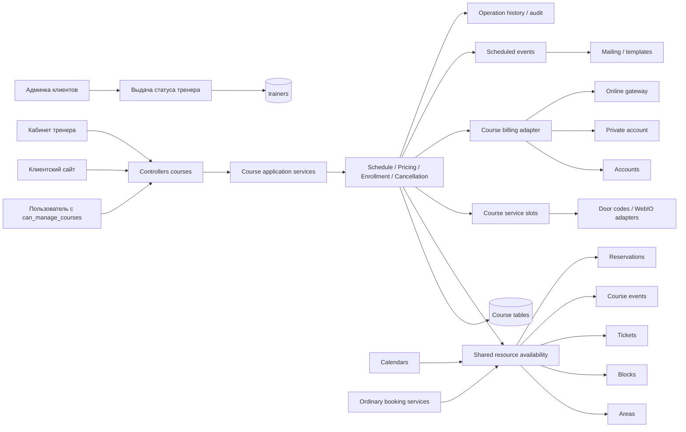

# Модуль групповых занятий (Kurse / Events): анализ, целевая модель и план реализации

Дата: 21 июля 2026 г.  
Статус: архитектурно-функциональный план, без реализации и применения DDL

Последняя проверка плана и проекта SQL: 24 сентября 2026 г. `src/create.sql` актуализирован до v1.20.
Код приложения и рабочие базы данных не изменены; применение схемы требует отдельной миграции.
Макеты первого этапа созданы в Figma 18 сентября и актуализированы 24 сентября 2026 г.; ссылки, оформление и источники изображений закреплены в §2.1.1.

Уточнение от 7 сентября 2026 г.: тренеры выделены в `trainers`; курс хранит `trainer_id` со ссылкой на профиль тренера.
Цены связаны с `config_club_state.id` через `club_state_id`, одна строка на курс и тип клиента.
Оплату клиентов в обоих сценариях принимает площадка. `trainer_settlement_mode = rental|hired` определяет взаиморасчёты с тренером.
Внешний тренер (`rental`) арендует площадку за фиксированную `trainer_price`; необходимость согласования суммы
с администратором задаётся в `config` (`courses / rental_approval_required`).
При `hired` тренер работает по найму и ничего не арендует: `trainer_price = NULL`.
Цены участия в обоих вариантах устанавливает основной тренер либо пользователь `users` с правом `can_manage_courses`.
Цены участия независимы от стоимости обычного резервирования; отчёты будут доработаны отдельной задачей.
Возврат за одно занятие из полного курса: без возврата либо по отдельной цене тренера, сохранённой при покупке.
Срок отмены организатором задаётся общими и персональными условиями `trainers_min_max` (§5.7); у наёмного тренера аренды нет.
Параметры отмены сохраняются в существующих сущностях; полный учёт фактических возвратов пока не добавляется.
Занятия хранятся в `course_events` как самостоятельный источник занятости, технические периоды — в `course_event_service_slots`.
Участники и суммы их записей хранятся отдельно в `course_enrollments` и `course_enrollment_events`.
Эти решения отражены в [create.sql](src/create.sql). Остальные исходные материалы в `src` сохраняют прежние варианты.

Уточнение от 8 сентября 2026 г.: в SQL добавлена общая очередь `scheduled_events` для внешнего процесса.
Напоминания участникам — один из видов рассылки. Интервал хранится в курсе, несколько макетов — в `course_email_templates`,
их языковые тексты — в `course_email_template_translations`. Основной тренер создаёт произвольные макеты своего курса
и включает нужные в автоматические напоминания через `lesson_reminder_enabled`.
Это проект схемы и контракт обработчика; сам cron, кабинет тренера и отправка напоминаний ещё не реализованы.
В текущей задаче подготавливаются только данные для будущих функций. Каждый макет допускает отправку сейчас,
на конкретные дату/время и периодически — например, ежедневно в 12:00. Эти возможности не зависят от напоминаний перед занятиями.
Разовые задания имеют `trigger_type = manual`, периодические — `recurring`, напоминания перед занятием — `automatic`.
Периодическое правило хранится в `course_email_schedules`: `recipient_mode = selected` задаёт отдельных клиентов,
`course` — весь актуальный состав курса. Только выбранные ID хранятся в `course_email_schedule_recipients`.
Рассылка участникам проверяет действующее участие: отписка прекращает письма клиенту, окончание/отмена/архивация курса — всем.
Для разовой отправки сейчас или на дату дополнительно разрешён `recipient_mode = direct`: любые клиенты общей базы
и введённые вручную email. По уточнению пользователя прямые письма независимы от участия и состояния курса;
после постановки они используют сохранённые адреса и содержание.
Параметры макета сверены с эталонной `at_base_active_court_letters_templates`: имя и фамилия задаются
через `%CLIENT_NAME%` и `%CLIENT_SURNAME%`; подстановка предусмотрена как в теле, так и в теме письма курса.
Актуальный DDL v1.20 содержит 14 новых таблиц, включая условия тренеров `trainers_min_max`.
Карточки макетов, переводы, повторяющиеся расписания и получатели разделены.
В существующей `users` добавляется отдельное право `can_manage_courses`. Персональные списки разрешённых занятий, отдельная роль управляющего курсом
и общий журнал рассылок исключены. Доступ тренера определяется назначением на курс; записи дат и результаты писем
хранятся соответственно в `course_enrollment_events` и `scheduled_events`.

Уточнение от 17 сентября 2026 г.: пользователь `users` с отдельным правом `can_manage_courses = 1` полностью
управляет всеми курсами наряду с основным тренером, в том числе создаёт курс и назначает/меняет его тренера.
Без этого права общий административный уровень не открывает управление курсами. Тренер управляет только своими курсами.
Автор сохраняется в одной из ссылок `created_by_trainer_id` или `created_by_user_id`; назначенный тренер не подменяет автора.
Для суммы аренды предусмотрены два режима `config / courses / rental_approval_required`:
`1` — согласование суммы и её изменений с администратором обязательно; `0` — автономный тренер, согласование не требуется.
Настройка касается только `trainer_price` во внешнем договоре. У наёмного тренера аренды нет;
публикация, расписание, участники, цены участия и рассылка согласования не требуют.
Само согласование суммы не даёт права редактировать курс: полный административный доступ определяется `can_manage_courses`.

Уточнение от 17 сентября 2026 г.: принят вариант B из [ADR-003](../../architecture/decisions/adr-003-courses-availability-sources.md).
Курсы не создают строки в `reservations` и `reservations_tmp_paypal`. В DDL v1.17 таблица связей
`course_event_reservations` заменена на `course_event_service_slots` для кодов доступа и параметров оборудования.
Занятость определяется интервалом и состоянием занятия; общие проверки ресурсов и подключение потребителей обязательны.
Это изменение проекта схемы и плана, без применения к рабочей БД или реализации общего слоя занятости.

Приоритет реализации от 17 сентября 2026 г.: первый этап включает все новые страницы из §8.12 с рабочим функционалом,
редактирование курса в личном кабинете тренера и оплату по счёту по аналогии с существующим бронированием (§10).
Формирование писем, редактор макетов, постановка почтовых заданий и отправка пока не реализуются.
Их целевая схема и требования сохранены для отдельного последующего этапа. DDL v1.20 содержит ссылку оформления
на первичный счёт и состояние его формирования; рабочий адаптер оплаты по счёту предстоит реализовать.

Уточнение приёма оплаты: площадка выставляет счёт клиенту и принимает деньги при обеих моделях работы тренера.
Различается дальнейшее распределение средств и взаиморасчёты площадки с тренером, а не получатель клиентского платежа.
В DDL v1.18 поле выбора сборщика заменено моделью взаиморасчётов, в оформлении сохраняется основной тренер для обоих режимов.
Правила расчёта, сроки и проводки распределения ещё не определены и не выводятся автоматически из поступившей суммы.
Решение закреплено в [ADR-004](../../architecture/decisions/adr-004-courses-venue-payments.md).

Уточнение от 18 сентября 2026 г.: в первом этапе сначала реализуются семь страниц и их функционал,
затем отдельная вкладка «Курсы» в админке с управлением всеми курсами по `can_manage_courses`.
Блоки страниц, формы и состояния описаны в §8.13–8.15; изменения действующего функционала — в §10.1.
Структура модуля следует существующим `text`, `membershipFees` и `accounts`, без отдельного приложения или системы авторизации.

Решения владельца продукта от 18 сентября 2026 г. по семи вопросам:
поздняя полная запись оплачивается по сумме разовых цен оставшихся занятий; новая дата автоматически и бесплатно
добавляется действующим полным покупкам; для полного отказа задаётся отдельная цена возврата курса с пропорцией
неиспользованных занятий к полному числу. Для аренды администратор выбирает «без возврата» или «пропорционально».
Условия отмены тренеров получают отдельную таблицу по аналогии с `areas_min_max`, с общими и персональными значениями.
Аренду при включённом согласовании подтверждает любой `users.can_manage_courses = 1`; по умолчанию согласование выключено.
Дополнительно подтверждены общий срок отмены тренером — 1 календарный день — и пропорция возврата аренды по длительности занятий.
Эти решения отражены в DDL v1.20 (§5.7), включая финансовые снимки и поля согласования; рабочая БД не изменялась.


## Уточнения от 24 сентября 2026 г.

Эти решения определяют актуальные границы этапов и заменяют прежний вариант «счёт и PDF в первом этапе».
Документ описывает целевую архитектуру обоих этапов; технические контракты отложенных функций сохраняются.

- **Первый этап:** семь страниц, кабинет тренера и админка, запись, групповые/персональные тарифы,
  личный счёт (Guthaben) и ежемесячный расчёт по счёту. Создание счёта и PDF при записи не выполняется.
- **Второй этап:** формирование месячных счетов/PDF, прочие оплаты, дверные коды, оборудование,
  все почтовые события, письма и рассылки. Их поля и контракты предусмотрены заранее.
- **Персональные цены:** остаются в интерфейсе. Администратор может выключить их управление для конкретного тренера
  независимо от возможности менять групповые цены. Снятие права скрывает персональные действия и запрещает прямые запросы;
  действующие персональные тарифы продолжают применяться, сохранённые цены покупок не изменяются.
- **Жизненный цикл:** «Kurs ausblenden» временно исключает курс из каталога, недельного списка курсов и профиля тренера;
  «Wieder anzeigen» возвращает его. Прямой URL опубликованного курса, существующие записи и занятость сохраняются.
  Архивация окончательно завершает курс и запрещена при незавершённых будущих датах; она не подменяет отмену.
- **Формы:** цены редактируются непосредственно в подписанных полях и применяются кнопкой «Preise speichern»;
  добавлены фото тренера, календарь каталога, детали выбранных участником дат и чекбокс уведомления об изменении занятия.
  Чекбокс показан в макете с двуязычной пометкой о втором этапе; в первом этапе отправка отсутствует.
- **Прототип:** оформление отделено от «Моих курсов», лишняя кнопка просмотра личных данных убрана;
  доступны полный курс, отдельные даты, недостаточный баланс, подтверждение и возврат к своим курсам.
- Дублирование навигации и отдельная HTML-презентация исключены из текущей правки по указанию пользователя.
  Модель аренды/найма и существующие административные права не пересматриваются.

### Дополнения DDL v1.20

В `trainers`: `photo_path NULL` и `can_manage_personal_prices` (0/1, по умолчанию 1).
Флаг меняется в существующей админке профиля; тренер не может выдать его себе. Пользователь с `can_manage_courses`
сохраняет управление персональными ценами всех курсов. Каждая операция тренера повторно проверяет текущий флаг.
В `course_groups`: `is_publicly_listed` (0/1, по умолчанию 1), отдельный от `status`.
Фильтр видимости применяется к публичным спискам, но никогда к источнику занятости площадок.
`course_event_service_slots`, настройки оборудования, коды, `scheduled_events` и почтовые таблицы остаются в проекте.
Публикация первого этапа не требует заполненных технических периодов и не запускает устройства или почтовую очередь.
Для чекбокса предусмотрен параметр команды изменения `notify_participants`: в первом этапе он не запускает отправку;
во втором после успешного сохранения создаёт идемпотентное событие по новой ревизии занятия и актуальным участникам.
При ошибке сохранения письма не создаются; повтор команды не создаёт повторную рассылку.
`invoice_account_id` индексируется без UNIQUE: один месячный счёт клиента сможет содержать несколько оформлений.
В первом этапе эта ссылка пуста, `invoice_status = not_created`; это штатное состояние, а не ошибка формирования.
Новых таблиц не добавлено: проект по-прежнему содержит 14 таблиц. DDL к рабочей БД не применялся.

## 1. Результат анализа

Материалы описывают один и тот же продукт с разных точек зрения, но не образуют готовую спецификацию для разработки.
В них смешаны:

- исходные бизнес-требования и вопросы;
- поздние продуктовые уточнения;
- сгенерированные технические предложения;
- две несовместимые версии DDL;
- комментарии к спорным техническим решениям.

Исходные варианты SQL нельзя применять без сверки с актуальной схемой. Модуль `courses` хранит собственное расписание
и записи участников. `src/create.sql` описывает эту модель; он не является миграцией уже установленных таблиц.

Главное правило целевой модели:

> Одно занятие хранится одной строкой `course_events`. Одно оформление участия — строкой `course_enrollments`.
> Выбранные занятия связываются через `course_enrollment_events`, без копирования дат и отдельных броней на участников.
> Площадка занята самим опубликованным занятием; коды и оборудование хранятся в его технических периодах.
> Оплату принимает площадка; суммы участия и снимок взаиморасчётов с тренером фиксируются отдельно от занятости.

## 2. Изученные материалы и их приоритет

### 2.1. Источники

Исторические материалы исходного анализа:

- `curse.docx` — исходное описание, вопросы и визуальные примеры;
- `Описание GPT.docx` — структурированное функциональное ТЗ и макеты;
- `kurse.md` — расширенная постановка из исходного анализа; при проверке 8 сентября этот файл в `src` отсутствует;
- `МОДУЛЬ ГРУППОВЫХ ЗАНЯТИЙ.docx` — техническое предложение с замечаниями;
- `course_module_specification.txt` — предложенный жизненный цикл;
- `kurse_module_logic.txt` — предложенная архитектура;
- `logic_kurs.txt` — детальная логика регистрации;
- `Правильная процедура переноса одного занятия курса.txt` — сценарий переноса;
- `create_sql.txt`, `sql.docx` — исходные варианты схемы БД и комментарии к ней.

Актуальные требования находятся в этом документе и [kurse-events.md](../kurse-events.md), схема — в [create.sql](src/create.sql).
Остальные файлы `src` сохранены как исторические источники. Первоначальное ТЗ не соответствует текущей работе
и не является актуальным основанием разработки. Его прежние таблицы, SQL-примеры, права и финансовые правила
не являются действующим контрактом и не должны переноситься в реализацию. Исходные документы не переписываются.

Актуальный визуальный ориентир первого этапа — страница [«Курсы — Этап 1»][figma-phase-one]
в Figma-файле «Шаги по бронированию курсов (Copy)»; состав макетов и прямые ссылки приведены в §2.1.1.
Исходная [Page 1][figma-originals] сохранена как основа оформления: `home` (`1:41`),
два варианта страницы курса (`4:478`, `82:2`) и `Wocheansicht` (`64:2`).
Для разработки новых экранов использовать страницу первого этапа и требования §8.13–8.16.

Также проверены реальные модули бронирований, клиентов, счетов, оплат и рассылок, текущая схема таблиц,
Service Locator, история операций и правила тестирования проекта.

#### 2.1.1. Актуальные макеты Figma первого этапа

Макеты созданы 18 сентября; последняя сверка после обновления дат, фотографий и элементов выбора — 24 сентября 2026 г.
Работа выполнена в локальной Figma через `figma-console-mcp@1.39.1` и Desktop Bridge.
Файл: `S2iIovI9pXQxOOvW6aSJzv`; страница Pages: **«Курсы — Этап 1 / Kurse — Phase 1»**, ID `4012:161`.
Начальная точка — [карта макетов на русском и немецком][figma-map] в верхней части страницы.

**Семь новых страниц приложения:**

| Страница по плану | Фрейм Figma |
|---|---|
| Список курсов | [01 · Kursübersicht][figma-catalog] |
| Курсы на недельном отображении | [02 · Kurse – Wochenansicht][figma-week] |
| Детальная страница курса | [03 · Hatha Yoga][figma-course] |
| Личный кабинет тренера | [08 · Mein Trainerbereich][figma-trainer-cabinet] |
| Публичная страница тренера | [05 · Thomas Becker][figma-trainer-profile] |
| Список тренеров | [04 · Unsere Trainer][figma-trainers] |
| «Мои курсы» | [Мои курсы / Meine Kurse][figma-my-courses] |

«Мои курсы» перенесены с `Page 1` исходным фреймом `4010:2`; его ID сохранён. Остальные исходные экраны
остались на `Page 1`. Публичные макеты продолжают их оформление; административные используют оболочку,
меню и элементы действующей админки, сверенные с `tennisbuchung-test.loc`.

**Дополнительные представления, формы и состояния:**

| Раздел новой страницы | Состав макетов |
|---|---|
| [01 · Клиент — сайт и личный кабинет][figma-client-section] | Основные клиентские экраны, `06` — подтверждение участия, `07` — история. |
| [02 · Кабинет тренера и редактор][figma-trainer-section] | `08–14`, `31`: кабинет, редактор, даты, цены, участники, договор и публикация. |
| [03 · Администрирование курсов][figma-admin-section] | `15–22`: курсы, даты, участники, аренда, условия тренеров, оплаты, права и настройки. Формирование счетов вынесено в раздел этапа 2. |
| [04 · Формы, подтверждения и состояния][figma-states-section] | `23–44`: запись, отмены, возвраты, конфликты, навигация, скрытие/архив, детали участия, выбор дат, ограниченные права и оплаты. |
| [05 · Мобильные экраны — 320 px][figma-mobile-section] | `M01–M16`: основные страницы, оформление, редактор, участники, меню, выбор отдельных дат, Guthaben и текущая неделя. |

В мобильных макетах недельная сетка перестраивается в последовательность дней, списки — в карточки,
а поля и действия располагаются по ширине экрана. При реализации проверить адаптацию по §8.16.

**Уточнение недельного экрана:** во фрейме `02 · Kurse – Wochenansicht` слева расположен стандартный календарь сайта:
крупная выбранная дата, переключение месяцев, сетка дней и штатные обозначения. Выбор дня переключает расписание
на соответствующую неделю. Справа сохранены интервал и кнопки предыдущей, текущей и следующей недели;
дублирующее поле «Datum auswählen» убрано. Переиспользовать существующий календарь, а не создавать отдельный компонент выбора даты.

Фреймы оформления, редакторов и листы с несколькими состояниями не увеличивают перечень семи страниц приложения.
Обновление 24 сентября: формы и переключатели сверены с тестовым сайтом. Добавлены редактируемые поля цен,
индивидуальное право персональных тарифов, фото, календарь каталога, детали участия и переходы прототипа.
Базовое оформление — [Guthaben и месячный счёт](https://www.figma.com/design/S2iIovI9pXQxOOvW6aSJzv/?node-id=4015-759).
[Детали участия](https://www.figma.com/design/S2iIovI9pXQxOOvW6aSJzv/?node-id=4093-1651),
[ограниченное право тренера](https://www.figma.com/design/S2iIovI9pXQxOOvW6aSJzv/?node-id=4093-2080),
[платежи первого этапа](https://www.figma.com/design/S2iIovI9pXQxOOvW6aSJzv/?node-id=4092-1331).
Документы и доступ вынесены в [раздел второго этапа](https://www.figma.com/design/S2iIovI9pXQxOOvW6aSJzv/?node-id=4092-1274).

**Прямые ссылки на уточнённые экраны и компоненты от 24 сентября:**

| Назначение | Настольный макет / компонент | Мобильный макет |
|---|---|---|
| Каталог с фотографиями курсов | [Kursübersicht][figma-catalog] | [M01](https://www.figma.com/design/S2iIovI9pXQxOOvW6aSJzv/?node-id=4016-3956) |
| Список тренеров с фотографиями | [Unsere Trainer][figma-trainers] | [M04](https://www.figma.com/design/S2iIovI9pXQxOOvW6aSJzv/?node-id=4016-4179) |
| Профиль тренера и его курсы | [Thomas Becker][figma-trainer-profile] | [M05](https://www.figma.com/design/S2iIovI9pXQxOOvW6aSJzv/?node-id=4016-4208) |
| Оформление с оплатой по месячному счёту | [06](https://www.figma.com/design/S2iIovI9pXQxOOvW6aSJzv/?node-id=4015-759) | [M08](https://www.figma.com/design/S2iIovI9pXQxOOvW6aSJzv/?node-id=4016-4353) |
| Оформление со списанием Guthaben | [40](https://www.figma.com/design/S2iIovI9pXQxOOvW6aSJzv/?node-id=4094-2394) | [M13](https://www.figma.com/design/S2iIovI9pXQxOOvW6aSJzv/?node-id=4094-2524) |
| Выбор отдельных дат | [35](https://www.figma.com/design/S2iIovI9pXQxOOvW6aSJzv/?node-id=4093-1665) | [M12](https://www.figma.com/design/S2iIovI9pXQxOOvW6aSJzv/?node-id=4093-1809) |
| Редактор курса, выбор места и независимые настройки | [09](https://www.figma.com/design/S2iIovI9pXQxOOvW6aSJzv/?node-id=4015-990) | [M09](https://www.figma.com/design/S2iIovI9pXQxOOvW6aSJzv/?node-id=4016-4396) |
| Фото тренера и его права в админке | [22](https://www.figma.com/design/S2iIovI9pXQxOOvW6aSJzv/?node-id=4016-3168) | — |
| Шапка и верхнее меню | [Site / Header](https://www.figma.com/design/S2iIovI9pXQxOOvW6aSJzv/?node-id=4076-362), варианты Desktop/Mobile и Guest/Member | В том же компоненте |
| Чекбоксы и радиокнопки сайта | [Live / Site selection](https://www.figma.com/design/S2iIovI9pXQxOOvW6aSJzv/?node-id=4091-943) | Общий компонент |

ID существующих экранов сохранены: прежние ссылки на них открывают обновлённый вариант.
Шапка собрана из редактируемых элементов и изображений тестового сайта; пункт `Buchung` ведёт к таблице площадок,
отдельный соседний пункт `Kurse` — к курсам. Системные пояснения макета оформлены на русском и немецком;
это не означает двуязычный вывод пользовательских сообщений в приложении.

**Даты и элементы выбора.** Короткая дата в подписях и интервалах — `21.09`, без завершающей точки;
полная дата — `21.09.2026`, например `07.09–12.10.2026`. В макете исправлены 62 текстовых блока.
Используются исходные изображения пользовательского интерфейса `tennisbuchung-test.loc`:

| Элемент | Размер изображения | Пустое состояние | Выбранное состояние |
|---|---|---|---|
| Радиокнопка | 19 × 19 px | [radio_empty.png](https://tennisbuchung-test.loc/assets/common/images/icon/input/radio_empty.png) | [radio_full.png](https://tennisbuchung-test.loc/assets/common/images/icon/input/radio_full.png) |
| Чекбокс | 25 × 25 px | [check_empty.png](https://tennisbuchung-test.loc/assets/common/images/icon/input/check_empty.png) | [check_full.png](https://tennisbuchung-test.loc/assets/common/images/icon/input/check_full.png) |

Радиокнопки применяются для одного способа оплаты, формата участия и места; чекбоксы — для отдельных дат,
согласий и независимых настроек. В компоненте заданы `Kind=Checkbox|Radio` и `State=Unchecked|Checked|Disabled`;
подпись связана с TEXT-свойством `Label`. Недоступные состояния приглушены. При реализации используются настоящие
`input[type=radio]` и `input[type=checkbox]` со штатными стилями и связанными подписями, а не текстовые символы.
Оформление административных элементов остаётся собственным, по действующей админке.
В макетах обновлены 72 элемента выбора; проверены подписи, выбранные состояния, переходы и размещение на desktop/mobile.

**Тестовые фотографии.** Добавлены шесть снимков Pexels в 17 местах: карточки курсов и тренеров,
публичный профиль, форма фото в админке и мобильные варианты. Один персонаж или курс использует один снимок во всех этих местах.
Фото являются демонстрационными и не изображают людей с указанными в макете именами; это отмечено системным пояснением RU/DE.
Они не добавляются в рабочие данные миграцией. Источники для замены и повторного использования в макете:

| Блок макета | Автор и исходное изображение |
|---|---|
| Thomas Becker | [César O'neill · Pexels 31559351](https://www.pexels.com/photo/young-male-tennis-player-on-court-in-fall-31559351/) |
| Julia Weber | [Stomy · Pexels 16764644](https://www.pexels.com/photo/woman-posing-with-tennis-racket-16764644/) |
| Zlatka Kostrun | [Mikhail Nilov · Pexels 6739127](https://www.pexels.com/photo/woman-with-blonde-hair-6739127/) |
| Tennis – Grundlagen für Erwachsene | [Stephen Kim · Pexels 20594357](https://www.pexels.com/photo/men-playing-tennis-on-court-20594357/) |
| Aufschlag & Return | [Anna Shvets · Pexels 5067817](https://www.pexels.com/photo/tennis-player-standing-with-racket-and-ball-5067817/) |
| Tennis – Technik am Wochenende | [Sebastian Angarita · Pexels 11915643](https://www.pexels.com/photo/a-man-playing-tennis-11915643/) |

Макеты закрепляют визуальное представление первого этапа; бизнес-правила, права и расчёты определяются этим планом
и последними решениями пользователя. Демонстрационные имена, даты, суммы и коды не являются данными для миграции.
Создание макетов не означает реализацию функциональности. Дети, лист ожидания и прочие отклонённые функции не добавлены;
письма, дополнительные способы оплаты и автоматические выплаты остаются за пределами первого этапа.

Для последующих правок использовать локальный Desktop Bridge в указанном файле с проверкой `fileKey` и ID фрейма.
Способ получения изображений через SVG → PNG и ограничения альтернативного подключения описаны в §10.3.

[figma-phase-one]: https://www.figma.com/design/S2iIovI9pXQxOOvW6aSJzv/?node-id=4012-161
[figma-originals]: https://www.figma.com/design/S2iIovI9pXQxOOvW6aSJzv/?node-id=0-1
[figma-map]: https://www.figma.com/design/S2iIovI9pXQxOOvW6aSJzv/?node-id=4017-4676
[figma-catalog]: https://www.figma.com/design/S2iIovI9pXQxOOvW6aSJzv/?node-id=4014-298
[figma-week]: https://www.figma.com/design/S2iIovI9pXQxOOvW6aSJzv/?node-id=4014-384
[figma-course]: https://www.figma.com/design/S2iIovI9pXQxOOvW6aSJzv/?node-id=4015-511
[figma-trainer-cabinet]: https://www.figma.com/design/S2iIovI9pXQxOOvW6aSJzv/?node-id=4015-904
[figma-trainer-profile]: https://www.figma.com/design/S2iIovI9pXQxOOvW6aSJzv/?node-id=4015-693
[figma-trainers]: https://www.figma.com/design/S2iIovI9pXQxOOvW6aSJzv/?node-id=4015-640
[figma-my-courses]: https://www.figma.com/design/S2iIovI9pXQxOOvW6aSJzv/?node-id=4010-2
[figma-client-section]: https://www.figma.com/design/S2iIovI9pXQxOOvW6aSJzv/?node-id=4012-163
[figma-trainer-section]: https://www.figma.com/design/S2iIovI9pXQxOOvW6aSJzv/?node-id=4012-164
[figma-admin-section]: https://www.figma.com/design/S2iIovI9pXQxOOvW6aSJzv/?node-id=4012-165
[figma-states-section]: https://www.figma.com/design/S2iIovI9pXQxOOvW6aSJzv/?node-id=4012-166
[figma-mobile-section]: https://www.figma.com/design/S2iIovI9pXQxOOvW6aSJzv/?node-id=4012-167

## 3. Основные противоречия и принятые решения

| Вопрос | В материалах | Целевое решение |
|---|---|---|
| Курс и занятие | Занятие дублировалось обычными бронями площадки | Вариант B: `course_events` задаёт занятость, `course_event_service_slots` хранит коды и оборудование |
| Участник | Для каждого участника предлагается создавать ещё одну бронь площадки | Отдельное оформление и связи с выбранными занятиями |
| Конфликты | В одном файле конфликт запрещает создание, в другом админ может его игнорировать | Черновик можно сохранить; публикация и перенос запрещены до устранения конфликта |
| Тренер | Одновременно клиент с флагом и админ Level 4 | Тренер — клиент с профилем `trainers`; курс хранит `trainer_id`, права ограничены курсом |
| Внешнее место | `area_id = NULL`, флаг и виртуальная площадка `99999` | `area_id = NULL` и обязательный адрес занятия; фиктивная площадка и отдельный флаг не нужны |
| Цена | Полная цена, сумма событий и персональные цены смешаны | Полный курс и отдельное занятие — два независимых продукта с отдельными правилами |
| Приём оплаты и распределение | Сбор оплаты ошибочно зависел от модели тренера | Площадка принимает оплату всегда; `rental` — аренда, `hired` — найм; различаются взаиморасчёты |
| Управление курсом | Доступ смешивался с общим уровнем админа | Основной тренер управляет своим курсом, `users.can_manage_courses = 1` — всеми курсами и назначением тренеров |
| Управление ценами | Административные права не отделялись | Тарифы меняет тренер своего курса или пользователь с правом курсов; согласование суммы аренды включается в `config` |
| Изменение состава курса | Неясно, пересчитывать ли уже оплаченную сумму | Цена фиксируется в момент записи; добавление или удаление дат её автоматически не меняет |
| Возвраты | Упоминаются и автоматический возврат, и ручная обработка | Сохраняются условия и результат расчёта; `refund_required` нужен при положительной сумме или необходимости ручного решения, автоматической выплаты нет |
| Повторяющийся курс | В одном ТЗ нужен, в другом вынесен за MVP | Генератор регулярного расписания входит в кабинет тренера; в БД всё равно сохраняются отдельные события |
| Изображения | Одно изображение против основной картинки и галереи | MVP — одно основное изображение; галерея отдельным расширением |
| Скидки | Требуются скидки/наценки, но позднее явно исключены | MVP — базовые цены и персональная фиксированная цена; движок скидок не подключать |
| Рассылки | То обязательны, то «пока не трогать» | В модели предусмотрены автоматические и ручные задания с теми же макетами; реализация отправки отложена |

## 4. Почему исходные варианты DDL нельзя использовать без переработки

### 4.1. Несовместимые движки таблиц

Базовые SQL-файлы `reservations` и `areas` допускают `MyISAM`; текущий файл `clients.sql` уже задаёт `InnoDB`.
В старых установках движки могут отличаться. Внешние ключи из InnoDB к MyISAM невозможны.

Проверка эталонной БД `at_base_active_court` от 7 сентября 2026 г. показала InnoDB у `reservations`, `areas`,
`clients`, `users` и `config_club_state`. Нельзя определять фактический движок только по исходному SQL-файлу.

Текущий DDL рассчитан на эталон: базовые `areas`, `users`, `config_club_state` и `clients`, на которые есть FK,
должны использовать InnoDB и совместимые ключи. Проверка от 8 сентября 2026 г. повторно подтвердила это без записи в БД.
На иной установке схема не применяется вслепую: перенос базовых таблиц либо адаптация связей требуют отдельного решения.
В варианте B ссылок на `reservations` нет; это не делает FK к остальным базовым таблицам совместимыми с MyISAM.

### 4.2. Несуществующая модель членства

В исходном `src/create_sql.txt` есть ссылка на `membership_types`, которой в текущем проекте нет.
Тип клиента хранится в `clients.club_state`, а справочник представлен `config_club_state`.
В `src/create.sql` цены приведены к связи `course_prices.club_state_id -> config_club_state.id`.

Проверка эталонной БД `at_base_active_court` от 7 сентября 2026 г.: `config_club_state` использует InnoDB,
первичный ключ `id` имеет тип `INT(11)` без `UNSIGNED`. Поля справочника: `id`, `title`, `comment`, `mark`, `active`.
Текущие записи: `1` — Nichtmitglied (`no_club_rate`), `2` — Mitglied V1 (`club_rate`), `3` — Mitglied V2 (`club_rate2`).
Это содержимое конкретного эталона: значения ID, названия и количество типов нельзя фиксировать в коде или структуре цен.
На других площадках перед применением внешнего ключа необходимо проверить движок и тип ключевого поля справочника.

### 4.3. Неверная семантика `reservations.status`

В текущем коде `status = 0` означает незавершённое бронирование открытого корта, а не отмену. Кроме того,
проверка занятости учитывает запись независимо от `status`. Поэтому предложенная процедура «пометить старую бронь
status = 0» не освобождает время.

В варианте B состояние занятия хранится в `course_events.status`: отменённое занятие исключается из действующей
занятости и расписания оборудования; участники, технические периоды и история сохраняются.
Состояния обычного резервирования не используются как состояния курса.

### 4.4. `type_reservation` нельзя использовать как тип курса

Значения `1` и `2` уже означают одиночную и двойную игру и закреплены enum `TypeReservation`. Значение `3`
потребует изменения множества старых веток. Общий контракт занятости различает `reservation` и `course_event`
по типу источника и его ID, без нового значения в этом enum, фиктивного `reservation_id` или поиска по `memo`.

### 4.5. Связующая таблица не различает разные понятия

Предложенная `course_reservations` смешивает:

- ресурсную бронь, представляющую занятие;
- запись участника;
- участие во всём курсе;
- участие в отдельной дате.

Из такой таблицы нельзя надёжно определить количество участников конкретного занятия. Она также приводит к нескольким
пересекающимся броням одной площадки. Эти связи должны быть разделены.

### 4.6. Финансовая связь через текст ненадёжна

Поиск счёта по `accounts.info LIKE 'Kurs: %'` не обеспечивает целостность, идемпотентность и однозначный аудит.
В DDL v1.20 предусмотрены `course_enrollments.invoice_account_id` и `invoice_status` (§8.5).
Связь логическая: ID сохраняется и после переноса документа из `accounts` в `accounts_archive`.

### 4.7. Шаблоны писем используют другой формат переменных

Текущий `LettersTemplatesEngine::replaceTemplateData()` заменяет маркер `%KEY%` значением массива с ключом `KEY`.
Проверка эталонной `at_base_active_court_letters_templates` 8 сентября 2026 г. показала использование
`%CLIENT_NAME%`, `%CLIENT_SURNAME%`, `%DATE%`, `%PERIOD%`, `%PLACE_TITLE%` в письмах бронирования;
регистрационные макеты используют также `%NAME%` и `%SURNAME%`.
Например, начало клиентского `order_remove`: `Lieber %CLIENT_NAME% %CLIENT_SURNAME%,`.
Исторические INSERT использовали `{name}` и `{course_title}`. Из актуального `create.sql` они удалены:
карточки макетов хранятся в `course_email_templates`, тексты с `%KEY%` — в `course_email_template_translations`.
Общая `letters_templates` не изменяется.
`%COURSE_TITLE%` и остальные параметры курса должен передать новый обработчик: движок не получает их из БД сам.
Также `Mailer::dispatch()` сейчас подставляет значения только в тело. Для темы курса требуется отдельный вызов подстановки.

### 4.8. Права тренера привязаны не к той области авторизации

`users` — административные пользователи, `clients` — пользователи сайта. Исходный DDL связывал права тренера
с административной учётной записью. Текущая схема использует `trainers.client_id` и назначение `course_groups.trainer_id`.
Профиль тренера не предоставляет административных полномочий. Отдельная таблица ролей курса не требуется:
пользователь админки получает доступ ко всем курсам через явный флаг `users.can_manage_courses`.
Право позволяет создавать и менять курсы, назначать активных тренеров, управлять тарифами, участниками и рассылкой.
Без флага могут сохраняться отдельно разрешённые действия выдачи статуса тренера; согласование аренды требует этого флага.

## 5. Целевая предметная модель

### 5.1. Основные сущности

Таблица ниже в точности соответствует 14 новым таблицам `src/create.sql`:

| Сущность | Назначение |
|---|---|
| `trainers` | Профиль тренера, уникальная связь с клиентом, активность, описание и квалификация |
| `trainers_min_max` | Общий срок отмены организатором и персональные переопределения тренеров |
| `course_groups` | Карточка курса, основной тренер, общие условия, модель взаиморасчётов и статус |
| `course_prices` | Независимые цены полного курса, разового занятия и возврата по `club_state_id` |
| `course_events` | Конкретное занятие со своим временем, местом, тренером, вместимостью и состоянием |
| `course_event_service_slots` | Коды доступа и настройки света, отопления и канала `net` по периодам занятия |
| `course_enrollments` | Оформление участия клиента, снимки цены, условий отмены и взаиморасчётов с тренером |
| `course_enrollment_events` | Выбранные при оформлении занятия и состояния участия в них |
| `course_participant_overrides` | Персональные тарифы клиента в курсе, назначенные тренером или пользователем с правом |
| `scheduled_events` | Автоматические и ручные задания, снимки сообщений и индивидуальные результаты обработки |
| `course_email_templates` | Несколько макетов курса: название, включение автоматики, общая ревизия и автор |
| `course_email_template_translations` | Тема и тело конкретного макета на каждом языке |
| `course_email_schedules` | Периодические правила макета, выбор отдельных участников или всего курса, время и курсор запуска |
| `course_email_schedule_recipients` | Выбранные клиенты расписания в режиме `selected`; действующее участие проверяется отдельно |

В DDL v1.20 остаётся одна настройка `config`: `courses / rental_approval_required` с начальным значением `0`.
Срок организатора хранится в `trainers_min_max`: общая запись со значением 1 день и переопределения тренеров.
В существующей `users` добавляется `can_manage_courses TINYINT UNSIGNED NOT NULL DEFAULT 0` с проверкой `0|1`.
Это дополнительное право, а не новый числовой уровень `users.rights`; отдельная таблица полномочий не создаётся.
Дополнения v1.20 и правила перехода перечислены в §5.7. Способы оплаты берутся из настроек приложения.
Связь оформления со счётом и состояние формирования предусмотрены в `course_enrollments`; формирование документа через адаптер — второй этап.
Остальная финансовая интеграция, полный аудит, категории, возрастные фильтры и галерея относятся к последующим решениям;
таблицы для них не входят в текущую схему. Дополнительные управляющие и отдельная матрица прав по курсам не предусмотрены.

### 5.2. Ключевые поля

`trainers`:

- `trainer_id` — первичный ключ профиля;
- `client_id` — обязательная уникальная ссылка на существующего клиента;
- `is_active` — действующий статус тренера, обязательный для создания курса, управления своим курсом и нового назначения;
- `can_manage_personal_prices` — отдельное разрешение управлять персональными тарифами, без ограничения групповых цен;
- `photo_path` — необязательное фото публичного профиля с загрузкой/заменой/удалением;
- `description`, `qualification` — дополнительные сведения;
- `created_at`, `updated_at`.

Курс ссылается на профиль через `course_groups.trainer_id -> trainers.trainer_id`; внешний ключ запрещает ссылку
на отсутствующий профиль и удаление профиля, назначенного на курс. Связь с `clients` проверяется приложением,
поскольку на существующих площадках эта таблица может использовать MyISAM.
При назначении сервер должен проверить существование связанного клиента и `trainers.is_active = 1`.
Администратор выдаёт статус тренера существующему клиенту через создание/активацию профиля.
Клиент не может выдать себе этот статус. Неактивный профиль сохраняется для истории, но не даёт права создавать
или менять курсы и не доступен для новых назначений. Само отключение профиля не отменяет занятия и покупки.
Для счетов и авторизации используется `trainers.client_id`; значение `trainer_id` не подставляется
в поля, которые ожидают ID клиента. Профиль сам по себе не предоставляет административных прав.

`course_groups`:

- `title`, `description`, `image_path`;
- `trainer_id` — обязательный основной профиль; тренер создаёт курс на себя, пользователь с правом выбирает активного тренера;
- `area_id` — площадка по умолчанию; `NULL` означает внешнее место, отдельный флаг не хранится;
- `min_participants`, `max_participants`;
- `is_sessions_bookable_separately = 0|1` — разрешение записи на отдельные занятия;
- `trainer_settlement_mode = rental|hired` — обязательная модель взаиморасчётов; выбирает основной тренер или пользователь с правом;
- `trainer_price DECIMAL(10,2)` — фиксированная стоимость предоставления площадки за весь курс для внешнего тренера;
- `rental_refund_mode = none|proportional` — административный выбор возврата аренды; `NULL` до выбора или при найме;
- `rental_terms_revision`, `rental_proposed_*`, `rental_approved_*` — версия условий, ожидающая сумма и подтверждение действующей суммы (§5.7);
- `cancel_days_limit` — ограничение отмены участником в днях; при покупке копируется в оформление;
- `reminder_minutes_before` — за сколько минут до каждой даты напомнить участникам; `0` выключает напоминания;
- `status = active|cancelled|archived`, `created_by_trainer_id`, `created_by_user_id`, `created_at`.
- `cancelled_at`, `cancellation_parameters` — время и неизменяемый снимок отмены курса.

Это поля текущего DDL. Дополнения v1.20 разобраны в §5.7; поздняя запись разрешена по правилу §8.2.
Расширенный жизненный цикл курса, точность срока отмены в минутах и версия карточки остаются отдельными предложениями.
Создатель хранится в одной из nullable-ссылок `created_by_trainer_id -> trainers` или `created_by_user_id -> users`.
`CHECK` требует ровно одного автора, FK используют `ON DELETE RESTRICT` для сохранения истории.
При создании тренером сервер сохраняет его профиль и назначает его основным; при создании пользователем с правом
сервер сохраняет `users.user_id`, а основного тренера выбирают среди активных профилей. `user_id` не записывается в `trainer_id`.
Авторство неизменяемо и само по себе не даёт текущих прав; данные автора из запроса не принимаются.
Внешний адрес хранится у конкретного занятия, отдельного поля адреса в карточке курса нет.
Тип места определяется по `area_id`; удаление используемой площадки запрещено FK `RESTRICT`,
поэтому исчезновение площадки не превращает курс во внешний. Для прекращения использования площадку деактивируют.
`CHECK` требует `0 < min_participants <= max_participants` и допустимый флаг разовой записи.
При уменьшении вместимости существующего занятия сервис проверяет, что уже занятые/удержанные места помещаются в новый лимит.

Деньги участников в обоих режимах принимает оператор площадки/клуба; отдельного поля выбора получателя платежа нет.
Основной тренер сохраняется в оформлении как сторона истории взаиморасчётов, а не как получатель платежа клиента.
Режим выбирается для всего курса; после появления первого оформления обычное редактирование режима запрещается.
Это правило будущего сервиса, а не действие `CHECK`: проверка и оформление должны блокировать одну строку курса.

`rental` описывает внешний договор с тренером: площадка принимает деньги участников, а во взаиморасчётах с тренером
учитывается фиксированная аренда `trainer_price`. При `rental_approval_required = 1` сумма требует согласования с администратором;
при `0` тренер работает автономно, без обязательного подтверждения суммы. Она не рассчитывается автоматически
по обычным тарифам площадки. Подробный контракт настройки приведён в §8.5.
Сумма не делится автоматически на участников и не пересчитывается из их количества, тарифов или отдельных броней.
Изменение суммы требует истории и повторного согласования при включённом `rental_approval_required`; добавление занятия
само по себе не меняет цену договора. Основной тренер курса — сторона договора; замена ведущего отдельного занятия
не переносит обязательство на другого человека. Замена стороны действующего договора требует отдельной процедуры,
а не обычного редактирования `trainer_id`.

`hired` описывает наёмного тренера: площадка принимает деньги участников и рассчитывается с тренером по условиям найма.
`CHECK` допускает для `rental` неотрицательную аренду либо `NULL` в черновике, для `hired` — строго `NULL`.
До публикации сервис требует действующую сумму, административный способ возврата и подтверждение, если оно включено.
Значение `0.00` для внешнего договора означает явно установленную бесплатную аренду; оно не заменяет отсутствующую цену.
При включённом согласовании нулевая сумма также требует подтверждения.
Вознаграждение наёмному тренеру в это поле не записывается; правила его расчёта сейчас не проектируются.

`course_prices`:

- `course_group_id` — ссылка на курс;
- `club_state_id` — ссылка на `config_club_state.id`, тип `INT(11)` совпадает с ключом справочника;
- `price_full`, `price_single` — независимые цены `DECIMAL(10,2)`, допускающие `NULL`;
- `refund_single_from_full DECIMAL(10,2) NOT NULL DEFAULT 0.00` — отдельная цена возврата за одну дату из полного курса;
- `refund_full DECIMAL(10,2) NOT NULL DEFAULT 0.00` — отдельная база возврата всего курса с пропорцией по числу занятий;
- составной первичный ключ `(course_group_id, club_state_id)` запрещает повторную цену одного типа в рамках курса;
- индекс `club_state_id` и внешний ключ с `ON DELETE RESTRICT` защищают используемые типы от удаления.

При настройке цен список типов берётся из `ConfigClubStateModel::getMarks(false)` — активные записи справочника.
Тарифы `price_full`, `price_single`, `refund_single_from_full` и `refund_full` назначает основной тренер
либо пользователь с `can_manage_courses = 1`.
То же правило действует для персональных цен в обеих моделях взаиморасчётов.
Пользователь без этого права не меняет тарифы и не оформляет участие вручную. Финансовые снимки прошлых покупок не переписываются.
Синтетический гость с ID `0`, который модель может добавлять отдельно, не является записью `config_club_state`
и не должен сохраняться в `course_prices`. Базовая цена выбирается по курсу и `clients.club_state = club_state_id`.
Отсутствие строки или `NULL` в цене нужного продукта означает его недоступность; `0.00` означает бесплатное участие.
Деактивация типа в справочнике не удаляет строки цен и не меняет ранее зафиксированную стоимость записей участников.
Цена не выводится из стоимости `reservations`, `trainer_price` или модели взаиморасчётов с тренером.

Для возврата предусмотрены ровно два варианта: `0.00` — ничего не возвращается, положительное значение —
фиксированная сумма за одно отменённое занятие из полного курса. Отдельный переключатель не хранится:
он повторял бы смысл суммы. Возврат не вычисляется из `price_single` или делением `price_full` на число дат.
Настройка доступна и когда покупка отдельных занятий запрещена. Персональный
`refund_single_from_full_override` использует `NULL` для наследования тарифа, `0.00` для запрета возврата,
положительную сумму для персонального возврата. Все три поля возврата имеют проверку неотрицательной суммы.

Для отказа от полного курса дополнительно планируется `refund_full` и персональное `refund_full_override`:
ноль означает отсутствие возврата, положительная сумма — базу возврата курса целиком. Эффективное значение
сохраняется при покупке и не меняется вслед за новым тарифом. Пропорциональный расчёт описан в §8.8.
Это не замена `refund_single_from_full`: отмена одной даты и отказ от всего оставшегося курса — разные операции.

`course_events`:

- `course_event_id` — первичный ключ занятия;
- `course_group_id`, `start_at`, `finish_at`;
- фактические `trainer_id`, `area_id`, `external_location_text`, `max_participants`;
- `status = draft|scheduled|cancelled|completed`;
- `revision`, `cancelled_at`, `cancellation_reason`, `cancellation_parameters`, временные метки.

Тренер, вместимость и площадка заполняются из курса при создании занятия; внешний адрес задаётся для занятия.
Это значения конкретного занятия, пригодные для черновиков, внешних адресов и истории после отмены занятия.
Они не требуют `COALESCE` и соединения с курсом для чтения расписания. Изменение общих настроек не переписывает
расписание молча; применение новых значений к выбранным будущим датам выполняется отдельной операцией.
`CHECK` ограничивает интервал `finish_at > start_at`, положительную вместимость и единственный способ задания места:
либо `area_id` с пустым внешним адресом (`NULL`), либо `area_id = NULL` с непустым `external_location_text`.
Отдельный `location_type` не хранится. FK на `areas` проверяет существование площадки и запрещает её физическое удаление,
пока на неё ссылается занятие, в том числе проведённое. Активность площадки для нового назначения проверяет сервис.

`course_event_service_slots`:

- `course_event_id BIGINT UNSIGNED` — внешний ключ на занятие с `ON DELETE RESTRICT`;
- `offset_minutes INT UNSIGNED` — смещение начала периода от `course_events.start_at` в минутах;
- `duration_minutes INT UNSIGNED` — положительная длительность периода в минутах;
- `door_code VARCHAR(20) NULL` — сохранённый выбранный код; `NULL`, если код не используется;
- `light_state`, `heating_state`, `net_state` — `TINYINT UNSIGNED`, по умолчанию `0`, допустимы только `0|1`;
- первичный ключ `(course_event_id, offset_minutes)`; отдельного суррогатного ID нет;
- `CHECK` ограничивают смещение, длительность, состояния оборудования и непустой код при его наличии.

При занятии 90 минут и сетке 30 минут создаются три технических периода со смещениями `0`, `30`, `60`
и длительностью `30`, без строк в `reservations`. Абсолютное время, площадка и тренер наследуются от занятия.
Сервис под блокировкой занятия проверяет полное покрытие его интервала, отсутствие пропусков/наложений,
соответствие сетке площадки и готовность обязательных параметров. Эти межстрочные условия не проверяются одним `CHECK`.
Для внешнего адреса без управляемого ресурса технические периоды и локальные дверные коды не создаются.
Технические строки не являются источником занятости: неполный набор не делает часть опубликованного занятия свободной.

Периоды изменяются только вместе с занятием через сервис расписания с проверкой основного тренера либо `can_manage_courses`.
Перенос сохраняет ID занятия, согласует параметры и выбранные коды с новой ревизией; прежние значения сохраняются в аудите.
Отмена сохраняет строки для истории; применение параметров прекращается по состоянию родительского занятия.
Стоимость оборудования, валюта, клиент, статус оплаты и самостоятельное расписание в технические строки не копируются.
Финансовые снимки дополнительных услуг требуют отдельного решения; правила цены участия и аренды не меняются.

`course_enrollments`:

- `course_enrollment_id`, `course_group_id`, `client_id`, `booking_type = full|partial`;
- `pricing_basis = full_course|remaining_sessions|selected_sessions` — полный тариф, разовые цены остатка либо выбранных дат;
- `trainer_settlement_mode = rental|hired` — снимок модели взаиморасчётов курса;
- `settlement_trainer_id` — обязательный профиль основного тренера на момент оформления в обоих режимах;
- снимки `club_state_id`, `total_price`, `currency`, `payment_method`, `payment_status`;
- `refund_single_from_full`, `refund_full` — снимки цен возврата одной даты и всего курса для `full`, строго `NULL` для `partial`;
- `invoice_account_id`, `invoice_status = not_created|building|issued` — первичный счёт площадки и состояние его формирования (§8.5);
- `cancel_days_limit` — снимок срока отмены участником на момент покупки;
- `status = pending_payment|confirmed|partially_cancelled|cancelled|payment_failed|expired`;
- `hold_expires_at` — обязательный срок удержания для `pending_payment`;
- `created_by_type = client|admin|trainer|system` и ID инициатора; ручное оформление — тренеру или пользователю с правом;
- уникальный ключ идемпотентности.
- `cancelled_at`, `cancellation_parameters` — отмена оформления целиком; отмены отдельных дат находятся у связей.

`client_id` обозначает участника и плательщика в текущем сценарии. Отдельная оплата третьим лицом не заявлена,
поэтому второй ID плательщика не хранится. Деньги принимает площадка.
Сервер копирует режим из курса, а `settlement_trainer_id` — из `course_groups.trainer_id`; клиент не передаёт их
как независимо редактируемые настройки. `NOT NULL` и внешний ключ требуют существующий профиль тренера для обоих режимов.
Замена основного тренера курса не переписывает снимок взаиморасчётов старых оформлений.
Способ и состояние оплаты относятся к участию; они не подтверждают автоматически оплату обычного резервирования.
Каждая сумма возврата копируется из персональной настройки, если она не `NULL`, иначе из тарифа типа клиента.
Нулевая персональная сумма не должна заменяться базовой через проверку на truthy.
Для `full` оба снимка обязательны, включая явный ноль; `CHECK` запрещает отсутствие снимков и их заполнение для `partial`.
Изменение тарифа, типа клиента или настроек курса не переписывает условия ранее оформленной покупки.

`course_enrollment_events`:

- составной первичный ключ `(course_enrollment_id, course_event_id)`;
- `course_group_id`, `client_id` — контролируемое дублирование для проверки целостности и повторной записи;
- `status = pending|confirmed|cancelled`;
- `active_client_id` — вычисляемый ID клиента для `pending` и `confirmed`, иначе `NULL`;
- уникальность `(course_event_id, active_client_id)` запрещает повторную действующую запись клиента на занятие;
- `price_amount` — цена даты для `remaining_sessions` и `selected_sessions`, `NULL` для исходных дат `full_course`;
- `inclusion_type = purchased|added_free` — дата покупки либо последующее бесплатное добавление; для `added_free` цена строго `0.00`;
- дата и причина отмены, `cancellation_parameters` с параметрами и результатом расчёта, временные метки.

Составные внешние ключи проверяют, что оформление, клиент и занятие относятся к одному курсу.
После отмены клиент может записаться повторно новым оформлением, при этом старая запись сохраняется.
Просроченное удержание нужно явно перевести в `cancelled`: вычисляемый ключ не зависит от текущего времени.
Для полного курса сохраняется связь с каждой включённой датой, чтобы поздняя запись не включала прошедшие занятия.
Сервис сверяет `inclusion_type` и цену с основанием расчёта родительского оформления под блокировкой.
Межтабличные правила не обеспечиваются одним `CHECK`; бесплатные добавления не меняют исходную сумму и счёт.
Дополнительная покупка других дат создаёт новое оформление; уникальность «клиент + курс» не устанавливается.

`course_participant_overrides` хранит персональные тарифы: полный курс, одно занятие, возврат за дату и возврат всего курса.
Первичный ключ — пара `(course_group_id, client_id)`; отдельного `id` и тарифа конкретной даты здесь нет.
Хотя бы одно переопределение должно быть не `NULL`; явный ноль считается заданным тарифом.
Если тренер сбрасывает все четыре значения на базовые, строка удаляется. Условия прошлых покупок остаются в снимках оформлений.
`NULL` у персонального поля означает наследование соответствующего тарифа типа клиента; явный ноль сохраняет своё значение.
Автор хранится в одной из ссылок `created_by_trainer_id` или `created_by_user_id`; `CHECK` требует ровно одну.
Сервер проверяет основного тренера именно этого курса либо пользователя с `can_manage_courses = 1`.
Настройка цены не создаёт участие и не занимает место.

Персональных списков разрешённых дат нет. Доступность покупки проверяется по состоянию курса и занятия, сроку,
вместимости, тарифу и `is_sessions_bookable_separately`. Состав оформленной покупки определяется только
`course_enrollment_events`; отмена меняет состояние связи, сохраняя историю.

Все денежные поля курса используют `DECIMAL(10,2)` и запрещают отрицательные цены через `CHECK`.
Отсутствующий тариф покупки остаётся `NULL`, бесплатный — `0.00`; возврат имеет отдельную цену и финансовое состояние.

`scheduled_events` — самостоятельная очередь действий приложения, отличная от расписания занятий `course_events`:

- `scheduled_event_id`, `event_type` — ID задания и английский ключ зарегистрированного обработчика;
- `trigger_type = automatic|manual|recurring` — напоминание перед занятием, разовая постановка или периодический запуск;
- `source_type`, `source_id` — необязательная пара источника; для писем `course`, `course_event` либо `course_email_schedule` и соответствующий ID;
- `scheduled_at`, `available_at` — плановое время и ближайшее время попытки в UTC;
- `payload JSON` — параметры действия, а после подготовки письма также снимок получателя и готового сообщения;
- `idempotency_key` — уникальный ключ одного логического действия;
- `status = pending|processing|completed|cancelled|failed`, `attempts`;
- `lock_token`, `locked_until` — владелец обработки и срок его полномочий;
- `finished_at`, `last_error`, `created_at`, `updated_at` — результат и время обработки.

Индекс `(status, available_at, scheduled_event_id)` обслуживает выборку cron, `(status, locked_until, scheduled_event_id)` —
поиск зависшей обработки, `(source_type, source_id, trigger_type, status)` — задания занятия с разделением способов запуска.
Разовые задания курса выбираются по `source_type = course`, задания дат — по `course_event` через `course_events`.
Периодические выбираются по `course_email_schedule` через расписания курса. Индекс источника обслуживает все три варианта;
отдельный столбец `course_group_id` в общей очереди не нужен.
Полиморфная связь проверяется при постановке; FK к таблицам курсов в универсальной очереди нет.
Перед исполнением письма по участию источник проверяется заново; `manual + direct` использует сохранённый контекст,
даже если исходная сущность затем удалена. Тип действия и корректность формата проверяются во всех случаях.
`CHECK` требует JSON-объект, согласованную пару источника, корректное состояние блокировки и метку окончания
для конечного состояния. `available_at` не может быть раньше `scheduled_at`.
Для `course_email_send` в режиме `direct` дополнительный `CHECK` разрешает только `manual`, требует непустую строку email
и согласованную личность: `recipient_type = client` с положительным целым `client_id` либо `email` с JSON `null`.
Синтаксис адреса, полномочия и полный формат `payload` проверяет сервис. Проверка не меняет другие типы общих заданий.

`course_email_templates` — общая карточка одного из макетов курса:

- первичный ключ `(course_group_id, template_alias)`; у одного курса может быть несколько произвольных макетов;
- `title` — название для списка в кабинете тренера, например «Что взять на занятие»;
- `lesson_reminder_enabled = 0|1` — включение в автоматические напоминания перед занятиями; по умолчанию `0`;
- `revision` — общая версия, увеличивается при изменении карточки или любого языкового текста;
- `updated_by_trainer_id` или `updated_by_user_id` (ровно одно), `created_at`, `updated_at` — автор и время изменения.

`lesson_reminder_enabled = 0` отключает только напоминания перед занятиями. Значение `1` включает их
по `course_groups.reminder_minutes_before`. Отправка сейчас, на дату и периодически доступна при обоих значениях.
Прежнее имя поля `automatic_enabled` уточнено, чтобы его не путали с включением периодического расписания.
Индекс `(course_group_id, lesson_reminder_enabled, template_alias)` выбирает включённые макеты курса.
Общего эксклюзивного режима отправки в карточке нет. Один макет может одновременно использоваться в разовых рассылках,
периодических расписаниях и напоминаниях. Время отдельной рассылки не хранится в карточке.
`template_alias` — стабильный английский ключ формата `^[a-z][a-z0-9-]{0,69}$`, не имя функции.
Сервер может сгенерировать `custom-<uuid>`; введённое тренером название хранится в `title` и не обязано быть английским.
Переименование меняет `title`, сохраняя ключ и ранее поставленные задания.

`course_email_template_translations` — языковые тексты:

- первичный ключ `(course_group_id, template_alias, language)`;
- `subject`, `content` — тема и тело с разрешёнными параметрами `%KEY%`;
- составной FK связывает текст с карточкой макета; один язык не может повторяться у одного макета.

Название, включение автоматики, ревизия и автор не копируются в каждую языковую строку.
Будущий сервис блокирует карточку, сохраняет настройки и переводы одной транзакцией, обновляет общую ревизию и автора.
Языки берутся из `LangConfig`; редактор предусматривает тексты на всех активных языках.
Полномочия основного тренера проверяются сервером. Общая `letters_templates` не изменяется.

Все способы рассылки используют `scheduled_events` для индивидуальных результатов и снимков.
Создание задания означает постановку в очередь; внешний процесс начинает его не раньше выбранного времени.
Состав ручной пачки определяется по `request_id`, результаты — по состояниям заданий.
Ручная постановка сразу фиксирует получателей и готовые письма; изменение или удаление исходного макета не меняет эти снимки.
Прямые разовые получатели хранятся в `payload`, без отдельной таблицы, фиктивного клиента или оформления участия.
Их `recipient_mode = direct` не относится к одноимённому полю периодических правил: там допустимы только `selected|course`.

`course_email_schedules` — одно периодическое правило выбранного макета:

- `course_email_schedule_id` — ID правила; один макет может иметь несколько независимо управляемых правил;
- `course_group_id`, `template_alias` — составная ссылка на макет своего курса;
- `course_event_id` — необязательный контекст занятия того же курса; `NULL` означает общий контекст курса;
- `recipient_mode = selected|course` — отдельные выбранные участники либо весь актуальный состав; по умолчанию `selected`;
- `interval_days`, `send_time`, `timezone` — каждые N календарных дней в указанное местное время;
- `start_date`, `end_date` — первая и последняя допустимые местные даты; `NULL` не продлевает рассылку после окончания курса;
- `status = paused|active|completed` — отдельное включение правила, по умолчанию пауза;
- `next_run_at` — индексируемое время ближайшего запуска в UTC, обязательно только для `active`;
- `last_occurrence_at` — последний обработанный календарный момент в UTC независимо от результата отправки писем;
- `revision`, `updated_by_trainer_id` или `updated_by_user_id` (ровно одно), временные метки; `last_error` — внутренняя причина ошибки.

`next_run_at` нужен для быстрой выборки, а `last_occurrence_at` запрещает возвращаться к обработанным моментам
при изменении или повторном включении правила. Это не подтверждение отправки: результат каждого письма находится в очереди.
Индекс `(status, next_run_at, course_email_schedule_id)` обслуживает внешний процесс.
`CHECK` проверяет положительный интервал, время суток, порядок дат и согласованность состояния/курсора.
Валидность IANA-зоны и расчёт календаря проверяет приложение.

`course_email_schedule_recipients` — выбранные получатели правила:

- первичный ключ `(course_email_schedule_id, client_id)` исключает повтор одного клиента;
- FK ссылается на расписание; существование клиента и принадлежность курсу/занятию проверяет сервер при выборе;
- имена, адреса и тексты не копируются сюда: снимки создаются для каждого конкретного запуска в `scheduled_events`.

В режиме `selected` список фиксируется тренером; новые клиенты не добавляются автоматически, ушедшие не получают писем.
Сохранённый ID — настройка выбора, а не отдельная подписка и не основание обойти проверку участия.
В режиме `course` строки получателей не создаются: состав перечитывается перед каждым запуском.
Пустой список `selected` допустим в паузе. Для включения нужны действующие получатели; для `course` — действующий курс,
даже если участников пока нет. Соответствие режима наличию строк проверяет приложение в транзакции настройки.
Отдельного журнала запусков нет: правило хранит курсор, а очередь — письма и их результаты.
Шаблон с существующим расписанием защищён от физического удаления; расписания сохраняются в паузе или завершёнными.

### 5.3. Самостоятельная занятость и границы интеграции

- `course_events` — единственный источник расписания и занятости курсов; строки обычных и временных броней не создаются.
- Состояние `scheduled` занимает весь интервал площадки независимо от числа участников и оплаты; `draft|cancelled` не занимает.
- Проведённые занятия `completed` сохраняются для истории и календаря, не запускают оборудование повторно.
- Общий контракт интервалов содержит тип источника, ID, ресурс, начало и окончание; курс имеет тип `course_event`.
- Календари и проверки используют одни источники: обычные брони, абонементы, блокировки и занятия курсов.
- Для внешнего места сохраняются адрес и время, без фиктивной площадки; занятость произвольного внешнего адреса не гарантируется.
- Запись или отмена одного участника меняет вместимость группы, но не занятость площадки.
- Занятость тренера между площадками и внешними занятиями проверяется отдельно по `trainer_id` и времени.

Обычные брони, курсы, абонементы и блокировки должны учитывать пересечения в обе стороны и использовать общую
блокировку ресурса с повторной проверкой перед записью. Существующие исключения абонементов сохраняются.
Календарный кеш не является источником для окончательной проверки. Выборки выполняются за диапазон и набор ресурсов,
а не отдельно для каждой ячейки. Общей таблицы-копии всей занятости не создаётся.
Сайт, админка, терминалы, API и фоновые операции подключаются до рабочего включения курсов;
путь записи ресурса, не учитывающий курсы, не может оставаться действующим.

Публикация, перенос и отмена согласуют занятие, ревизию, технические периоды и зависимые задания в транзакции InnoDB.
Технические параметры читаются из `course_event_service_slots`. Адаптеры оборудования обновляют iCal, FTP, JSON
и немедленное управление после commit; при переносе обновляются старый и новый ресурсы, ошибки доставки допускают повтор.
Настройки `DOOR_CODES`, WebIO и существующие справочники устройств переиспользуются.
Выбранные дверные коды сохраняются; повторный просмотр не генерирует их заново. Коды доступны управляющим курсом
и подтверждённым участникам только их действующих занятий, не публичному календарю. Допустимая оплата по счёту
или на месте не вводит безусловную проверку `payment_status = paid` для выдачи кода.
Отмена участия прекращает дальнейшую выдачу, но не гарантирует отзыв ранее сообщённого общего кода в устройстве.
Персональные права с отзывом требуют отдельной интеграции контроля доступа.

Цены участия и фиксированная аренда внешнего тренера остаются в таблицах курса; наёмному тренеру аренда не начисляется.
Оплата связывается с `course_enrollment_id`, не создаёт курсовую бронь в `reservations_tmp_paypal`.
Финансовые обработчики обычных броней не вызываются для переноса, отмены, кодов или оборудования курса.
В первом этапе Guthaben и сумма для ежемесячного расчёта по счёту; адаптер формирования `accounts`, фактические возвраты и расширенная отчётность — второй этап.
Старые выборки `reservations` не становятся отчётами по курсам автоматически.
Дополнительные услуги `reservation_data` требуют отдельного адаптера.
Перед внедрением проверяются движки базовых таблиц и общий механизм конкурентной записи на целевой установке.
Подробный контракт и потребители перечислены в [ADR-003](../../architecture/decisions/adr-003-courses-availability-sources.md).

### 5.4. Индексы и основные выборки

| Выборка | Индекс |
|---|---|
| Расписание курса за период | `course_events(course_group_id, start_at)` |
| Общий календарь опубликованных занятий | `course_events(status, start_at)` |
| Расписание площадки | `course_events(area_id, status, start_at)` |
| Расписание тренера | `course_events(trainer_id, status, start_at)` |
| Технические периоды занятия | Первичный ключ `course_event_service_slots(course_event_id, offset_minutes)` |
| Участники и занятые места занятия | `course_enrollment_events(course_event_id, status, course_enrollment_id)` |
| Даты одного оформления | Первичный ключ `course_enrollment_events(course_enrollment_id, course_event_id)` |
| История клиента | `course_enrollments(client_id, created_at, course_enrollment_id)` |
| Записи на курс по состоянию | `course_enrollments(course_group_id, status, course_enrollment_id)` |
| Истёкшие удержания | `course_enrollments(status, hold_expires_at)` |

Составные индексы идентичности дополнительно обслуживают внешние ключи и проверку принадлежности данных.
Даты не хранятся в JSON или списках ID. Число участников не дублируется счётчиком до появления подтверждённой
необходимости: для обычных размеров групп достаточно индексированной выборки связей выбранных занятий.
Длинные списки читаются страницами; для истории клиента используется курсор `(created_at, course_enrollment_id)`.

Ниже указаны логические имена таблиц: прикладной код подставляет префикс через `Query::tableName()` и передаёт
параметры отдельно.

Расписание курса — одна таблица:

```sql
SELECT course_event_id, start_at, finish_at, trainer_id, area_id, status
FROM course_events
WHERE course_group_id = :course_id
  AND start_at >= :date_from AND start_at < :date_until
ORDER BY start_at, course_event_id;
```

Подтверждённые участники занятия — связи и оформление; профиль клиента присоединяется только для нужных полей:

```sql
SELECT n.course_enrollment_id, n.client_id, n.total_price, n.currency, n.payment_status,
       n.trainer_settlement_mode, n.settlement_trainer_id
FROM course_enrollment_events AS ee
JOIN course_enrollments AS n ON n.course_enrollment_id = ee.course_enrollment_id
WHERE ee.course_event_id = :event_id AND ee.status = 'confirmed';
```

Технические периоды занятия для оборудования (занятость читается из родительского занятия):

```sql
SELECT e.course_event_id, e.area_id, e.start_at, e.finish_at, e.revision,
       s.offset_minutes, s.duration_minutes, s.door_code, s.light_state, s.heating_state, s.net_state
FROM course_events AS e
JOIN course_event_service_slots AS s ON s.course_event_id = e.course_event_id
WHERE e.course_event_id = :event_id AND e.status = 'scheduled' AND e.area_id IS NOT NULL
ORDER BY s.offset_minutes;
```

Для нескольких занятий используется пакетная выборка по ID. Отсутствие обязательных технических периодов — ошибка
подготовки оборудования, а не свободная площадка; выборка занятости не зависит от этого `JOIN`.

Остаток мест для нескольких занятий считается одним запросом, без отдельного запроса на каждую строку календаря:

```sql
SELECT ee.course_event_id, COUNT(*) AS occupied
FROM course_enrollment_events AS ee
JOIN course_enrollments AS n ON n.course_enrollment_id = ee.course_enrollment_id
WHERE ee.course_event_id IN (:event_id_1, :event_id_2)
  AND (ee.status = 'confirmed'
    OR (ee.status = 'pending' AND n.status = 'pending_payment' AND n.hold_expires_at > :now))
GROUP BY ee.course_event_id;
```

Для занятий без строк результат дополняется нулём. Этот агрегат предназначен для отображения;
окончательная проверка вместимости выполняется под блокировками, как описано ниже.
Вычисленный остаток равен `max_participants - occupied`.

Пересечение занятий тренера проверяется условием `start_at < :new_finish AND finish_at > :new_start` при равенстве
тренера и `status = 'scheduled'`. Индекс ограничивает кандидатов по тренеру, статусу и началу;
окончание проверяется дополнительным условием. Не применять `DATE(start_at)` в фильтрах календаря.
Для площадки применяется то же условие пересечения с `area_id` и состоянием `scheduled`, независимо от технических периодов.
Общий сервис добавляет обычные брони, абонементы и блокировки; собственное изменяемое занятие исключается по типу источника и ID.
Фактическую стоимость запросов нужно проверять через `EXPLAIN` на объёмах конкретной площадки.

### 5.5. Атомарное оформление и проведение занятия

1. Авторизовать клиента, проверить курс, состав выбранных дат и ключ идемпотентности.
   При повторном ключе сверить владельца и исходные параметры; чужой или изменённый запрос отклоняется.
2. Начать транзакцию InnoDB. Заблокировать курс, затем строки выбранных `course_events` по первичному ключу
   в одинаковом возрастающем порядке. Повторно проверить принадлежность курсу, будущую дату и статус `scheduled`.
   Считать модель взаиморасчётов и основного тренера под блокировкой курса, исключив гонку с изменением этих настроек.
3. Актуальным блокирующим чтением связей и оформлений проверить места и отсутствие действующего участия клиента.
   При `REPEATABLE READ` нельзя использовать старый снимок обычного `COUNT`: для подтверждения применяется
   `SELECT ... FOR UPDATE` и подсчёт полученных действующих связей.
4. Просроченные `pending`-связи заблокированных занятий явно отменить, освобождая уникальный ключ участия.
   Фоновая очистка завершает истёкшие оформления и отменяет остальные связи с тем же порядком блокировок.
5. Создать одну строку `course_enrollments` со снимками суммы, модели взаиморасчётов и тренера, пакетно вставить выбранные даты
   в `course_enrollment_events`. Состояния оформления и его связей должны изменяться согласованно.
6. Выполнить commit. HTTP-запрос к оплате и отправка письма не удерживают блокировки расписания.
7. Callback оплаты снова блокирует курс, затем занятия и оформление в общем порядке, проверяет срок удержания, связи и состояние.
   Повторный callback не подтверждает запись дважды. Оплата после освобождения мест требует финансового
   урегулирования и не должна автоматически возвращать участие, если место уже занято другим клиентом.

Запись, отмена, перенос, подтверждение оплаты и очистка удержаний обязаны использовать один порядок блокировок.
Сам индекс не предотвращает переполнение вместимости: это контракт будущего сервиса записи.
Ошибка на любом занятии откатывает оформление целиком. Подтверждённые записи со счётом или оплатой на месте
не имеют срока удержания онлайн-оплаты и не истекают из-за состояния `unpaid`.

Начало занятия может определяться по времени без изменения строк. Завершение фиксируется статусом `completed`
самого занятия; связи участников и суммы сохраняются. В `create.sql` нет отметок посещаемости:
`confirmed` означает запись на занятие, а не подтверждение фактического присутствия.

### 5.6. Проверка состава полей

При сверке v1.9 удалены три таблицы прежнего проекта:

| Удалённая таблица | Актуальное решение |
|---|---|
| `course_participant_allowed_sessions` | Дополнительный список допуска не предусмотрен; выбранные даты покупки находятся в `course_enrollment_events` |
| `user_course_roles` | Основной тренер определяется через `trainer_id`; доступ пользователя ко всем курсам даёт `users.can_manage_courses` |
| `course_notifications_log` | Задания, снимки и результаты всех способов рассылки находятся в `scheduled_events` |

Из `course_participant_overrides` ранее удалён `uk_cpo_identity (id, course_group_id)`, обслуживавший список допуска.
При проверке v1.13 удалён и неиспользуемый `id`: первичный ключ теперь `(course_group_id, client_id)`;
отдельный уникальный индекс с той же парой больше не нужен.
Старая вставка общих писем с `{name}` удалена; текущий SQL не изменяет `letters_templates`.

Из проектного DDL удалены без сохранения legacy-полей:

| Поле | Причина удаления |
|---|---|
| `course_groups.is_other_location` | Повторял условие `area_id IS NULL`; место курса определяется одним полем |
| `course_events.location_type` | Повторял сочетание площадки и внешнего адреса; допустимые сочетания проверяет `CHECK` |
| `course_participant_overrides.id` | На него нет ссылок; настройка однозначно определяется парой курса и клиента |
| `course_groups.payment_type` | Варианты `self/trainer/free` смешивали плательщика и бесплатность; модель взаиморасчётов хранится в `trainer_settlement_mode` |
| `course_enrollments.payer_type` | Платит участник; бесплатность определяется нулевой суммой, оплату всегда принимает площадка |
| `course_enrollments.payer_client_id` | Повторяет `client_id` в текущем сценарии; оплата третьим лицом не предусмотрена |

В v1.16 добавлено отдельное право `users.can_manage_courses`, восстановлен автор `admin` в оформлении и отменах.
У курса и персональных тарифов автор задаётся ровно одной ссылкой `created_by_trainer_id`/`created_by_user_id`;
у макетов и периодических правил — `updated_by_trainer_id`/`updated_by_user_id`. FK сохраняют подлинного автора.
Права не выводятся из авторства: они проверяются по текущему назначению тренера или флагу пользователя.
Количество новых таблиц остаётся равным 13; расширение `users` описано отдельным `ALTER` в проекте SQL.

В v1.17 принят вариант B: таблица связей `course_event_reservations` заменена семью полями
`course_event_service_slots`. У занятия остаётся один источник абсолютного расписания, в техническом периоде —
относительное смещение, длительность, сохранённый код и три настройки оборудования. Новых броней `reservations` нет.
Это замена проектной схемы создания; при наличии установленной A потребуется отдельная миграция данных и переключение потребителей.

В v1.18 исправлена финансовая модель: клиент платит площадке при аренде и найме тренера.
`payment_collector` заменён на `trainer_settlement_mode = rental|hired`, а `collector_trainer_id` —
на обязательный `settlement_trainer_id` в оформлении для обоих режимов. Это снимок стороны взаиморасчётов,
не получателя клиентского платежа; прежние поля в проектном DDL не сохраняются.

В v1.20 добавлены `trainers_min_max`, отдельная цена возврата курса и её снимки, основание расчёта покупки,
признак бесплатной дополнительной даты, условия возврата/согласования аренды и связь со счётом площадки (§5.7).
Старый общий срок в `config` заменён начальными условиями тренеров; согласование суммы по умолчанию выключено.
Схема проверена на изолированной MariaDB 10.6.21: создание 14 таблиц и 44 проверки новых ограничений/начальных данных прошли.
Временная база удалена; это проверка проекта DDL, без применения к рабочей БД и без проверки ещё не реализованных сервисов.

`course_groups.trainer_price` сохранён с уточнённым назначением: фиксированная аренда всего курса для внешнего
тренера. Это отдельная договорная сумма; она не является ценой участия, вознаграждением или вычисляемым счётчиком долга.

Поля, похожие на дубли, сохранены с конкретным назначением:

- `trainer_settlement_mode` в оформлении и `settlement_trainer_id` фиксируют историю, а не вторую настройку курса;
- время и площадка занятия — единственный источник расписания; технические периоды хранят только относительные смещения;
- тренер и вместимость занятия — фактические значения, настройки курса служат значениями при создании;
- `club_state_id` в оформлении сохраняет тип клиента при расчёте цены;
- `total_price` хранит цену оформления, `price_amount` — цену выбранной даты; полная сумма по датам не размножается;
- `refund_single_from_full` и `cancel_days_limit` в оформлении сохраняют условия покупки после изменения настроек;
- `cancellation_parameters` хранит параметры принятого решения; отдельного журнала выплат и копии тарифов по всем датам нет;
- `course_group_id` и `client_id` в связях участия обеспечивают составные FK и уникальность действующей записи;
- `active_client_id` вычисляется БД и позволяет повторную запись после отмены с сохранением истории;
- статусы занятия, участия и оплаты описывают разные состояния; отмена записи не равна возврату денег;
- авторы и временные метки фиксируют происхождение записей; персональные тарифы не заменяют фактическое участие.

В парных ссылках автора ровно одна сторона заполнена; назначенный тренер не используется как автор действий пользователя.
`RESTRICT` сохраняет авторство: удаление связанного профиля или пользователя требует отдельной стратегии архивирования,
не обнуления обязательной ссылки. Флаг доступа при этом можно снять без изменения исторических записей.

Счётчики участников, суммы для отчётов, отдельные признаки бесплатности и второй переключатель найма/аренды не добавлены.
Два сценария уже однозначно определены через `trainer_settlement_mode`; размер задолженности не хранится отдельным счётчиком.
В технических периодах нет суррогатного `id` и копий полей курса, клиента, тренера, площадки или цены.
Отчёты и будущие поля для их расчётов не входят в текущую задачу.
Для напоминаний добавлен один интервал в курс без отдельного флага включения. Время повторной попытки в очереди
отделено от исходного планового времени, а токен и срок обработки защищают владение заданием при нескольких cron.
Карточка макета и языковые тексты разделены: режим и версия общие для всех переводов. Дополнительной очереди и журнала нет.
Дата разовой рассылки хранится в задании; периодическое правило — отдельно от каждого его выполнения.
Получатели правила нормализованы по клиентам, без JSON-списков; новая строка очереди создаётся на каждый запуск и получателя.

Проверка v1.13 сохраняет все 13 таблиц: оформление и состав дат нужны для частичной отмены, базовые и персональные
тарифы относятся к разным адресатам, карточка макета отделяет общие настройки от переводов,
расписание описывает повторение, очередь — конкретные попытки, а список выбора нужен только для `selected`.
Добавлены проверки допустимости `trainers.is_active`, вместимости курса и наличия персонального переопределения.
Общий порядок блокировок для участия и рассылки: курс → занятия по ID → оформления по ID → карточки макетов →
расписания по ID → выбранные получатели → задания. Захват очереди завершается до чтения курса, SMTP выполняется отдельно.
Пауза правила отменяет также ожидающие повторы; смена версии не даёт старой попытке отправиться после возобновления.

### 5.7. Дополнения будущей структуры по решениям от 18 сентября

Дополнения внесены в `src/create.sql` v1.20. Это схема создания, а не миграция ранее установленных таблиц.
Перед реализацией потребуется миграция с проверкой существующих данных; рабочая БД пока не меняется.

| Сущность | Дополнение в DDL v1.20 | Назначение |
|---|---|---|
| `trainers_min_max` — новая таблица | Область «по умолчанию» либо существующий `trainer_id`; `min_rejection_days_count`; история изменения через штатный аудит. | Отдельные условия тренеров, аналог назначения `areas_min_max`, без влияния на обычные бронирования. |
| `course_prices` | `refund_full DECIMAL` с неотрицательной суммой, ноль — без возврата. | Отдельная цена возврата всего курса для типа клиента. |
| `course_participant_overrides` | `refund_full_override DECIMAL NULL`. | `NULL` наследует тариф, ноль отключает возврат, положительное значение переопределяет сумму. |
| `course_enrollments` | Снимок `refund_full` для полной покупки; `pricing_basis = full_course\|remaining_sessions\|selected_sessions`. | Воспроизводимость суммы и условий поздней записи после изменения тарифов. |
| `course_enrollments` — счёт | `invoice_account_id`, `invoice_status = not_created\|building\|issued`; индексированный ID месячного счёта, общий для нескольких оформлений клиента. | Явная связь с документом площадки и восстановление прерванного формирования без поиска по тексту. |
| `course_enrollment_events` | Разовые цены дат поздней полной покупки; `inclusion_type = purchased\|added_free`, при бесплатном добавлении цена `0.00`. | Объяснение расчёта счёта; новые бесплатные даты не создают начисление. |
| `course_groups` | `rental_refund_mode = none|proportional`, выбираемый администратором; данные действующей/предложенной аренды и её подтверждения. | Способ уменьшения арендного обязательства и согласование конкретной суммы, без автоматических выплат. |
| Снимки отмены | База возврата, полное число дат, отменяемые неиспользованные даты, ранее назначенные возвраты, источник условий тренера и округление. | Повтор и аудит дают тот же результат; изменения настроек не переписывают уже выполненную отмену. |

Имена и локальные ограничения полей определены в SQL. Согласованность `price_amount` с `pricing_basis` родителя
обеспечивает сервис: исходные даты `full_course` имеют `NULL`, даты `remaining_sessions` и `selected_sessions` —
сохранённую разовую цену, последующее бесплатное добавление — ноль. SQL отдельно проверяет нулевую цену `added_free`.
Количество дат для пропорции фиксируется в параметрах операции; это не поле оплаты, которое молча обновляется в старом счёте.

**Условия тренеров.** В проекте проверены `ConfigEngine::loadMinMaxParams()`, `ConfigCountModel`
и административный шаблон `config/views/admin/default/min_max.php`: действующие записи `areas_min_max`
индексируются по типу площадки и спорту. Они не содержат персональных условий тренера и не используются вместо новой таблицы.
Для `trainers_min_max` предусматриваются одна общая запись и не более одной записи переопределения на тренера.
Первичный ключ — `trainer_min_max_id`; общая область хранится с `trainer_id = NULL`, без фиктивного тренера.
Вычисляемый `scope_key = IFNULL(trainer_id, 0)` с `UNIQUE` запрещает дубли как общей записи, так и условий тренера.
Для персональной строки FK требует существующего тренера, а `CHECK` запрещает пустой срок общей записи.

Приоритет для каждого параметра: явно заданное значение тренера → общее значение.
`NULL` в персональном условии означает наследование; `0` — явное нулевое значение, не наследование.
Отсутствие персональной записи также использует общие условия. В первом этапе необходим срок отмены
`min_rejection_days_count`; прочие ограничения обычных броней не копируются без соответствующего требования.
Условия назначаются администратором с правом управления курсами; тренер видит эффективное значение и его источник,
но не меняет свои ограничения. Общие условия редактируются в отдельном блоке той же административной вкладки.
Значение срока отмены по умолчанию — 1 календарный день; персональные условия имеют приоритет.
Начальное значение задаётся при создании общей записи и не перезаписывает явно настроенный администратором срок.
Пустое общее значение не означает ноль.

Для отмены занятия применяется условие основного тренера курса; замена ведущего отдельной даты не меняет
условия организатора. Административная отмена использует тот же срок. При выполнении сохраняются использованные
тренер, источник и значение условия; уже выполненные расчёты не пересчитываются после правки настроек.
Старый проектный `config / courses / reservation_cancel_days` после будущего перехода не остаётся вторым источником;
при установленной ранней схеме его значение переносится в общую запись явно. Сейчас переноса или записи в БД нет.

**Аренда.** `rental_refund_mode` относится к договору курса; выбор и изменение доступны пользователю с
`can_manage_courses`, в кабинете тренера отображаются для сведения. Автономность освобождает от согласования суммы,
но не даёт тренеру права назначать административный способ возврата аренды. Начальное значение способа пока не выбрано:
до расчёта оно должно быть явно установлено администратором, отсутствие значения не считается `none`.
`rental_approval_required` для новой установки по умолчанию `0`; существующая явная настройка `1` не перезаписывается.
При `1` подтверждение сохраняет точную сумму/версию, пользователя с правом курсов и время;
новое предложение не заменяет действующую аренду до подтверждения. Отдельной роли согласующего не требуется.
В SQL ожидающая сумма хранится в `rental_proposed_price` с временем и ровно одним автором из тренеров или `users`.
`rental_terms_revision` увеличивается при изменении условий/предложения; сервис отклоняет подтверждение устаревшей версии.
`rental_approved_price` совпадает с действующей `trainer_price`; ревизия подтверждения не выше текущей, автор и время обязательны.
Более новое предложение не отменяет подтверждение прежней действующей суммы. Права, настройку, историю и переходы проверяет сервис.

## 6. Структура модуля и взаимодействия

### 6.1. Предлагаемая структура файлов

```text
core/modules/courses/
├── CoursesModule.php
├── config/
│   └── CoursesConfig.php
├── controllers/
│   ├── CoursesController.php
│   ├── CoursesTrainersController.php
│   ├── CoursesTrainerController.php
│   ├── CoursesPersonalController.php
│   ├── admin/
│   │   ├── CoursesManagementController.php
│   │   └── CoursesAccountsController.php
│   └── modComm/
├── entities/
│   ├── dto/
│   └── enums/
├── models/
├── tables/
│   └── sql/
├── engines/
├── services/
│   ├── CourseApplicationService.php
│   ├── CourseScheduleService.php
│   ├── CourseAvailabilitySource.php
│   ├── CourseServiceSlotsService.php
│   ├── CourseEquipmentAdapter.php
│   ├── CourseAvailabilityService.php
│   ├── CourseEnrollmentService.php
│   ├── CoursePricingService.php
│   ├── CourseBillingService.php
│   └── CourseCancellationService.php
├── views/
│   ├── admin/
│   │   ├── management/
│   │   └── accounts/
│   └── site/
│       ├── catalog/
│       ├── course/
│       ├── trainers/
│       ├── trainer/
│       └── personal/
├── structure/
│   ├── structure.site.php
│   └── structure.admin.php
└── lang/
```

Контроллеры принимают и валидируют запрос, но не содержат SQL и расчёты. Сценарии координируются прикладными
сервисами. Доступ к текущим модулям выполняется через Service Locator, существующие движки и узкие адаптеры.
`modComm` следует использовать для стабильных JSON-контрактов, а не для переноса доменной логики в контроллеры.
Выдача статуса тренера выполняется в админке клиентов, выдача `can_manage_courses` — в существующей форме пользователей.
Административные контроллеры курсов проверяют отдельное право до вызова изменяющих сервисов.

Дерево показывает целевые части первого этапа, а не уже созданные файлы. `CourseNotificationService` и почтовые
представления добавляются только в отложенном этапе. Модели, таблицы, движки и DTO создаются по используемым
сущностям и сценариям, без пустых классов ради заполнения дерева.

Проверенные образцы и точки подключения:

| Часть | Аналог в текущем проекте | Применение к курсам |
|---|---|---|
| Модуль и загрузка | `core/system/module/BaseModule.php`, `core/modules/text/TextModule.php` | `CoursesModule` наследует `BaseModule`, сохраняется custom autoloader и выбор устройства. |
| Публичные контроллеры | `core/modules/text/controllers/TextController.php` | Наследование `BaseController`, `render()`, серверные PHP-представления и штатные параметры вида. |
| Управление | `core/modules/membershipFees/controllers/admin/MembershipFeesManagementController.php` | Наследование `AdminController`, `checkActionData()` до action, `setViewParams()` и стандартные переходы. |
| Вкладка админки | `core/modules/membershipFees/structure/structure.admin.php` | Корневой пункт и дочерние вкладки через `parent_key`, `href`, `sort`, `content_menu`; существующая оболочка `internal`. |
| Счета | `core/modules/accounts/`, `engines/accounts.php` | Адаптер курсов к существующим документам и финансовым действиям, без второй системы счетов. |
| Меню клиента | `app/structure/structure.site.php`, `app/tpl/site/_header.php` | «Мои курсы» в существующей панели; отдельная ссылка в кабинет активного тренера. |
| JSON-действия | `core/modules/clients/controllers/modComm/ClientsController.php` | Штатные запросы и ответы `modComm`, с отдельной проверкой доступа к данным курса. |

Имена контроллеров соблюдают схему `Courses` + имя режима + `Controller`, которую использует загрузчик.
Конкретные адреса назначаются через действующую маршрутизацию и структуру; отдельный `routes/` добавляется
только если штатного сопоставления недостаточно. Новые корневые PHP-страницы для обхода модуля не требуются.
Основные операции редактирования, расписания, тарифов и участников общие для кабинета и админки;
различаются контекст авторизации, область видимости и представление. HTML не собирается в JavaScript.
Готовый административный генератор HTML-таблиц не копируется в новые страницы: их списки используют div/Flex
по требованиям разработки, сохраняя штатные фильтры, пагинацию и навигацию.

### 6.2. Схема взаимодействия



### 6.3. Границы ответственности

- `CourseScheduleService` согласует занятие, ревизию и технические периоды в транзакции, сохраняя историю изменений.
- `CourseAvailabilitySource` предоставляет интервалы `course_events` общему слою без дублирования в обычных бронях.
- `CourseServiceSlotsService` готовит и проверяет покрытие технических периодов, коды и параметры оборудования.
- `CourseEquipmentAdapter` после commit обновляет потребителей оборудования и обрабатывает повтор внешних операций.
- `CourseAvailabilityService` использует общий слой обычных броней, абонементов, блокировок и курсов; проверяет рабочее время и тренера.
- Общие сервисы календаря и доступности подключают всех потребителей; обычные операции записи учитывают источник курсов.
- `CoursePricingService` возвращает неизменяемый расчёт цены без побочных эффектов.
- `CourseEnrollmentService` отвечает за выбранные занятия, вместимость и идемпотентность.
- `CourseBillingService` сохраняет сумму участия и снимок взаиморасчётов; списание Guthaben и долг для месячного расчёта входят в первый этап; формирование документа и прочие оплаты — во второй.
- `CourseCancellationService` применяет сроки, меняет состояния и сохраняет параметры расчёта; фактические выплаты отложены.
- `CourseNotificationService` в последующем этапе будет ставить действия в `scheduled_events` в транзакции изменения состояния.
  Первый этап не формирует писем и не ставит почтовых заданий.
  Общий обработчик cron исполняет наступившие задания после commit; SMTP не удерживает транзакцию расписания.

## 7. Роли и права

| Действие | Пользователь с `can_manage_courses = 1` | Основной тренер курса | Клиент |
|---|---:|---:|---:|
| Выдать клиенту статус тренера | По существующим правам админки клиентов | Нет | Нет |
| Создать и опубликовать курс | Да, с выбором активного тренера | Да, создаёт свой курс | Нет |
| Назначить/сменить основного тренера | Да, из активных профилей `trainers` | Нет, создаёт курс на себя | Нет |
| Выбрать сценарий курса и площадку | Да, режим до первого оформления | Да, режим до первого оформления | Нет |
| Согласовать фиксированную аренду | Любой пользователь с этим правом при `rental_approval_required = 1` | При `1` передаёт сумму на подтверждение; при `0` действует автономно | Нет |
| Назначить общие/персональные условия тренеров и способ возврата аренды | Да | Только просмотр применённых условий | Нет |
| Назначить цену курса и отдельного занятия | Да | Да, основной тренер своего курса | Нет |
| Просматривать курс в кабинете управления | Да, все курсы | Да, только свой | Только публичные/свои записи |
| Добавить или перенести занятие | Да | Да, только свой курс | Нет |
| Отменить/архивировать курс, отменить занятие | Да, с общими проверками | Свой курс, с общими проверками | Нет |
| Просматривать участников | Да, всех курсов | Только своего курса | Нет |
| Оформить/отменить участие вручную | Да, с общими проверками | Только свой курс, с общими проверками | Нет |
| Назначить персональную цену | Да | Да, основной тренер своего курса | Нет |
| Обрабатывать счета и возвраты | Счета — §8.5, возвраты — позднее; нужны финансовые права | Профиль тренера сам по себе не даёт финансовых прав площадки | Нет; просмотр собственного счёта разрешён |
| Поставить ручную рассылку участникам | Да | Да, основной тренер своего курса | Нет |
| Настроить напоминание, макет и периодическую рассылку | Да | Да, основной тренер своего курса | Нет |
| Записаться/отменить участие | Нет | Как обычный клиент | Да, по правилам курса |

Единый доступ к управлению курсом разрешается по одному из двух оснований:

- авторизованный клиент имеет активный профиль `trainers`, совпадающий с `course_groups.trainer_id`;
- авторизованный пользователь админки имеет актуальный `users.can_manage_courses = 1`.

Второй вариант не требует профиля тренера и открывает все курсы, включая созданные другими пользователями.
Создание тренером назначает его самого; пользователь с правом выбирает существующего активного тренера.
Автора сервер определяет по используемому контексту авторизации, а не по назначенному тренеру или переданному в форме ID.
Нельзя объединять ID административной и клиентской сессии или выдавать права одному контексту по наличию другого.

**Интеграция с существующей системой прав.** Сейчас `UsersAuthController::checkRights()` сравнивает числовой `rights`
с уровнем страницы. Поле `access` используется в структуре меню и `AdminDeviceAction::after()`.
Это не отдельное право модуля; проверка после выполнения action не защищает запись.
Для курсов планируется отдельная проверка `canManageCourses()` в административной авторизации с чтением флага пользователя.
`checkRights()` и `users.rights` сохраняют прежний смысл и сигнатуры; новый числовой уровень не вводится.
Право проверяется перед чтением закрытых данных и перед каждым изменением в контроллере/сервисе, включая API,
прямые URL, рассылки и действия над техническими периодами. Меню и кнопки используют ту же проверку.

Флаг хранится отдельным столбцом `users.can_manage_courses`, по умолчанию `0`; отсутствие поля до миграции означает отказ.
Ни один общий уровень, включая служебные уровни, не заменяет явное право. Выдавать/снимать его может только пользователь
с существующими полномочиями управления учётными записями; сам флаг не даёт права менять пользователей или глобальную конфигурацию.
Пользователь без флага не управляет курсами; выдача статуса тренера и согласование аренды остаются отдельными разрешёнными сценариями.
Отзыв права действует со следующего запроса: старое значение в сессии не должно сохранять доступ. История действий не удаляется.
Проверка активного профиля и владения для тренера также выполняется на сервере, независимо от UI.

Связанный существующий код: [UsersAuthController](../../../core/modules/users/controllers/admin/UsersAuthController.php),
[AdminDeviceAction](../../../app/actions/device/AdminDeviceAction.php), [Structure](../../../core/system/structure/Structure.php),
[форма пользователей](../../../at/users.php), [UsersEngine](../../../core/engines/UsersEngine.php).
Это точки последующей реализации, сейчас обновляется план и проект SQL.

`course_events.trainer_id` обозначает фактического ведущего даты. Замена ведущего не передаёт ему управление
курсом или отдельным занятием. Расписанием управляет основной тренер или пользователь с правом курсов.

**Назначение тренера пользователем с правом.** `course_groups.trainer_id` выбирается только из активных профилей
с существующим клиентом. При смене основного тренера новый получает доступ к курсу, прежний теряет его со следующего запроса.
Исторический автор не меняется. Фактические тренеры уже созданных занятий не переписываются автоматически:
выбранные будущие занятия изменяются явно через сервис расписания с проверкой конфликтов и технических периодов.
Прошедшие занятия, цены покупок и `settlement_trainer_id` оформленных записей сохраняются.
Смена стороны действующего договора аренды требует отдельной явной операции и согласования финансовых условий (§5.2);
назначение основного тренера само по себе не переносит старые обязательства.

Во всех сценариях ниже операции основного тренера доступны также пользователю с `can_manage_courses = 1`;
в авторстве сохраняется фактический инициатор. Тарифы и рассылки больше не имеют исключительного запрета для такого пользователя.
Полное управление модулем не отменяет проверки конфликтов, вместимости, сроков и неизменяемости финансовой истории.
`rental_approval_required` по-прежнему регулирует только сумму аренды. Право на курсы разрешает действие согласования,
но не заменяет факт подтверждения конкретной суммы и не позволяет скрыто отключить требование.
При `1` первоначальная сумма и её изменения подтверждаются явно; при `0` подтверждение не запрашивается.
Подтверждение конкретной суммы хранится по техническому проекту §5.7. Право не открывает несвязанные счета и платёжные операции.
Приём оплаты и возврат клиенту выполняет площадка. Для взаиморасчётов с тренером используются сохранённые
`trainer_settlement_mode` и `settlement_trainer_id`, а не текущий ведущий занятия.

## 8. Бизнес-логика

### 8.1. Создание и публикация курса

1. Основной тренер создаёт свой курс либо пользователь с `can_manage_courses = 1` создаёт курс с выбором активного тренера.
   Сервер сохраняет выбранный основной профиль в `trainer_id`, фактического автора — в одной из двух ссылок авторства.
   Курс получает общую информацию, черновики занятий, место, вместимость и правила.
2. Расписание задаётся одним из способов:
   - регулярное: период, дни недели, единое время;
   - гибкое: отдельные даты и время.
3. Генератор всегда материализует отдельные `CourseEvent`; правило повторения не является самим занятием.
4. Для каждой даты выполняется проверка всех пересекаемых периодов:
   - рабочее время площадки;
   - абонементы;
   - блокировки;
   - обычные резервирования площадки;
   - занятия всех курсов на этой площадке;
   - занятость тренера.
5. Конфликтный черновик можно сохранить, но нельзя опубликовать.
6. Основной тренер либо пользователь с правом выбирает `rental|hired`; площадка принимает оплату в обоих режимах.
   Для внешнего договора задаётся фиксированная аренда.
   При `rental_approval_required = 1` до использования суммы требуется её согласование с администратором;
   при `0` подтверждение не требуется. Отдельного согласования публикации курса нет.
   Управляющий задаёт цены участия до публикации. Способы оплаты настраиваются отдельно.
7. Перед публикацией система повторно проверяет конфликты.
8. Для занятия на площадке создаются технические периоды `course_event_service_slots` с сохранёнными кодами и настройками оборудования.
   Состояние `scheduled` устанавливается после проверки полного покрытия и обязательных параметров; внешнему месту периоды не нужны.
9. Курс публикуется только если существует хотя бы одно корректное будущее занятие.

Проверка использует общий слой источников занятости и рабочую сетку площадки. Занятость возвращает весь интервал занятия,
а технические периоды сохраняют необходимую детализацию кодов и оборудования. Обычные брони для курса не создаются.
Защита публикации/переноса общая с обычным оформлением, иначе два запроса могут занять один интервал.
Для тренера требуется отдельная блокировка и проверка между площадками. После блокировки ресурсов строки БД
обрабатываются в общем порядке: курс, затем занятия по возрастанию ID. Индексы не заменяют этот контракт.

### 8.2. Ценообразование

Правила цены:

1. Цена полного курса и цена отдельного занятия независимы.
   Групповые цены назначает основной тренер либо пользователь с правом. Персональные тарифы доступны тренеру только при trainers.can_manage_personal_prices = 1; администратор с правом курсов сохраняет доступ. Согласование аренды описано в §8.5.
2. Для полного бронирования до начала курса берётся `price_full_override`, если он не `NULL`, иначе `price_full` по `clients.club_state`.
3. Для частичного бронирования аналогично выбирается `price_single_override` либо `price_single`.
   Эта единая цена применяется к каждой выбранной дате курса и сохраняется в её `price_amount`; итог равен сумме дат.
4. Персональная цена полного курса применяется к полной покупке до старта; поздняя полная покупка использует разовый тариф.
5. Разные персональные цены для разных дат одного курса не предусмотрены: у настройки нет `course_event_id`.
6. `NULL` в персональной цене означает наследование; отсутствие итогового тарифа запрещает покупку.
   Итоговый `0.00` означает бесплатно и не заменяется другим тарифом.
7. Итог, тип членства, модель взаиморасчётов и основной тренер фиксируются в `course_enrollments` при записи.
8. Позднейшее изменение цен или состава курса не меняет уже созданный финансовый снимок.
9. Для полного курса отдельно показывается `refund_single_from_full`: «без возврата» либо фиксированная сумма за дату.
   Для отказа от всего курса показывается `refund_full` и правило пропорции; обе суммы с персональными переопределениями
   и срок отмены сохраняются при покупке.

Если курс уже начался, полная запись разрешена только на оставшиеся будущие доступные занятия.
Цена равна сумме их разовых цен: для каждой даты применяется `price_single_override`, иначе `price_single` типа клиента.
Это полная запись на оставшуюся часть курса с отдельным основанием расчёта `remaining_sessions`,
а не пропорция `price_full`. Она сохраняет право на бесплатно добавляемые даты по §8.6.
Флаг разовой покупки управляет самостоятельным выбором отдельных дат и не запрещает этот вариант полной записи.
Если эффективный разовый тариф не задан, позднюю запись нельзя оценить: требуется заполнить тариф, полная цена не подставляется.
До подтверждения показываются каждая оставшаяся дата, её цена и итог; расчёт и состав дат фиксируются в покупке (§5.7).

### 8.3. Вместимость

- Вместимость считается отдельно по каждому занятию.
- Полный курс доступен, только если место есть во всех будущих занятиях, входящих в запись.
- Для списка курса доступность полного курса равна минимальному остатку мест среди этих занятий.
- Проверка UI не считается защитой: перед подтверждением сервер блокирует строки событий и повторно считает места.
- Ожидающая онлайн-оплата временно резервирует места; просроченная попытка освобождает их.
- Лист ожидания отсутствует.
- Недостижение минимума подсвечивается управляющему курсом; автоматической отмены нет.

### 8.4. Запись участника

1. Проверить авторизацию, статус курса и доступность выбранных будущих занятий.
2. Проверить `is_sessions_bookable_separately`: отдельные даты доступны только при включённом флаге.
3. Проверить отсутствие активного участия клиента в каждой выбранной дате; другие даты того же курса можно докупить.
4. Рассчитать и показать снимок цены.
   Для полного курса показать также условие возврата за одну дату; разрешение разовой покупки на этот показ не влияет.
5. Начать транзакцию, заблокировать курс, затем выбранные занятия по возрастанию ID и повторно проверить места.
6. Скопировать модель взаиморасчётов и ID основного тренера для обоих режимов. Плательщик — записываемый клиент,
   получатель оплаты — площадка. При нулевой цене отдельная финансовая операция не требуется.
7. В первом этапе доступны Guthaben и ежемесячная оплата по счёту (§8.5). Списание Guthaben подтверждается
   существующим балансовым движком идемпотентно; по счёту сохраняется confirmed/unpaid для месячного расчёта.
   Бесплатная запись не создаёт долг. Сумма, состав дат и способ оплаты фиксируются один раз.
8. Документ и PDF в первом этапе не создаются. Во втором они включаются в штатный месячный процесс;
   ошибка формирования не требует повторной записи и не означает ошибку участия.
9. В последующем этапе онлайн-оплаты используются `pending_payment`, срок удержания и `pending` у связей;
   успех подтверждает участие, ошибка переводит оформление в `payment_failed` и освобождает временно удержанные места.
10. Формирование писем и постановка напоминаний включаются только в отдельном этапе коммуникаций (§8.9).

При ручном оформлении сервер проверяет основного тренера или `can_manage_courses = 1` и выполняет те же проверки дат, тарифов,
повторного участия и вместимости. Ручная операция не даёт автоматического обхода этих правил и не меняет цену тренера.
Доступные способы оплаты и проверки Guthaben определяются настройками площадки и клиента;
старый запрет онлайн-оплаты по одному признаку ручного оформления не является утверждённым правилом.

### 8.5. Сбор оплаты; Guthaben и ежемесячный счёт

В текущем DDL закрепляются два согласованных варианта:

- `rental`: внешний тренер арендует площадку за фиксированную `trainer_price`; оплату участников принимает площадка;
- `hired`: наёмный тренер без аренды, `trainer_price = NULL`; оплату участников также принимает площадка.

Различие относится к дальнейшему распределению средств и расчётам площадки с тренером.
Формулы, удержания, сроки и фактические выплаты требуют отдельной детализации; новые проценты или автоматический расчёт не вводятся.

Цены участников в обоих вариантах задаёт основной тренер или пользователь с правом курсов. Стоимость обычных броней, аренда по договору
и тарифы участников имеют разное назначение.

#### Настройка согласования суммы аренды

В существующей `config` используется `type = courses`, `alias = rental_approval_required`:

| Значение | Правило |
|---|---|
| `1` | Сумму `trainer_price` и каждое её изменение требуется согласовать с администратором до применения. |
| `0` | Автономный тренер: обязательного согласования суммы с администратором нет. |

Настройка действует только для внешнего тренера (`trainer_settlement_mode = rental`). Для наёмного тренера
(`hired`) она не применяется: аренды нет, `trainer_price = NULL`.
Модель взаиморасчётов и требование согласования — разные настройки: `rental` не означает автоматически автономность,
а выключенное согласование не превращает наёмного тренера в арендатора.

Согласуется только сумма аренды. Для публикации курса, изменения расписания, состава участников, тарифов участия
и рассылки отдельного подтверждения администратора не требуется. При `1` внешний курс до публикации должен иметь
согласованную аренду как финансовое условие; это не отдельный статус утверждения всего курса.
При изменении аренды действующего курса прежняя сумма сохраняет силу до подтверждения новой.
Подтверждение должно относиться к конкретной сумме; последующее изменение не может использовать старое подтверждение.
При `0` сумма остаётся фиксированной стоимостью аренды, не обнуляется и не пересчитывается по обычным тарифам площадки.
Изменение конфигурации не переписывает ранее оформленные финансовые условия.

Для новой установки начальное значение — `0`, автономная работа. Будущая миграция добавляет его только при отсутствии
и не перезаписывает явное существующее `1`. Пустое или недопустимое значение требует исправления, это не неявный `0`.
Тренер не может отключить согласование в карточке своего курса. При `1` сумму подтверждает любой авторизованный
пользователь с актуальным `can_manage_courses = 1`; отдельной роли или доступа согласующего без этого флага нет.
При `0` действие согласования никому не требуется. Подтверждение конкретной версии суммы и новая предложенная сумма
хранятся по техническому проекту §5.7; одна настройка и поле `trainer_price` не реализуют этот процесс.
DDL v1.20 вставляет начальное `0` только при отсутствии настройки; существующее значение не перезаписывается.
Текущая задача подготавливает проект данных и правила, без рабочего обработчика согласования или изменений БД.
Вознаграждение сотруднику и формирование отчётов остаются отдельными задачами.
Оплата участия фиксируется в `course_enrollments`; режим и конкретный тренер сохраняются на момент оформления.

#### Оплата в первом этапе: Guthaben и ежемесячный счёт

Способ выбирается отдельными строками с переключателями по образцу тестового сайта. В макете показаны основные способы,
но в первом этапе доступны только личный счёт и расчёт по счёту, если они разрешены настройками площадки и клиента.
Сервер использует существующие PaymentMethodResolver и Encash, а не доверяет значению из формы.
Lastschrift остаётся способом исполнения счёта при соответствующих настройках клиента, не новым независимым кодом оплаты.

- Guthaben: до подтверждения показать баланс, сумму списания и остаток. Списание использует существующий личный счёт,
  контекст курса и стабильный ключ операции. Проверки мест, цены и достаточного баланса повторяются атомарно;
  повтор не списывает деньги второй раз. Только подтверждённое списание даёт payment_status = paid и участие confirmed.
  Ошибка или нехватка средств не оставляет оплаченной записи, потерянного баланса или занятого места.
  Если существующий балансовый движок не поддерживает общую транзакцию, требуется идемпотентный адаптер с восстановлением;
  до завершения этой зависимости Guthaben не включается.
- По счёту: участие confirmed, payment_method = invoice, payment_status = unpaid, без срока онлайн-удержания.
  Сумма сохраняется для ежемесячного расчёта площадки. Документ при записи не формируется; invoice_status = not_created,
  invoice_account_id = NULL. Интерфейс сообщает «Monatliche Abrechnung», не обещает немедленный PDF.
- Бесплатная запись не списывает баланс и не создаёт задолженность или нулевой счёт.
- Прочие способы, автоматические выплаты и расширенная финансовая интеграция подключаются во втором этапе.

#### Ежемесячные счета и PDF — второй этап

Штатный accounts::insertAccount() работает за период; insertReservationsAccount() выбирает только reservations.
Курс не создаёт фиктивную бронь: нужен адаптер источника course_enrollments к существующему месячному процессу.
Сохраняются accounts, снимок плательщика, реквизиты площадки, нумерация, архивирование и представление/PDF.
Целевая опора — AccountType::Special и accounts_reservations_others с суммами из неизменяемого снимка покупки.
Один счёт клиента за месяц может включать несколько оформлений; invoice_account_id не уникален.
Правила периода и включения позиций следуют текущему процессу площадки; оплаченные Guthaben покупки не выставляются повторным долгом.
Защита повторов должна связывать каждое оформление с его позицией документа, учитывать MyISAM позиций и восстановление после сбоя.
Переходы not_created → building → issued означают готовность документа, а не оплату.
Просмотр/скачивание открываются владельцу только после формирования; финансовые действия требуют штатных прав accounts.
Печать, скачивание, отправка и архивирование не подтверждают поступление денег.
Корректировки не переписывают финансовую историю; фактическое подтверждение поступления синхронизирует payment_status.

Проверенные точки интеграции: [допуск способов оплаты](../../../core/modules/reservations/services/PaymentMethodResolver.php),
[коды способов оплаты](../../../app/entities/enums/Encash.php), [формирование счетов](../../../engines/accounts.php),
[движок счетов](../../../core/engines/AccountsEngine.php).

#### Остальные финансовые направления

Ниже перечислен полный целевой набор; в первом этапе реализуются `Guthaben` и ежемесячная оплата по счёту; остальные способы — во втором этапе.
Автоматические выплаты и расширенная отчётность остаются последующими задачами.

Поддерживаемое отображение способов оплаты:

- BAR vor Ort -> `Encash::Cash`;
- Rechnung -> `Encash::Invoice`;
- Lastschrift -> счёт с SEPA-настройками, а не новый код `encash`;
- Guthaben -> `Encash::PrivateAccount` и транзакция `type_code = course`;
- PayPal/Payone -> `Encash::PayOnline`; допустимые сценарии и интеграция с платёжным аккаунтом площадки требуют отдельного согласования;
- EC/Card -> `Encash::Card`, если разрешено конфигурацией сайта.

Для счетов можно использовать `AccountType::Special`, но необходимо:

- спроектировать явную связь оформления со счётом при реализации финансов, без поиска по тексту;
- сохранить строки курса в стандартных позициях дополнительного счёта;
- добавить фильтр/вкладку `Kurse / Events` по явному источнику, а не по тексту `info`;
- хранить клиента, модель взаиморасчётов, основного тренера, сумму, способ и статус в финансовом снимке записи;
- не менять способ уже завершённой оплаты: после расчёта используется корректировка или возврат.

Онлайн-оплата сейчас ориентирована на ID бронирований. Нельзя подставлять фиктивные или дублирующие брони участников.
Нужен адаптер контекста оплаты курса и таблица попыток оплаты с callback-идемпотентностью. После подтверждения создаётся
счёт/финансовый снимок курса без обычных или временных броней. Оплата участия и договорная аренда имеют разные
финансовые основания; технические периоды не являются оплачиваемыми резервированиями.

### 8.6. Добавление занятия

Коды, технические периоды и обновление оборудования в описанном целевом алгоритме относятся ко второму этапу.
В первом выполняются изменения занятий, проверки занятости/вместимости и календарей без запуска устройств.

1. Проверить полномочия и конфликт нового времени.
2. Создать занятие в `course_events`, а для площадки — технические периоды `course_event_service_slots`.
   Публикация проходит общие проверки ресурсов и готовности периодов из §8.1.
3. При публикации автоматически включить новую дату во все действующие полные покупки, включая поздние полные записи.
   Добавить связь без доплаты и изменения цены/счёта после проверки вместимости под общей блокировкой.
   Включаются подтверждённые полные оформления и частично отменённые, у которых сохраняется участие в курсе;
   полностью отменённые/неуспешные записи не возобновляются. Не создавать повторную связь с уже включённой датой.
   При нехватке мест операция целиком откатывается с показом необходимой вместимости, без молчаливого пропуска клиентов.
4. Частичные записи не расширять автоматически.
5. Зафиксировать изменение в аудите; новые даты сразу видны в «Моих курсах». Письма относятся к последующему этапу.

### 8.7. Перенос занятия

Коды, технические периоды и обновление оборудования в описанном целевом алгоритме относятся ко второму этапу.
В первом выполняются изменения занятий, проверки занятости/вместимости и календарей без запуска устройств.

1. Заблокировать затронутые ресурсы площадки/тренера, затем курс и занятие в общем порядке, проверить `revision`.
2. Проверить новый интервал общим слоем занятости площадки и тренера, исключая собственный `course_event_id`.
3. Изменить ту же строку `course_events` и согласовать её технические периоды в одной транзакции, увеличить `revision`.
   При изменении площадки или длительности проверить новую сетку и покрытие, пересмотреть коды и параметры оборудования.
4. Сохранить прежние и новые данные занятия и периодов в аудите, согласовать зависимую очередь по §8.9.
   Автоматическое письмо о переносе остаётся отдельным расширением; независимые прямые письма сохраняют свои правила.
5. При ошибке откатить транзакцию InnoDB. После commit обновить календари и оборудование старого и нового ресурсов;
   ошибки внешней доставки обрабатываются отдельно с возможностью повтора, без удержания блокировок расписания.
6. Связи участников продолжают ссылаться на тот же `course_event_id`; массовое обновление участников не требуется.

Таблицы курса используют InnoDB. Внешние уведомления выполняются после успешного согласования расписания;
изменение времени или тренера занятия не меняет суммы и снимки взаиморасчётов оформленных записей.

### 8.8. Отмена

Коды, технические периоды и обновление оборудования в описанном целевом алгоритме относятся ко второму этапу.
В первом выполняются изменения занятий, проверки занятости/вместимости и календарей без запуска устройств. занятия или курса

Правила ниже относятся к проектируемому сервису. DDL хранит условия и историю; сам по себе он не выполняет отмену,
возврат денег или списание аренды. Полноценный финансовый учёт и адаптация отчётов отложены.

#### Возврат участнику за одну дату

Для одной даты из полного курса используется снимок `course_enrollments.refund_single_from_full`:

| Значение при покупке | Результат расчёта |
|---|---|
| `0.00` | Возврат не предусмотрен; отмена не создаёт новый `refund_required` |
| Больше `0.00` | Возврат по отдельной фиксированной цене за одну отменённую дату |

Правило применяется при отмене одной даты клиентом и при отмене этого занятия организатором.
Цена возврата не равна автоматически цене разовой покупки или доле полной цены. Для разовой покупки основание —
сохранённый `course_enrollment_events.price_amount`. Новая цена или новый тип клиента не участвуют в расчёте старой записи.
Отмена одной даты полного курса доступна по сроку участия независимо от `is_sessions_bookable_separately`:
этот флаг разрешает покупку отдельных дат, а не задаёт право отказаться от уже купленной даты.

Возврат ограничивается оплаченной суммой за вычетом уже назначенных возвратов этого оформления.
В текущем MVP полностью оплаченная запись подтверждается состоянием `paid` либо сохранённым фактом этого состояния
до предыдущей отмены (`payment_status_before` в параметрах); частичная оплата не моделируется.
Под блокировкой курса и оформления учитываются сохранённые суммы отменённых дат, включая ещё не выплаченные,
чтобы повторная или массовая отмена не назначила возврат сверх `total_price`. При недостатке остатка применяется
оставшаяся сумма; порядок обработки дат стабилен по ID. Это проверяет сервис, `CHECK` не суммирует связанные строки.
Неоплаченная запись и бесплатное участие не создают денежного возврата; подтверждение оплаты после отмены
требует отдельной сверки. Положительный результат даёт `refund_required`, нулевой не стирает ранее возникшее обязательство.
Сумма в истории — результат расчёта, не подтверждение выплаты; старые `total_price` и `price_amount` не уменьшаются.

#### Возврат при отказе от всего курса

Для полной покупки задаётся отдельная цена возврата всего курса `refund_full` по типу клиента, с персональным
переопределением и снимком в оформлении. Ноль означает отсутствие возврата. Положительная сумма — база для пропорции:

`расчётный возврат = сохранённая цена возврата курса × количество отменяемых неиспользованных занятий / полное число занятий курса`.

Пример: цена возврата курса 120, всего 10 занятий, 4 уже прошли; за оставшиеся 6 расчётный возврат равен 72.
Используется цена возврата, а не цена покупки и не сумма `refund_single_from_full` для каждой даты.
До начала при отказе от всех дат доля равна единице; после части занятий применяется указанная пропорция.
Для поздней полной покупки действует та же формула и ограничение фактически оплаченной суммой.

Технический порядок: до изменения состояний зафиксировать полный состав опубликованных дат курса и оставшиеся
действующие даты участия. В полный состав входят прошедшие и ранее отменённые даты для сохранения истории,
а также опубликованные дополнительные даты; черновики не входят. Дополнительные даты не увеличивают сумму покупки
или базовую цену возврата. Прошедшие занятия считаются использованными по расписанию; отдельный учёт посещаемости не вводится.
В числитель не попадают уже отменённые связи, прошедшие даты и даты, на которые клиент не был записан.
Состав, числитель и знаменатель сохраняются в снимке операции; повтор не пересчитывается по изменённому расписанию.

Итог ограничивается оплаченной суммой за вычетом всех ранее назначенных возвратов, включая ещё не выплаченные.
Округление выполняется один раз после умножения/деления с точностью валюты, без накопления ошибок `float`.
Нельзя одновременно назначить возврат всего курса и возвраты за те же даты. Для полной отмены результат хранится
в оформлении, связи получают общий `operation_id` и ссылку на основание `proportional_full_course` без отдельного начисления.
Отмена всего курса организатором применяет эту операцию к каждому полному оформлению; для частичных покупок
используются сохранённые суммы отменяемых дат. Для неоплаченных счетов рассчитывается корректировка задолженности,
а не выплата клиенту; бесплатное участие не создаёт денежный возврат.
Возврат участнику обрабатывает площадка в обоих режимах. Влияние возврата на взаиморасчёты с тренером определяется отдельно
по сохранённым модели и тренеру; расчёт возврата не считается фактом выплаты или распределения средств.

#### Срок отмены организатором и аренда

По решению от 18 сентября используется новая таблица `trainers_min_max` (§5.7), а не общий ключ срока в `config`.
Администратор задаёт общие условия и индивидуальные переопределения тренеров. Для отмены берётся эффективное
`min_rejection_days_count` основного тренера курса: персональное значение, если оно задано, иначе общее.
Число — целое, не меньше нуля; `NULL` персонального значения означает наследование, явный ноль допустим.
Общий срок по умолчанию — 1 календарный день. Пустота общего значения, отрицательное число или текст — ошибка настройки.
Обычные брони продолжают использовать свои `areas_min_max`; их условия не изменяются.

Проверка аналогична `OrdersModelReservation::checkRemove()`:
`start_at > начало местного дня отмены + N календарных дней`, в часовом поясе площадки.
Равенство границе не проходит. Это календарные дни, не ровно `N * 24` часа до начала.
Например, 18 сентября при стандартном `N = 1` занятие 19 сентября в 10:00 проходит проверку,
а 19 сентября в 00:00 — нет. Это действующая календарная формула, а не требование полных 24 часов до занятия.
Будущий адаптер курсов читает только эффективные условия тренера; старый проектный ключ `config` не становится
второй проверкой с иным сроком. Совпадает формула календарной границы, а не источник настроек.

| Сценарий курса | В допустимый срок | Позже срока |
|---|---|---|
| Внешний тренер, `rental` | Отмена занятия; аренда сохраняется либо уменьшается пропорционально по выбору администратора | Отмена запрещена; административного обхода нет, обязательство сохраняется |
| Наёмный тренер, `hired` | Тот же срок разрешает отмену; аренды у тренера нет | Отмена запрещена; административного обхода нет, аренда/штраф тренеру не назначаются |

В допустимый срок применяется выбранный администратором `rental_refund_mode`:
`none` — арендное обязательство не уменьшается; `proportional` — уменьшается на соответствующую долю аренды курса.
Основа пропорции — длительность занятий, покрытых арендой:

`уменьшение аренды = договорная сумма аренды × длительность отменяемых занятий / общая длительность занятий по договору`.

Длительности считаются в одинаковых единицах по времени начала и окончания занятий; число участников и количество дат
не заменяют длительность. Внешние занятия без арендуемой площадки не участвуют в этой базе, обычный публичный тариф не используется.
Пример: аренда 90 за занятия длительностью 60 и 120 минут; отмена первого даёт уменьшение 90 × 60 / 180 = 30.
Общая длительность не сокращается на уже отменённые даты при повторных расчётах по тому же составу договора.
Округление выполняется один раз с точностью валюты; нулевая общая длительность — ошибка основания расчёта, не деление на ноль.
Сохраняются режим, договорная `trainer_price`, сторона договора, состав дат, длительности и рассчитанная доля;
повторная отмена той же даты не уменьшает аренду второй раз. Совокупное уменьшение не превышает договорную сумму.
Это расчёт изменения обязательства, а не автоматическое перечисление денег тренеру.
После срока операция отклоняется без изменения занятия, участия и оборудования. Нового исключения для поздней отмены
пользователь не задавал: индивидуальный срок не означает разрешение обходить его.
Для `hired` и занятия вне площадок результат по аренде — `not_applicable`, без задолженности тренера.
Проверка права управления курсом по §7 выполняется отдельно; сам интервал права не предоставляет.

Участник использует свой сохранённый `course_enrollments.cancel_days_limit`, а не срок из `trainers_min_max`.
Для отмены всего участия проверяется самая ранняя активная дата; для одной даты — её начало.
Срок участия проверяется в календарных днях по той же формуле; ручная отмена тренером или пользователем с правом не обходит его.
После срока отмена участия отклоняется. Отмена самого занятия организатором проверяет срок организатора,
а не срок участника; административного обхода нет.

#### Изменения записей

1. Проверить полномочия и сроки; при отмене занятия сначала блокировать затронутые ресурсы,
   затем использовать общий порядок блокировок курса и занятий, затем оформления по ID.
2. При отмене занятия перевести `course_events` в `cancelled`, сохранить время, причину и параметры.
3. Состояние занятия исключает его из действующей занятости и применения технических параметров.
   Сохранить `course_event_service_slots` для истории; после commit обновить календарь и оборудование.
   `removeReservation()` и `refundPayment()` обычных броней не вызываются: у курса нет таких броней.
4. Отменить затронутые связи участия, сохранив параметры расчёта. При отмене клиентом меняются только его связи;
   занятие продолжает занимать площадку даже после ухода последнего участника.
5. Оформление получает `partially_cancelled`, пока часть участия сохраняется, либо `cancelled`, если отменено всё.
   Проведённые занятия и участие в них сохраняются. Истёкшие удержания отменяются системой с нулевым возвратом.
6. Согласовать очередь рассылки: отменить затронутые ожидающие письма по участию согласно §8.9.
   После полного выхода клиент больше не получает письма по участию в курсе; история писем, участия и цены сохраняется.
   Явно адресованные разовые `manual`-письма с `recipient_mode = direct` отменой участия/курса не затрагиваются.
   Автоматическое письмо об отмене здесь не создаётся; деньги и отчёты автоматически не изменяются.

Отмена курса затрагивает все будущие занятия. Для каждого проверяются его дата и результат по аренде;
прошедшие занятия не отменяются. Самостоятельная операция не должна молча отменить только часть курса:
при нарушении срока любой затронутой даты операция отклоняется целиком; административного обхода нет.

#### Снимки истории без учёта выплат

`cancellation_parameters JSON` добавлен в `course_groups`, `course_events`, `course_enrollments`
и `course_enrollment_events`. В этих таблицах отмена требует `cancelled_at` и объекта параметров;
DDL проверяет JSON-объект, обязательные ключи и их смысл проверяет сервис.

Общие параметры: `schema_version`, `operation_id`, `operation_scope`, `initiator_type`, `initiator_id`, `previous_status`.
`operation_scope = course|event|enrollment|participation` отличает полное расторжение от отмены одной даты.
`initiator_type = client|trainer|admin|system`; ID относится соответственно к `clients.client_id`,
`trainers.trainer_id`, `users.user_id`, для системы — `null`. Для `admin` проверяется `can_manage_courses = 1`.
`operation_id` объединяет массовую отмену, не является платёжным ID. Время берётся из `cancelled_at`,
причина — из существующего `cancellation_reason`; у курса и оформления без такого поля причина хранится в JSON.

Дополнительные параметры по месту хранения:

| Сущность | Что сохраняется |
|---|---|
| Курс | Причина отмены всего курса, модель взаиморасчётов и договорная сумма на момент решения |
| Занятие | Исходные время, место, тренер и ревизия; профиль/источник условия `trainers_min_max`, `interval_days`, часовой пояс, граница; способ возврата аренды, общая и отменяемая длительности, рассчитанная доля, сторона договора и снимок технических периодов |
| Оформление | Причина полного отказа, срок, сохранённая цена возврата, полный состав/число дат, неиспользованные отменяемые даты, учтённые предыдущие возвраты и итог |
| Участие в дате | Инициатор отмены, исходное начало занятия, применённый срок и результат проверки, `payment_status_before`, `refund_basis`, `refund_amount` и причина нулевой суммы либо ограничения остатком |

`refund_basis` различает `none`, `fixed_full_session`, `proportional_full_course`, `single_purchase`, `unpaid`, `review_required`.
Суммы в JSON сохраняются десятичными строками, не `float`; валюта участия берётся из оформления.
Интервал организатора сохраняется на момент отмены, тариф возврата и срок участника — из снимка покупки.
Действующие условия тренера или тарифа после отмены не используются для повторного расчёта старого решения.
Повторный запрос на уже отменённую сущность возвращает сохранённый результат, не переписывая снимок.
Отменённое участие повторно оформляется новой записью; отменённые занятия не восстанавливаются поверх истории.
Сервис `HistoryService` хранит события в памяти и сам по себе не заменяет эти постоянные снимки.

Новой таблицы истории, балансов, платёжных проводок, отдельных колонок для каждого параметра и сумм фактических
выплат сейчас нет. Состояния остаются в индексируемых колонках; JSON нужен для воспроизведения решения.

### 8.9. Уведомления

Второй этап. До перехода к коммуникациям не реализуются формирование темы/тела писем, редактор и предпросмотр
макетов, постановка почтовых заданий, cron и отправка, включая письма со счётом. Существующая проектная схема сохраняется;
описанные ниже правила не являются условиями завершения первого этапа новых страниц и оплаты по счёту.

#### Общая очередь и внешний процесс

Сейчас подготавливается только схема БД и описание контракта. Нижеследующие алгоритмы относятся к будущей реализации:
в этой задаче не создаются cron, внешняя функция отправки или работающий интерфейс рассылки.

Время запуска каждого отложенного действия хранится в `scheduled_events`. `event_type` выбирает обработчик
из серверного реестра: например, `course_email_send`. Это общая инфраструктура приложения, пригодная для других
отложенных действий без новой таблицы на каждый тип. Ни PHP-код, ни произвольные имена классов или shell-команды
из `payload` не исполняются. Неизвестный тип завершается ошибкой.

Внешний процесс проверяет очередь; периодический запуск через cron — один из способов его вызова.
Для действия «Отправить сейчас» интерфейс сможет передать внешнему процессу ID заданий после commit без ожидания cron.
При планировании на будущее процесс увидит их по наступлении срока; передача ID не позволяет исполнить задание раньше.
Периодические правила сначала порождают очередную пачку писем; все письма используют общий контракт захвата и исполнения.
Рекомендуемая частота периодической проверки — раз в минуту.
Действие становится доступно в указанное время и выполняется на ближайшем проходе с учётом очереди, а не раньше срока.
Текущий `app/cron/Cron.php` такого обработчика не содержит; его существующие действия не заменяются.
Чтение и запись всех времён очереди выполняются в UTC, соединение обработчика использует UTC.
Время занятия перед расчётом переводится из часового пояса площадки; UI показывает местное время.

Алгоритм одного прохода:

1. Выбрать до 50 `pending` с `available_at <= UTC_TIMESTAMP()`, сортировка по времени и ID.
2. Короткой транзакцией захватить каждое задание: условное изменение только из `pending` и при наступившем сроке,
   `status = processing`, новый случайный `lock_token`, `locked_until` и увеличение `attempts`.
   Успех подтверждается одной изменённой строкой; другой процесс не выполняет уже захваченное задание.
3. После commit вызвать зарегистрированный обработчик. Для письма проверить формат и основание отправки:
   проверки действующего участия/курса применяются к письмам по участию; `manual + direct` использует снимок независимо от них.
   Затем проверить условия соответствующего `trigger_type`:
   для `automatic` подготовить снимок перед первой попыткой, для `manual` использовать снимок ручного запроса,
   для `recurring` — снимок конкретного периодического запуска и повторно проверить состояние/версию расписания.
   SMTP выполняется без открытой транзакции расписания.
4. Результат записать условно по ID и своему действующему токену. Завершение устанавливает `finished_at`
   и снимает токен/срок владения. Старый процесс не может перезаписать результат нового владельца.
5. При заведомо не выполненном действии и временной ошибке вернуть `pending`, сдвинуть `available_at` и снять блокировку.
   `scheduled_at` сохраняется; повторы ограничены политикой обработчика, затем `failed`.
6. Зависшие `processing` выбирать по `locked_until`. Для идемпотентных обработчиков допустим повтор с новым токеном.
   Письмо с неизвестным результатом SMTP переводится в `failed` для проверки без автоматической повторной отправки.

Таймаут сетевой операции должен быть меньше срока владения; перед отправкой проверяется актуальность токена.
Уникальный ключ предотвращает повторную постановку одного действия, но не гарантирует «ровно одну доставку» через SMTP:
сервер мог принять письмо перед потерей ответа. Повтор неизвестного результата требует отдельного решения.
`completed` означает успешное завершение обработчика, для email — принятие почтовым транспортом, а не прочтение письма.
`Mailer::dispatch()` сейчас возвращает `true` после `_mail()` без проверки его результата; обработчик должен учитывать
реальный результат `sendMail()`/`_mail()` и исключения. Режим локального сохранения писем не подтверждает внешнюю доставку.

#### Получатели и обязательное прекращение рассылки

Есть два основания отправки: участие в курсе и явно адресованное разовое письмо.

| Режим получателей | Доступные способы | Основание отправки |
|---|---|---|
| `selected` — выбранные участники | Разово сейчас/на дату, периодически | Действующее участие выбранных клиентов |
| `course` — весь курс | Разово сейчас/на дату, периодически | Действующий состав курса или контекстного занятия |
| `direct` — клиенты общей базы или введённые email | Только разово сейчас/на дату | Явный выбор управляющего курсом; участие не требуется |

Автоматические напоминания всегда основаны на подтверждённом участии в конкретном занятии.
Для разового «весь курс» список фиксируется при подтверждении; для периодического — перечитывается на каждом запуске.
Контекст занятия ограничивает состав только в `selected|course`; для `direct` он нужен для параметров письма,
а выбранный клиент или владелец email не обязан быть записан на эту дату.

Проверка участия применяется к `automatic`, `recurring` и `manual` в режимах `selected|course`
при постановке и **перед каждой попыткой SMTP**, включая повтор после временной ошибки:

1. Курс существует, имеет `course_groups.status = active` и хотя бы одно занятие `scheduled` с `finish_at > now`.
   Время площадки переводится в UTC. В момент окончания последней даты рассылка прекращается даже без закрывающего cron.
   `completed`, `cancelled` и черновики не продлевают срок.
2. Клиент существует и активен; есть оформление `confirmed|partially_cancelled` и подтверждённая связь
   с ещё не окончившимся `scheduled`-занятием. Прошедшее участие или оплата сами по себе рассылку не продлевают.
   Отмена одной даты не прекращает общие письма, если остаются другие действующие занятия клиента.
3. Письму конкретного занятия нужна подтверждённая связь именно с ним; отмена даты или этой связи запрещает письмо.
4. Уже подготовленное письмо проверяет сохранённые ID оформлений и связей с датами. Хотя бы одно из них должно
   по-прежнему давать действующее участие. Новая запись после отписки не возобновляет старое задание.

Для `manual + recipient_mode = direct` эти проверки курса/участия не применяются.
Клиент выбирается из общей базы либо вводится email; после подтверждения используются снимки адреса и готового письма.
Отписка, окончание/отмена/архивация курса, отмена контекстной даты и удаление исходного макета не отменяют прямое письмо.
Изменение контактного email клиента не перенаправляет уже подтверждённое письмо на другой адрес.
Это отдельная разовая команда, она не создаёт участие, подписку или периодическое правило.

При прекращении участия/курса транзакция отменяет только ожидающие письма, основанные на участии:
`pending -> cancelled`, с `finished_at`, английской причиной и сохранением снимков.
Прямые письма исключаются **до** применения проверок источника/участия и массовых обновлений очереди.
Распознаётся только точная комбинация `event_type = course_email_send`, `trigger_type = manual`,
`payload.recipient_mode = direct` с проверенным форматом адресата; один произвольный флаг не даёт исключения.
Письма прежнего формата без режима сохраняют прежнюю проверку участия; неизвестный формат отклоняется.

Поиск выполняется через источники `course`, `course_event`, `course_email_schedule` и индекс
`(source_type, source_id, trigger_type, status)`, затем по клиенту/основаниям в `payload`.
Обрабатывающий процесс перед SMTP проверяет свой токен и условия соответствующего режима.
При окончании курса внешний процесс завершает периодические правила и отменяет связанные с участием ожидающие письма,
включая назначенные далеко в будущем; прямые разовые задания остаются в очереди.
Завершение расписания по `end_date` допускает последнюю пачку только при действующих курсе/участии.
`end_date = NULL` не продлевает периодическую рассылку после окончания курса.

История остаётся в очереди; отменённые из-за прекращения участия задания автоматически не возобновляются.
Отдельной таблицы подписок, второй очереди или журнала не добавляется.
Уже принятое SMTP письмо отозвать нельзя; его результат сохраняется.

#### Автоматические напоминания по включённым макетам

Основной тренер задаёт `reminder_minutes_before` в курсе: `0` выключает напоминания, положительное целое задаёт минуты
до начала каждой даты. Например, `1440` — за сутки, `120` — за два часа. Это общий интервал включённых макетов курса.
Конкретный макет участвует в автоматике только при `lesson_reminder_enabled = 1`. При отсутствии включённых макетов заданий нет.
Макеты с `0` доступны для отправки сейчас, на дату и периодически, но не подхватываются напоминаниями перед занятиями.

На каждую подтверждённую связь `course_enrollment_events` и каждый включённый макет создаётся отдельное `course_email_send`:

- `trigger_type = automatic`;
- `source_type = course_event`, `source_id = course_event_id`;
- `scheduled_at = начало занятия в UTC - reminder_minutes_before`;
- `available_at` сначала равен `scheduled_at`; для поздней записи — текущему времени, пока занятие не началось;
- ключ `course-reminder:{course_enrollment_id}:{course_event_id}:{template_alias}:{revision}` включает макет и ревизию занятия;
- `payload` содержит версию формата, ID курса, оформления и участника, ревизию занятия, интервал и `template_alias`.

Два включённых макета означают два письма участнику перед каждой датой. Переводы одного макета не создают
дополнительных писем: выбирается один язык получателя. Ревизия текста макета не входит в ключ постановки,
чтобы обычное редактирование не создавало повторную рассылку.
Полный курс содержит явные связи с датами и получает такие же напоминания.
Постановка выполняется при подтверждении участия, публикации/добавлении даты, включении интервала или отдельного макета.
Участие и задания сохраняются одной транзакцией; `pending_payment` не создаёт письмо.

Перед каждой попыткой автоматической отправки проверяются действующий курс, `scheduled` у занятия, актуальная ревизия,
подтверждённое участие, ненулевой интервал, наличие макета и `lesson_reminder_enabled = 1`, а также будущее начало занятия.
Устаревшее задание отменяется с причиной. После простоя процесса напоминание допустимо только до начала занятия.

Управление напоминаниями затрагивает `trigger_type = automatic`; прекращение участия или курса отменяет
связанные с участием письма всех способов отправки. Прямые `manual + direct` исключаются:

- Перенос повышает ревизию занятия, отменяет неотправленные задания прежней ревизии и создаёт новые для включённых макетов.
- Отмена курса, даты или участия отменяет затронутые письма по участию; прямые разовые задания и история сохраняются.
- Изменение интервала пересчитывает время ещё не начатых заданий; выполненные повторно не создаются.
- Выключение макета отменяет его ожидающие автоматические задания, не затрагивая остальные макеты.
- Выключение интервала отменяет все ожидающие напоминания курса.
- Повторное включение может вернуть задание с `attempts = 0`, отменённое только выключением напоминаний, в `pending`
  после повторной проверки условий и времени; `finished_at` и причина очищаются. Задания, отменённые из-за прекращения
  участия/курса, выполненные, начатые и окончательно ошибочные не возобновляются.
- Правка текста меняет ещё не подготовленные автоматические письма; начатые попытки используют прежний снимок.

Операции блокируют данные в порядке курс → занятие → участие → карточка макета → задание.
При изменении только макета блокируются курс и карточка, затем очередь; занятие после карточки не блокируется.
Исполнитель освобождает блокировку захвата до чтения курса и соблюдает общий порядок при подготовке снимка.
Перед SMTP выполняется последняя проверка; уже переданное почтовому серверу письмо отозвать невозможно.

#### Ручная рассылка сейчас или на выбранное время

Основной тренер использует любой макет своего курса независимо от `lesson_reminder_enabled`.
Для отправки сейчас или один раз на выбранную дату доступны:

- отдельные действующие участники или весь курс;
- любые существующие клиенты из общего списка клиентов, включая не записанных на этот курс;
- один или несколько email, введённых вручную, без создания клиентов в БД.

В одной постановке можно объединить источники получателей. Предпросмотр показывает итоговые адреса и основание отправки:
письмо по участию либо прямое разовое письмо. Источник фиксируется у каждого задания.
Периодические правила и напоминания остаются ограничены участниками; ввод произвольных email для них не предусмотрен.

Ручная постановка использует `event_type = course_email_send`, `trigger_type = manual`.
Будущее выполнение через cron не меняет разовую отправку на периодическую или напоминание.

| Условие | Автоматическое напоминание | Ручная постановка |
|---|---|---|
| Макеты | Только `lesson_reminder_enabled = 1` | Любой макет своего курса |
| Время | Начало занятия минус интервал | Сейчас либо однократно на дату/время |
| `reminder_minutes_before = 0` | Напоминаний нет | Постановка разрешена |
| Контекст | Обязательно занятие | Курс или выбранное занятие |
| Получатели | Подтверждённые участники даты | Участники, клиенты общей базы, введённые email |
| Снимок письма | Перед первой попыткой | При постановке, после предпросмотра |

Сервер проверяет основного тренера либо пользователя с `can_manage_courses = 1`, принадлежность макета и контекстной даты курсу.
В общем списке клиент ищется по имени/email и выбирается по `client_id`; полный список не требуется загружать в браузер.
Выбор клиента не даёт права редактировать его карточку и не создаёт запись на курс.
Для `selected|course` проверяется действующее участие; для `direct` участие и активное состояние курса не требуются.
Прямое письмо допускается также из завершённого/отменённого/архивного курса, если исходный курс и макет доступны тренеру.

Для контекста курса используются `source_type = course`, `source_id = course_group_id`; для даты — `course_event` и её ID.
Контекст нужен для подстановок. У `direct` он не является условием сохранения задания после постановки.
Дата, период и место требуют выбранного занятия; без него доступны данные адресата, курса и основного тренера.

**Адреса и параметры.** Для выбранного клиента email, язык, имя и фамилия берутся из карточки при постановке.
Для введённого email тренер выбирает язык из активных языков `LangConfig` (по умолчанию язык площадки)
и при необходимости вводит имя/фамилию. Они попадают в существующие `template_data.CLIENT_NAME` и `CLIENT_SURNAME`;
если не заданы — подставляется пустая строка. `%EMAIL%` получает адрес назначения.
Совпадение введённого адреса с карточкой не подставляет чужие персональные данные автоматически.
Клиент, оформление участия и постоянная адресная книга для введённого email не создаются.

Каждый адрес проверяется отдельно: убираются внешние пробелы, запрещаются CR/LF и несколько адресов в одном поле.
Применяется существующая проверка `FormatRules::valid_email()` с IDN-преобразованием домена при доступном `intl`.
Старый ограничительный шаблон `EmailHelper::checkEmail()` не используется: он отвергает `+` и длинные доменные зоны.
Для сравнения и хеширования домен приводится к нижнему регистру и тому же IDNA-представлению; локальная часть сохраняется.
Не удаляются точки или `+tag`. Подготовленный адрес и готовое письмо фиксируются до создания задания.

Повторы одного адресата/адреса убираются до постановки. Если один email выбран через несколько источников
с разными профилями, языками, содержанием или основанием отправки, тренер выбирает один вариант в предпросмотре;
сервер отклоняет неоднозначный состав. Это исключает два письма на один адрес и случайное обращение чужим именем.

Введённое местное время переводится в UTC. Невозможное или неоднозначное время требует уточнения в форме;
явно прошедшее время отклоняется, «сейчас» использует серверное время.
До подтверждения показываются часовой пояс, итоговые получатели и персонализированные письма.

Один запрос получает `request_id` (UUID). Одной транзакцией создаются задания:

- `trigger_type = manual`, `scheduled_at = available_at = выбранное время в UTC`;
- источник — курс либо занятие, общий контекст выбранного макета;
- для нового формата ключ `manual-course-mail:{request_id}:{source_type}:{source_id}:{recipient_key}`,
  где `recipient_key` — SHA-256 подготовленного адреса в 64 шестнадцатеричных символах;
- `payload.schema_version = 2`, `request_id`, `initiator_type = trainer|admin`, `initiator_id`, ID курса и параметры адресата;
  инициатор определяется сервером: профиль тренера либо `users.user_id` пользователя с правом, а не назначенный ведущий;
- ключ/ревизия макета, язык, email, `template_data`, готовые тема и тело, отправитель и `Reply-To`;
- исходное местное время/часовой пояс и при необходимости снимок контекстной даты;
- `request_fingerprint` — SHA-256 канонического подтверждённого запроса: источники/ID/email, явно введённые данные,
  выбор языка, макета/контекста и времени. Для карточек хешируются выбранные ID, для «всего курса» — команда выбора курса,
  без повторного раскрытия текущих контактов/состава. Серверная сериализация стабильна; снимки сохраняются отдельно.

| Поле в `payload` | Значение |
|---|---|
| `recipient_mode` | `selected` или `course` для письма по участию; `direct` для прямой разовой отправки |
| `recipient_type` | `client` для выбранной карточки; `email` для адреса, введённого вручную |
| `client_id` | Положительный ID при `client`; JSON `null` при `email` |
| `email` | Проверенный адрес назначения, сохраняется в обоих случаях |
| Основания участия | ID оформлений/связей с датами только для `selected|course`; при `direct` отсутствуют |

Пример части `payload` для прямого письма без карточки клиента:

```json
{
  "schema_version": 2,
  "recipient_mode": "direct",
  "recipient_type": "email",
  "client_id": null,
  "email": "guest@example.org",
  "language": "de",
  "template_data": {
    "CLIENT_NAME": "Alex",
    "CLIENT_SURNAME": "",
    "EMAIL": "guest@example.org"
  }
}
```

Это фрагмент: полное задание также содержит инициатора, `request_id`, отпечаток запроса, источник, макет и готовое письмо.
Формат проверяет сервис; ошибка адреса или недостаточный контекст отклоняют постановку до записи всей пачки.
`CHECK` дополнительно запрещает `direct` для `automatic|recurring`, пустой email и несогласованный тип/ID получателя.

Повтор `request_id` сначала ищет сохранённую пачку по префиксу ключа, сверяет инициатора и `request_fingerprint`
и возвращает её результаты, включая отменённые задания. Он не расширяет «весь курс» и не пересчитывает адреса/текст.
Подмена параметров под тем же UUID отклоняется; новая намеренная отправка получает новый UUID.
Старые задания с прежним ключом, заканчивающимся `client_id`, сохраняют ключ и правила участия;
они не преобразуются в `direct`. Неизвестная версия/режим адресата отклоняется.

Новые участники после постановки не добавляются. Смена контакта клиента, текста или удаление макета
не переписывают подтверждённое письмо. Для `selected|course` сохраняются проверки участия и остановка по курсу.
Для `direct` перед каждой попыткой проверяются корректность сохранённого задания, срок, статус и токен;
текущее состояние курса, занятия или участие адресата отправку не ограничивают.
Само письмо прямой отправки можно явно отменить: `pending` переводится в `cancelled`, включая ожидающую повторную попытку.
Изменять время можно только пока `attempts = 0`, согласованно меняя оба времени под блокировкой.
Новое содержание или адресат требуют отмены ожидающего письма и новой постановки; история сохраняется.
Пачка с начатой обработкой не редактируется целиком. Правила неизвестного результата SMTP общие для всех способов.

#### Периодическая отправка любого макета

Для каждого макета доступны одновременно три действия: «Отправить сейчас», «Отправить в дату/время» и «Настроить повторение».
Первые два создают разовые `manual`-задания. Третье создаёт правило в `course_email_schedules`;
каждое его выполнение создаёт новые `recurring`-задания. Напоминания перед занятиями остаются отдельной возможностью.
Ни `lesson_reminder_enabled = 0`, ни `reminder_minutes_before = 0` не запрещают периодическую рассылку.

Основной тренер выбирает макет, режим получателей (`selected` или `course`) и при необходимости конкретное занятие.
Повторение задаётся каждые `interval_days` календарных дней в `send_time`, начиная с `start_date`, по `timezone`.
Можно указать последнюю дату `end_date` и приостановить правило.
Например: `interval_days = 1`, `send_time = 12:00:00`, `timezone = Europe/Berlin` — каждый день в местные 12:00;
`interval_days = 7` — раз в неделю в день недели первой даты. Месячные правила текущей схемой не задаются.

В режиме `selected` выбор сохраняется в `course_email_schedule_recipients`; при каждом запуске берётся
пересечение этого списка с действующими участниками. Новые участники автоматически не выбираются.
В режиме `course` весь действующий состав перечитывается заново; строки в таблице выбранных клиентов отсутствуют.
Смена режима выполняется одной транзакцией: при переходе в `course` выбранные строки удаляются,
при переходе в `selected` тренер явно задаёт список. Ревизия правила обновляется, прежние ожидающие задания отменяются.

Клиент без действующего участия исключается до подготовки письма; это нормальное прекращение рассылки, а не ошибка.
Если после отбора никто не остался, письма не создаются, курсор продвигается без накопления пропущенных запусков.
Пустой актуальный состав `course` не ставит правило на паузу: пока курс действует, будущие участники смогут получать новые запуски.
Пустая настройка `selected` или некорректная настройка — причина паузы; сохранённый выбор без действующих участников
можно оставить как настройку, но он не даёт права отправлять им письма.
Для допущенных клиентов используются актуальные контакты, тексты и параметры; затем они фиксируются в заданиях запуска.
Ошибка адреса/рендеринга допущенного клиента отражается отдельным `failed`-заданием с причиной;
отсутствующего или неактивного клиента исключают по общему правилу.

**Календарь повторений.** Допустимые даты равны `start_date + k * interval_days`, где `k >= 0`;
последняя дата включается в правило. Для каждой даты местное время преобразуется в UTC.
Следующий запуск вычисляется по календарной дате, а не прибавлением 86400 секунд к предыдущему UTC-моменту.
При весеннем переводе часов несуществующее местное время пропускается; при осеннем повторении часа используется
первое вхождение времени, чтобы в один календарный момент правило не создавало две рассылки.
Часовой пояс задаётся явно и валидируется по поддерживаемым IANA-зонам.

При включении/изменении правила выбирается ближайший допустимый момент не раньше текущего времени
и строго позже `last_occurrence_at`; этот курсор не сбрасывается при паузе или редактировании.
Если будущих дат до `end_date` нет, правило получает `completed`, `next_run_at = NULL`.
После простоя внешнего процесса формируется максимум один последний наступивший запуск в пределах действия правила,
затем курсор переводится на будущее. Полная пачка накопившихся ежедневных писем не отправляется.
Если местная дата уже позже `end_date`, правило завершается без рассылки пропущенных дней.

**Создание очередного запуска.** Внешний процесс выбирает `active` с `next_run_at <= UTC_TIMESTAMP()` по индексу.
Предварительное чтение находит кандидатов; окончательное решение принимается после блокировки и повторной проверки.
Порядок блокировок: курс → занятия по ID → оформления по ID → карточка макета → расписание → выбранные получатели по ID → задания.
Операции записи/отмены участия также сначала блокируют курс: состав не меняется между отбором и созданием пачки.

Одной транзакцией процесс:

1. Повторно проверяет состояние, ревизию и курсор правила, допустимую дату, незавершённый курс, контекст и готовность макета.
2. Определяет действующих получателей по `recipient_mode`, исключает дубли `client_id` и готовит по одному письму на клиента.
3. Создаёт `course_email_send` с `trigger_type = recurring`, `source_type = course_email_schedule` и ID правила.
4. Устанавливает `scheduled_at` в календарный UTC-момент запуска, `available_at` — в него же либо текущее время при опоздании.
5. Сохраняет в `payload` ID курса и получателя, контекст, ключ/ревизию макета, ID/ревизию правила,
   `recipient_mode`, действующие основания участия, календарный момент, применённые интервал, местное время,
   часовой пояс и границы дат, готовые письмо и адреса.
6. Использует уникальный ключ `course-recurring:{course_email_schedule_id}:{occurrence_utc}:{client_id}`,
   где `occurrence_utc` имеет фиксированный формат `YYYYMMDDTHHMMSSZ`.
7. Продвигает `last_occurrence_at` на обработанный момент и вычисляет `next_run_at`; после последней даты завершает правило.

Ключ не содержит ревизии правила: изменение настройки не должно повторить уже обработанный календарный момент.
Транзакция и блокировка не позволяют двум процессам сформировать разные пачки одного запуска.
Курсор продвигается после создания всей пачки; падение до commit откатывает и задания, и продвижение.
Ошибка SQL не маскируется `INSERT IGNORE`. После успешного commit повторное чтение видит новый курсор.
SMTP выполняется отдельно, без удержания этих блокировок. Некорректная настройка выбора или неполный макет
приостанавливают правило с `last_error`; активация требует исправления. Отсутствие действующих получателей
в очередном запуске само по себе ошибкой не является.

Уже созданные письма используют свой снимок при всех попытках. Правка текста макета влияет на следующие запуски,
но не переписывает подготовленную пачку. Одна строка очереди никогда не возвращается в начало для следующего дня:
каждый день получает новые задания, а результаты предыдущих сохраняются.

**Управление правилом.** Пауза, возобновление и изменение времени, периода, контекста или получателей повышают
`revision` одной транзакцией с изменением настройки. Пауза очищает `next_run_at`, включение/правка пересчитывает будущий момент.
Эти операции отменяют все `pending`-задания `recurring` этого правила по индексу источника, включая ожидающие повторы
с `attempts > 0`; снимки сохраняются, устанавливаются `finished_at` и английская причина.
У захваченного `processing` остаётся его владелец; перед SMTP он обнаружит несовпадение ревизии и отменит старую попытку.
Даже если правило успело снова стать `active`, прежняя ревизия не совпадёт и старое письмо не возобновится.
Разовые `manual`-задания и напоминания `automatic` не затрагиваются.
Перед периодической отправкой проверяются источник, текущая ревизия и отсутствие паузы; устаревшая попытка отменяется.
Продвижение курсора, включая переход в `completed` по `end_date`, не повышает `revision` и допускает последнюю пачку
только при действующем курсе и участии клиента. Это штатное завершение расписания, а не ручная правка или пауза.
Пауза или отмена не может отозвать письмо, уже переданное SMTP; начатые попытки и результаты сохраняются.

Окончание/отмена/архивация курса завершает правила и отменяет ожидающие письма по участию всех способов отправки.
Отмена контекстного занятия приостанавливает его правила и отменяет связанные с участием письма этой даты.
Выход клиента прекращает письма по его участию; остальные действующие участники продолжают получать рассылку.
Явно адресованные разовые задания `manual + direct` ни одна из этих операций не отменяет.
Возобновление правила — явное действие тренера с проверкой курса/контекста и пересчётом будущего времени;
отменённые из-за прекращения участия или курса задания не возобновляются.
Управление повторением и его исполнение описываются как контракт данных; планировщик, интерфейс и отправка пока не реализуются.

#### Несколько макетов и их языковые тексты

В кабинете основного тренера предусмотрен список макетов курса с названием и переключателем автоматических напоминаний.
Можно создать произвольный макет, написать тему и тело, проверить подстановки и сохранить языковые варианты.
Новый макет получает `lesson_reminder_enabled = 0`, чтобы сохранение текста само по себе не включало рассылку перед занятиями.
Ключи не ограничены `course-event-reminder`: он может быть одним из макетов наряду с пользовательскими.

Карточка сохраняется в `course_email_templates`, тексты — в `course_email_template_translations`.
Правка любого перевода обновляет общую `revision` и автора карточки в той же транзакции.
Включение напоминаний, периодического правила и разовая постановка требуют готовых непустых текстов на всех активных языках `LangConfig`;
неполный макет можно сохранить для дальнейшего редактирования, но использовать в рассылке ещё нельзя.
Существование всех переводов проверяет сервер: FK проверяет родителя перевода, а не полноту набора языков.

Право следует из назначения основным тренером либо `users.can_manage_courses = 1` в обоих режимах взаиморасчётов.
Временный ведущий даты не получает права менять макеты курса. Общие `letters_templates` могут служить образцом,
но создание и редактирование курса их не меняет. Пользовательские макеты в SQL автоматически не заполняются.

В теме и теле используются маркеры `%KEY%`, как в существующей таблице `letters_templates`.
Имя параметра всегда английское и одинаково на всех языках; переводы относятся к тексту макета и подписям редактора.
В редакторе показывается список параметров с возможностью вставки в тему или тело по аналогии с
`MailingLetterTemplatesController::getVariableTemplate()`. Подсказки и предпросмотр используют тот же список,
что и серверная проверка/подстановка.

| Параметр | Подставляемое значение |
|---|---|
| `%CLIENT_NAME%` | Имя выбранного клиента из `clients.name`; для введённого email — имя, заданное тренером, либо пустая строка |
| `%CLIENT_SURNAME%` | Фамилия выбранного клиента из `clients.surname`; для введённого email — заданная фамилия либо пустая строка |
| `%EMAIL%` | Зафиксированный адрес получателя: из карточки клиента либо введённый тренером |
| `%COURSE_TITLE%` | Название курса из `course_groups.title` |
| `%DATE%` | Дата конкретного занятия из `course_events.start_at`, в местном времени и формате языка получателя |
| `%PERIOD%` | Интервал начала и окончания конкретного занятия, как в письмах обычного резервирования |
| `%EVENT_START%`, `%EVENT_FINISH%` | Время начала и окончания занятия по отдельности |
| `%PLACE_TITLE%` | Название площадки из `areas.title`; для внешнего места — `external_location_text` занятия |
| `%TRAINER_NAME%` | Тренер выбранного занятия через `course_events.trainer_id`; без занятия — основной тренер курса; имя через `trainers.client_id → clients` |
| `%NAME%`, `%SURNAME%` | Совместимые алиасы `%CLIENT_NAME%` и `%CLIENT_SURNAME%` из регистрационных макетов |
| `%EVENT_DATE%`, `%LOCATION%` | Совместимые алиасы `%DATE%` и `%PLACE_TITLE%` из прежнего описания макета курса |

Контекст собирается для каждого получателя. Автоматическое напоминание всегда использует конкретную дату;
разовая или периодическая рассылка может ограничиться курсом. В редакторе различаются общие параметры и параметры, требующие занятия.
Неизвестный маркер отклоняется при сохранении; известный маркер без нужного контекста — при предпросмотре/постановке.
Пустое необязательное значение заменяется пустой строкой, но отсутствие обязательного контекста так не маскируется.
В `%PERIOD%` при переходе на другую дату нужно явно показать дату окончания.
Произвольные выражения в макете не выполняются; дополнительные параметры добавляются в общий разрешённый список обработчика.

Пример макета на немецком, аналогичного существующим письмам:

```text
Тема: Erinnerung: %COURSE_TITLE% am %DATE%

Hallo %CLIENT_NAME% %CLIENT_SURNAME%,
Ihr nächster Kurstermin findet am %DATE% um %EVENT_START% statt.
Ort: %PLACE_TITLE%
Trainer: %TRAINER_NAME%
```

Для участника Max Mustermann первая строка тела станет `Hallo Max Mustermann,`.
Пример показывает формат параметров; языковые макеты в БД автоматически не вставляются.

Обработчик передаёт в `LettersTemplatesEngine::replaceTemplateData()` карту с ключами без процентов:
например, `CLIENT_NAME => Max`, `CLIENT_SURNAME => Mustermann`.
Подстановка вызывается отдельно для `subject` и `content`: текущий `Mailer::dispatch()` обрабатывает только тело.
Предпросмотр должен использовать тот же сборщик данных и форматирование, что и cron, без отправки письма.
Существующий метод выполняет простую замену строк и сам не экранирует значения и не проверяет разрешённые ключи.
Эти проверки выполняет адаптер курса: для HTML-тела значения экранируются по контексту, для темы используются
текстовые значения без HTML и управляющих символов; HTML самого макета проверяется сервером.
`From` остаётся системным адресом домена; проверенный email тренера используется только как `Reply-To`.

Для автоматического задания перед первой попыткой обработчик проверяет включение карточки и читает её перевод
из `course_email_template_translations` на языке участника. В `payload` фиксируются email, язык, ключ и общая ревизия макета,
карта `template_data`, готовые тема и тело, отправитель и `Reply-To`.
Поэтому правка тренером влияет на ещё не начатые автоматические отправки, а повтор использует прежний снимок.
Ручное задание получает такой же снимок уже при постановке: отправляется то письмо, которое было выбрано тренером.
Если нужного языка/макета нет, ошибка явно фиксируется; случайный первый языковой вариант не выбирается.
Одно действие — один получатель, чужие адреса в письмо не попадают.

Последующее расширение предусматривает событийные шаблоны: `course-confirmation`, `course-cancellation`,
`course-event-cancellation`, `course-event-changed`, `course-invitation`.
Макеты можно сохранить и использовать в прямой разовой отправке: приглашение не записанному клиенту либо письмо
после окончания курса допускаются через `manual + direct`, в том числе на введённый email.
Автоматические напоминания и периодические правила остаются ограничены действующим участием.
Автоматическая реакция на подтверждение/отмену/перенос требует отдельного согласования правил постановки:
`lesson_reminder_enabled` сейчас включает только напоминания перед занятиями, а ключ макета не выбирает бизнес-событие.
Новые обработчики для обычного пользовательского текста не нужны: применяется `course_email_send`, включая периодические письма.
Реализация всех способов отправки и их интерфейсов отложена.

### 8.10. Публичное отображение и календарь

- Каталог показывает только опубликованные курсы с будущими занятиями.
- Отдельная страница недельного отображения показывает занятия курсов по дням выбранной недели с переходом к карточке курса.
- Текущая схема позволяет фильтровать по датам; категории и возрастные фильтры требуют отдельного согласования и данных.
- Детальная страница показывает тренера, место, будущие и прошедшие даты, правила отмены, цены и остаток мест.
- Бронирование запускается только со страницы курса.
- Календарь площадок получает курс из самостоятельного источника `course_events` через общий слой занятости,
  выводит одно занятие со стилем и ссылкой на курс; технические периоды не создают дополнительных событий.
- Для внешнего места календарная запись отсутствует.

### 8.11. «Мои курсы»: пункт панели и персональный отчёт

После авторизации клиента на сайте в пользовательской панели рядом с пунктом данных пользователя появляется
пункт «Мои курсы», открывающий отдельную страницу отчёта по его записям. Пункт доступен и при отсутствии записей;
в этом случае страница показывает пустое состояние и ссылку на каталог курсов.
Подключение планируется через существующую ветку `user_auth` в `app/structure/structure.site.php`, которую выводит
`app/tpl/site/_header.php`. Подпись пункта, названия колонок и состояния проходят через общую локализацию.

Доступ определяется авторизацией в `clients`; профиль тренера и право `users.can_manage_courses` не требуются.
Сервер берёт `client_id` из текущей авторизованной сессии и ограничивает им список, детали и действия с записью.
Переданный в запросе идентификатор оформления не позволяет получить чужую запись. Неавторизованный посетитель
не получает персональные данные; для просмотра страницы требуется вход. Курсы, которыми клиент управляет как тренер,
относятся к кабинету тренера; в персональный отчёт они попадают только при наличии собственной записи на участие.

Отчёт содержит текущие записи и историю прошедших, отменённых и не завершённых оплатой оформлений.
Записи группируются по курсу; внутри сохраняются отдельные оформления, если клиент докупал даты.
Для каждого оформления показываются:

- название курса, тренер и ссылка на доступные клиенту сведения о курсе;
- тип покупки: полный курс или отдельные занятия, дата оформления;
- купленные даты, время, место и фактический тренер занятия, состояние занятия и участия клиента;
- зафиксированная стоимость с валютой, способ и состояние оплаты, получатель оплаты;
- состояние записи, при ожидающей оплате — срок удержания мест;
- сохранённые условия отмены и возврата; доступная по действующим правилам самостоятельная отмена (§8.8).

Основной источник — `course_enrollments` текущего клиента и связанные `course_enrollment_events`;
название курса и актуальное расписание читаются из `course_groups`, `course_events` и профилей тренеров.
Отображаются только даты из конкретной записи, а не все занятия курса. Перенос отражается через существующий ID занятия;
отмена, завершение или архивация курса не удаляют его из личной истории и не делают его общедоступным.
Условия публичного каталога «опубликован и есть будущие занятия» не применяются к выборке личных записей.

Стоимость и условия возврата берутся из снимка оформления; получатель оплаты всегда площадка. Новые тарифы и смена основного тренера
не переписывают показанные финансовые условия. Сумма полного курса выводится один раз на оформление,
не повторяется в итогах по числу занятий и не делится на даты. Нулевая стоимость отображается как бесплатное участие.
Статусы записи, занятия и оплаты показываются отдельно; `refund_required` означает необходимость обработки возврата,
а не выполненную выплату. Отчёт не утверждает фактическое посещение по одному наличию записи.

Сам список участия использует существующую схему курса. Просмотр связанного счёта относится ко второму этапу §8.5
и потребует сохраняемой связи оформления с документом. Расширенные бухгалтерские отчёты и фактические выплаты отложены.

### 8.12. Перечень новых страниц

Для реализации модуля необходимо создать следующие страницы. Корректировки существующих страниц,
включая добавление пункта в пользовательскую панель и изменения календаря площадок, в этот перечень не входят.

| Новая страница | Назначение | Доступ |
|---|---|---|
| Список курсов | Каталог опубликованных курсов с переходом к детальной странице. | Публичный просмотр. |
| Курсы на недельном отображении | Расписание занятий курсов по дням выбранной недели, время и место, переход к курсу. | Публичный просмотр. |
| Детальная страница курса | Описание, тренер, расписание, цены, условия и начало бронирования. | Публичный просмотр; запись после авторизации. |
| Личный кабинет тренера | Создание и редактирование своих курсов, расписание, участники и тарифы (§11.4); рассылки — позднее. | Авторизованный активный тренер. |
| Страница тренера | Публичный профиль: имя, описание, квалификация и опубликованные курсы тренера. | Публичный просмотр. |
| Список тренеров | Каталог действующих тренеров с переходом к публичному профилю. | Публичный просмотр. |
| «Мои курсы» | Ранее согласованный персональный отчёт по собственным записям и их истории (§8.11). | Авторизованный клиент. |

Недельное отображение строится по `course_events`, включая занятия по внешнему адресу без брони площадки.
Публичная страница тренера и его личный кабинет — отдельные страницы; управление курсами следует правилам §7.
Макеты всех семи страниц созданы и закреплены в §2.1.1. Реализация страниц запланирована;
конкретные маршруты определяются при разработке.

В первом этапе после этих семи страниц добавляется отдельный административный раздел «Курсы» (§8.15).
Его внутренние вкладки и формы перечислены отдельно и не подменяют страницы публичного сайта и кабинетов.

### 8.13. Блоки семи страниц первого этапа

Ниже перечислен план реализации каждого нового блока: его данные, действия и обязательные состояния.
Оформление участия — форма в контексте детальной страницы с подтверждением результата, а не восьмая публичная страница.
Редактор курса — внутреннее представление кабинета тренера; административный редактор использует те же сценарии (§8.14).

#### 8.13.1. Список курсов

| Блок | Содержимое и функционал |
|---|---|
| Заголовок и навигация | Заголовок раздела; переходы между списком, недельным отображением и списком тренеров. |
| Фильтр дат | Выбор периода/даты по существующим компонентам, применение и сброс. Фильтрация по опубликованным занятиям, значения сохраняются при возврате из карточки. |
| Список курсов | Название-ссылка, одно фото при наличии, описание-анонс, основной тренер со ссылкой, период, место или признак разных мест, цена и доступность. |
| Действие карточки | Переход к подробностям и выбору участия. Каталог не создаёт запись; недоступный курс не предлагает оформить участие. |
| Навигация списка | Порционное чтение/пагинация с сохранением фильтров; опубликованный курс выводится один раз независимо от числа занятий. |
| Состояния | Нет опубликованных курсов, ничего не найдено, нет мест, запись закрыта, ошибка загрузки с повтором. Черновики и закрытые данные отсутствуют в выдаче. |

Цена гостю показывается как публичный тариф с указанием типа клиента либо диапазон с понятной подписью;
точный персональный расчёт доступен после входа. Свободные места полного курса определяются по входящим датам,
а не суммой свободных мест разных занятий. Персональные тарифы других клиентов публично не выдаются.

#### 8.13.2. Курсы на недельном отображении

| Блок | Содержимое и функционал |
|---|---|
| Навигация раздела | Переход к списку курсов и тренерам с сохранением контекста даты. |
| Календарь слева | Стандартный календарь сайта: выбранная дата, переключение месяцев и сетка дней. Выбор дня открывает его неделю. |
| Выбор недели | Предыдущая/следующая и текущая неделя; подпись интервала в локальном времени площадки. Дату выбирают в календаре слева. |
| Расписание по дням | Дата, день недели и занятия из `course_events`; на узком экране дни располагаются последовательно без горизонтального скролла документа. |
| Карточка занятия | Время начала/окончания, название-ссылка курса, фактический ведущий, площадка или внешний адрес, остаток мест и состояние записи. |
| Состояния | Пустая неделя или отдельный день, прошедшее занятие, отменённая ранее опубликованная дата с явной отметкой; черновики не показываются. |

Переход ведёт к курсу и выбранной дате. Нажатие в недельном расписании не бронирует место и не открывает форму обычной брони.
Внешние адреса отображаются здесь наравне с площадками, но не занимают строку корта в календаре площадок.

#### 8.13.3. Детальная страница курса

| Блок | Содержимое и функционал |
|---|---|
| Возврат и заголовок | Название, вычисляемое состояние курса, возврат к каталогу/неделе; сохранённый контекст проверяется сервером. |
| Фото и описание | Одно существующее поле фото и безопасно выведенное описание; без галереи и новых характеристик из отклонённых предложений. |
| Основной тренер | Публичное имя, ссылка на профиль; ведущие отдельных дат указаны в расписании отдельно. |
| Условия участия | Вместимость, разрешение покупки отдельных дат, срок отмены участником, условия возврата, место или разные места проведения. |
| Тарифы | Полная/разовая цена, обе цены возврата; после старта — сумма разовых цен оставшихся дат. После входа применяется тип клиента и персональное переопределение; ноль — бесплатно. |
| Расписание | Будущие и прошедшие даты раздельно: время, место, ведущий, состояние, места. Для разрешённой частичной покупки — выбор будущих доступных дат. |
| Выбор покупки | Полный курс или отдельные даты, состав выбранных занятий и предварительная сумма. Уже купленные даты нельзя повторно включить в заказ. |
| Вход | Для гостя — штатная авторизация с возвратом к курсу и выбору дат; после входа цена и доступность пересчитываются сервером. |
| Оформление | Проверка участника, заказа, выбора Guthaben или месячного счёта и окончательное подтверждение по §8.13.8. |
| Результат и ошибки | Успешная запись с переходом в «Мои курсы»; занято последнее место, изменились условия, курс отменён, способ оплаты недоступен. После ошибки сохраняется допустимый выбор, но нужна повторная проверка. |

Списки участников, их контакты, арендная сумма, внутренние расчёты и дверные коды в публичных блоках отсутствуют.
Сумма аренды не добавляется в заказ клиента. Недоступный по ID курс обрабатывается штатной страницей ошибки,
а доступ к собственной истории отменённого или архивного курса сохраняется в «Моих курсах».

#### 8.13.4. Личный кабинет тренера

| Блок | Содержимое и функционал |
|---|---|
| Вход и область доступа | Только авторизованный клиент с активным профилем тренера. Основное назначение на курс проверяется на каждом запросе. |
| Заголовок и действия | Имя тренера, переход к своему публичному профилю, действие создания курса; без административного переключения на чужого тренера. |
| Фильтры своих курсов | Текущие, завершённые/архивные и черновики; поиск по названию и периоду, постраничный список. |
| Карточки управления | Название, состояние, период, ближайшее занятие, состав/заполняемость; переходы к редактированию, расписанию, участникам и публичной карточке. |
| Создание и редактирование | Общая форма карточки, расписания, тарифов, аренды и участников из §8.14. Тренер создаёт курс на себя и не меняет основного тренера. |
| Сообщения действий | Результат сохранения, конфликт расписания, ошибка проверки, ожидание согласования аренды; пользовательские сообщения локализованы. |
| Состояния | Нет курсов, нет результатов фильтра, профиль отключён, курс передан другому тренеру, конфликт устаревшей формы. После потери доступа сохранение запрещено. |

Редактор писем, рассылки, почтовые настройки и автоматические выплаты в кабинет первого этапа не включаются.
Просмотр статуса оплаты не даёт тренеру права отмечать поступление денег площадке.

#### 8.13.5. Публичная страница тренера

| Блок | Содержимое и функционал |
|---|---|
| Навигация | Возврат к списку тренеров, переход к курсам. |
| Публичные сведения | Имя из связанного клиента, фото, описание и квалификация из `trainers`; выводятся только согласованные публичные поля. |
| Курсы тренера | Опубликованные курсы, где он основной тренер: название-ссылка, период, место, доступность и переход к подробностям. Тот же компонент карточки, что в каталоге. |
| Состояния | Нет опубликованных курсов; отсутствующий или неактивный профиль недоступен публично. История участия клиентов сохраняется. |

Фото тренера хранится в trainers.photo_path: загрузка, замена и удаление в существующей форме профиля; без фото — нейтральный заполнитель. Телефон и email автоматически в публичный профиль не добавляются.
Разовая замена ведущего занятия не делает курс собственным курсом этого тренера.

#### 8.13.6. Список тренеров

| Блок | Содержимое и функционал |
|---|---|
| Заголовок и навигация | Заголовок, переходы к курсам и недельному отображению. |
| Список профилей | Только активные профили существующих клиентов; фото из `trainers.photo_path`, имя-ссылка, краткое описание/квалификация, переход в публичный профиль. При отсутствии фото — нейтральный заполнитель. |
| Навигация списка | Стабильная сортировка по имени и ID, порционное чтение при большом количестве тренеров. |
| Состояния | Нет активных тренеров, нет описания/квалификации; пустые поля не создают пустые декоративные блоки. |

Публичного доступа к общей базе клиентов, выдачи статуса тренера и редактирования профилей на этой странице нет.

#### 8.13.7. «Мои курсы»

| Блок | Содержимое и функционал |
|---|---|
| Вход и заголовок | Персональный отчёт текущего клиента; пункт панели рядом с «Моими данными» виден после входа даже при отсутствии покупок. |
| Переключение состава | Текущие записи и история; постраничная загрузка, без объединения с курсами, которыми клиент управляет как тренер. |
| Сводка оформления | Курс-ссылка, номер/дата оформления, тип покупки, тренер, сохранённая сумма и валюта, статусы участия и оплаты. |
| Купленные занятия | Только приобретённые даты: актуальное время, ведущий, место, отметки отмены/проведения; сумма полного курса не повторяется как начисление на каждую дату. |
| Оплата | Guthaben: сумма и результат списания; по счёту: сумма и статус для ежемесячного расчёта. Документ и PDF — второй этап. |
| Доступ к площадке — этап 2 | Сохранённые коды только для действующего подтверждённого участия. В первом этапе этот блок не показывается. |
| Отмена | Действие для выбранной даты или оформления, срок, основание и предварительное финансовое последствие; подтверждение, затем серверная повторная проверка. |
| Состояния | Нет записей со ссылкой на каталог; частичная/полная отмена, архивный курс, счёт обрабатывается, финансовая корректировка требуется. Чужие документы и ID закрыты. |

При отказе от всего курса показываются сохранённая цена возврата, доля оставшихся занятий и итог по §8.8.
Пользователь видит отличие возврата одной даты от отказа от всего курса; ранее назначенные возвраты учитываются.

#### 8.13.8. Форма оформления и подтверждение результата

| Блок | Содержимое и функционал |
|---|---|
| Участник | Данные текущего авторизованного клиента из существующего профиля; изменение профиля через штатный интерфейс. Запись другого человека/ребёнка не добавляется. |
| Состав заказа | Полный курс либо выбранные даты, места и время, применённая цена, итог и валюта; расчёт сервера. |
| Условия | Срок отмены, возврат за одну дату, цена возврата всего курса и пропорция оставшихся занятий; обязательные подтверждения по существующим требованиям оформления. |
| Способ оплаты | Guthaben либо ежемесячный счёт по доступности клиенту/площадке. Баланс проверяется повторно перед списанием. Нулевая сумма — бесплатная запись. Прочие способы в макете помечены как второй этап. |
| Подтверждение | Повторная проверка активного курса, тарифа, выбранных дат, вместимости и дублей; идемпотентное создание `course_enrollments` и связей дат. |
| Успех | Идентификатор, даты, сумма, confirmed; paid после списания Guthaben или unpaid для месячного счёта; ссылка на «Мои курсы». Формирование PDF не обещается. |
| Документ — этап 2 | Формирование месячного счёта площадки и PDF через `accounts`. В первом этапе хранится сумма для месячного расчёта без создания документа при записи. |

Обновление страницы или повтор отправки не создаёт второе оформление или счёт. Цена из браузера не принимается как окончательная.
Изменение расписания/тарифа между просмотром и подтверждением требует показать обновлённые условия до новой попытки.
Форма, экран успеха, просмотр и скачивание счёта не вызывают почтовые обработчики.

### 8.14. Общие блоки создания и редактирования курса

Эти блоки сначала реализуются в кабинете тренера, затем используются административным разделом с расширенной областью доступа.
Создание следует трём уже согласованным шагам: карточка → расписание → договор и цены. Редактирование открывает
те же данные существующего курса; оформление блоков не создаёт отдельного жизненного цикла или второй модели данных.

| Блок | Поля и действия | Проверки и последствия |
|---|---|---|
| Контекст курса | Название, состояние, переход к публичной карточке, возврат в список. | Состояния берутся из §9; интерфейс «черновик» не требует нового статуса в SQL. |
| Основная информация | Название, описание через существующий редактор, одно фото: загрузка/замена/удаление. | Штатная загрузка, разрешённые форматы/размеры, безопасный HTML; данные чужого курса закрыты. |
| Основной тренер | В кабинете — текущий тренер; в админке — выбор/смена активного профиля. | Автор и финансовые снимки сохраняются; смена основного тренера не меняет ведущих дат автоматически. |
| Параметры группы | Площадка по умолчанию либо внешний адрес занятий, min/max участников, разовая запись, срок отмены участником. | `min > 0`, `max >= min`; нельзя уменьшить вместимость ниже занятых мест. Купленные сроки отмены сохраняются. |
| Генерация расписания | Период, дни недели, время и длительность; либо ручной список дат. Предварительный просмотр результата перед сохранением. | Проверки рабочих часов, тренера, обычных броней, курсов, абонементов и блокировок; конфликты показаны по датам. |
| Существующие занятия | Добавить дату, изменить время/место/ведущего/вместимость, отменить; просмотр прошедших и отменённых. | Сохранение ID, участников и истории; повторная проверка ревизии и пересечений. Прошедшее занятие не превращается в новое. |
| Технические периоды | Сетка периодов занятия, сохранённые коды, свет, отопление и `net` в пределах разрешённых настроек площадки. | Полное покрытие интервала, без пропусков/наложений; только через сервис занятия. Для внешнего адреса блок отсутствует. |
| Основные тарифы | По активным типам клиентов: полный курс, отдельная дата, возврат одной даты и цена возврата всего курса. | `NULL`/ноль различаются; поздняя запись считается по разовым тарифам; прежние суммы не пересчитываются. |
| Персональный тариф | Выбор клиента, полный/разовый тариф и обе цены возврата; сохранение или снятие переопределения. | `NULL` наследует общий тариф; тариф не записывает клиента на курс и не занимает место. |
| Модель расчётов | `rental`/`hired`; аренда за весь курс только для `rental`. Получатель клиентских денег — площадка. | Модель фиксируется до первой записи; наём не содержит аренды или поля вознаграждения в `trainer_price`. |
| Согласование аренды | Действующая/предложенная сумма и состояние рассмотрения при включённой настройке. | Любой пользователь с `can_manage_courses` подтверждает конкретную сумму. При `0` подтверждение не требуется; по умолчанию `0`. |
| Условия тренера и возврат аренды | Эффективный срок отмены и источник «общие/персональные», способ аренды «без возврата/пропорционально». | Тренер просматривает, пользователь с правом курсов задаёт условия и способ возврата; они не меняют возврат клиенту. |
| Участники | Список клиента/дат, статусы участия/оплаты, ручная запись и отмена с предварительным расчётом. | Те же цены, вместимость, сроки и идемпотентность; выбор клиента не даёт тренеру доступа к общему административному списку клиентов. |
| Финансовые сведения | Суммы оформлений, статусы, ссылки на счета в разрешённом контексте. | Просмотр не даёт финансовых прав; подтверждение оплаты и корректировки — существующие полномочия `accounts`. |
| Сохранение и публикация | Сохранить изменения, опубликовать даты, временно скрыть/снова показать курс, отменить либо окончательно архивировать. | Публикация требует валидного расписания и цен; при необходимости согласованной аренды. Архив не оставляет неуправляемых будущих дат. |
| Подтверждения и ошибки | Причина отмены, затронутые даты/участники, сохранённые условия; ошибки у полей и общая сводка. | Изменения выполняются атомарно; устаревшая форма не перетирает более новые данные. Перенос/отмена не запускают письма. |

Штатные справочники площадок, клиентов и статусов переиспользуются через существующие модели/движки.
Поиск клиента для ручной записи возвращает минимум данных, проверяется по праву управления курсом и не раскрывает
контакты произвольных клиентов публичным запросом. Полный административный профиль доступен только с прежними правами `clients`.
Перед публикацией дополнительной даты форма показывает число полных покупок, которым дата добавится бесплатно,
и проверяет вместимость. Полный отказ показывает расчёт от цены возврата курса; отдельная дата — свой тариф возврата.
Эти действия сохраняют прежние суммы покупки и счета, а изменение состава дат фиксируют в истории.

### 8.15. Отдельная вкладка «Курсы» в админке

После семи страниц подключается самостоятельный пункт верхнего административного меню по образцу `membershipFees/management`.
Он открывает управление курсами, а не расширенный финансовый отчёт второго этапа. Видимость и серверный доступ требуют
актуального `users.can_manage_courses = 1`; числовой `rights` не заменяет флаг. Шапка и основная оболочка админки переиспользуются.

| Экран/вкладка | Новые блоки и действия |
|---|---|
| Все курсы — стартовый экран | Заголовок и «Создать курс»; фильтры по названию, тренеру, периоду, состоянию и модели расчётов; список с основным тренером, датами, местом и доступностью; пагинация; пустые состояния. |
| Карточка и редактирование | Блоки §8.14 для любого курса; выбор основного тренера при создании и отдельное подтверждение его смены; автор административной операции — текущий `users.user_id`. |
| Расписание курса | Список дат, регулярное/ручное добавление, изменение времени/места/ведущего, вместимость и отмена; технические периоды — этап 2. Те же проверки без административного обхода. |
| Участники курса | Фильтр по дате и состояниям, список оформлений/купленных дат, ручная запись/отмена, персональные тарифы; переход к клиенту только при правах существующей админки клиентов. |
| Цены и аренда | Тарифы типов клиентов и обе цены возврата, модель расчётов, действующая/предложенная аренда; при `1` согласует любой пользователь с `can_manage_courses`. Выбор способа возврата аренды `none/proportional`. По умолчанию согласование выключено. |
| Условия тренеров | Общие значения `trainers_min_max`, поиск/выбор тренера, его переопределения и сброс к наследованию; показ эффективного срока. Сохранять может пользователь с правом курсов. |
| Платежи курса | Способ, сумма и состояние оплаты; по счёту — ежемесячный расчёт. Во втором этапе добавляются формирование/просмотр документа и финансовые действия с проверкой прав `accounts`. |
| Служебные переходы | Ссылки на выдачу статуса тренера в `clients`, право модуля в `users` и параметры в `config` только при соответствующих прежних полномочиях; отдельные дубли этих форм не создаются. |
| Общие состояния | Нет курсов/участников/счетов, конфликт изменения, отказ после отзыва права, неактивный назначенный тренер; явный результат операции и возврат в прежний фильтр списка. |

Начальный адрес планируется в существующем формате `courses/management` относительно административной базы URL;
адреса карточки и внутренних вкладок определяются штатным сопоставлением контроллеров. Вкладки карточки используют
один ID курса и проверяют право до загрузки участников и до любого изменения. Само отсутствие кнопки не является защитой.
При включённом согласовании его выполняет любой пользователь с `can_manage_courses = 1`.
Отдельного доступа согласующего без права курсов нет. При выключенной настройке этап подтверждения отсутствует.
Технический контракт хранения конкретной суммы и автора решения описан в §5.7.

Просмотр статуса счёта в курсе и проведение финансовой операции разделены. В первом этапе нет нового раздела
выплат тренерам, банковских реквизитов тренера, редактора писем, почтового журнала или расширенной финансовой аналитики.

### 8.16. Общие требования к новым блокам

- Переиспользовать оболочку сайта и админки, существующие формы входа, сообщения, календарь выбора даты и загрузку файлов.
  Шапка и футер заново не верстаются; в действующую навигацию добавляются только согласованные пункты.
- Новая вёрстка — Flex, классы с `fm-`, минимальные вложенности и разделение блоков через `section`.
  Списки и расписания — без новых HTML `table`; заголовки блоков — `h2`; `button` только внутри форм,
  действия вне форм — ссылки с корректной клавиатурной обработкой. Ограничения текстовых тегов из требований сохраняются.
- HTML и повторяемые фрагменты формируются PHP-представлениями; JS отвечает за взаимодействие.
  Динамическое добавление строк расписания использует подготовленный шаблоном фрагмент, не строку HTML внутри JS.
- CSS и JS разделяются комментариями по блокам, общие стили выделяются отдельно. Ресурсы подключаются только там, где нужны;
  на CDN используются существующая структура и сборка, для новых ресурсов соблюдается разделение `img`, `css`, `js`.
  SVG подключаются через штатный include; изображения ограничиваются размерами без анализа содержимого проектных файлов.
- Проверить настольные, планшетные и мобильные размеры вплоть до 320 px: без горизонтального скролла документа,
  обрезанных действий и выступающих текстов/изображений; высота содержательных блоков не фиксируется без необходимости.
  Длинные названия, адреса и переводы должны помещаться. Недельная сетка на мобильном перестраивается в дни.
- Интерфейсные изменения сопровождаются короткими `transition`, без анимации рамок/подчёркивания;
  сохраняются размеры, шрифты и тема текущего сайта. Новые слайдеры или модальные просмотрщики изображений не требуются.
- Новые ключи и названия фраз — английские; значения сразу добавляются на всех поддерживаемых языках.
  Пустые разделы `.ini` сохраняются. Даты, деньги и ошибки используют действующее форматирование и локализацию.
- В новых блоках курсов короткие даты отображаются без конечной точки (`21.09`); разделители полной даты сохраняются (`21.09.2026`).
  Чекбоксы и радиокнопки пользовательских форм используют штатные PNG и назначение состояний из §2.1.1.
  Фотографии карточек согласованы между каталогом, профилем и мобильным видом; для отсутствующего фото предусмотрен заполнитель.
- Изменяющие действия выполняются сервером с проверкой авторизации, входных значений и защитой от подделки запроса.
  ID курса/клиента, цена и видимость кнопки не являются подтверждением права. Публичные ответы не раскрывают внутренние ошибки.
- Безопасный возврат после входа разрешён только на локальный адрес; выбор дат пересчитывается после авторизации.
  Новые проверки и обёртки сохраняют имена, порядок и количество существующих параметров методов.

## 9. Состояния

### 9.1. Курс

В `create.sql` доступны только `active`, `cancelled`, `archived`.
Публикация отдельных занятий определяется их статусом `scheduled`.

```text
active -> cancelled -> archived
   +-----------------> archived
```

Карточка с `active` без опубликованных занятий служит черновиком и не показывается в каталоге.
Метки «предстоит», «идёт» и «завершён» вычисляются по датам и состояниям занятий; дополнительных статусов курса в SQL нет.
Архивация не должна оставлять действующие будущие занятия без управления: их предварительно завершают или отменяют.

### 9.2. Занятие

```text
draft -> scheduled -> completed
  |          |
  +----------+-> cancelled
```

Перенос сохраняет ID занятия: меняются время, место или тренер и ревизия расписания, а история сохраняется в аудите.

### 9.3. Запись участника

```text
pending_payment -> confirmed -> partially_cancelled -> cancelled
       |   |
       |   +-> expired
       +-> payment_failed
```

Финансовое состояние (`unpaid`, `pending`, `paid`, `refund_required`, `partially_refunded`, `refunded`) хранится
отдельно от состояния участия.

## 10. Общий план реализации

### Этап 1. Семь страниц, Guthaben, ежемесячный расчёт и админка

Это план разработки, а не готовый модуль. Проект SQL v1.20 и макеты подготовлены; код и миграции ещё не реализованы,
рабочая БД не изменена. Применение схемы выполняется отдельно в разрешённом контексте.

1. **Основа:** модуль courses по §6.1, маршруты, локализация, выключатель, миграции варианта B и серверные права §7.
   Структуры доступа, оборудования и почты резервируются; публикация не зависит от их заполнения.
2. **Занятость:** общие пересечения и блокировки с бронями, абонементами и блокировками по ADR-003;
   опубликованное занятие занимает ресурс независимо от числа участников и видимости курса в каталоге.
   Курсы не создают reservations или reservations_tmp_paypal; внешние адреса не занимают корт.
3. **Семь страниц:** каталог с календарём, неделя без перехода в прошлую неделю, курс с выбором дат,
   кабинет тренера, профиль тренера с фото, список тренеров, «Мои курсы». Оформление участия — отдельный шаг.
   Сохранить авторизацию с возвратом к выбору, мобильные состояния, пустые/ошибочные состояния и немецкие подписи.
4. **Редактор:** данные и WYSIWYG, фото курса, регулярные/ручные даты, ведущие тренеры, конфликты, участники и договор.
   Групповые цены вводятся в полях с понятными колонками и явным сохранением. Личные цены остаются отдельным действием.
   trainers.can_manage_personal_prices ограничивает только их управление тренером; проверка нужна и для прямых запросов.
5. **Участие:** полный курс или разрешённые даты, неизменяемый снимок цены, поздняя покупка по разовым тарифам остатка,
   бесплатные новые даты для действующих полных покупок, вместимость и отсутствие дублей под блокировками.
   Детали участника показывают все купленные даты, состояние участия, цену и состояние оплаты раздельно.
6. **Оплата:** Guthaben и ежемесячный счёт по §8.5. Достаточность баланса, идемпотентность списания и откат/восстановление
   проверяются совместно с участием. По счёту фиксируется сумма для месячного расчёта без генерации документа/PDF.
   При недостаточном Guthaben сохраняется выбор и предлагается пополнение либо разрешённая оплата по счёту.
7. **Жизненный цикл:** временное скрытие/повторный показ через is_publicly_listed; отмена по существующим срокам;
   окончательная архивация только без незавершённых будущих дат. Скрытие не освобождает площадку и не отменяет участие.
8. **Админка:** отдельная вкладка после семи страниц; все курсы, создание, назначение тренера, даты, участники, цены,
   состояния оплат и договорная аренда. Полномочия users.can_manage_courses и модель rental/hired сохраняются.
   В существующем профиле клиента — фото, статус тренера и независимое право персональных цен.
9. **Уведомление об изменении:** чекбокс предусмотрен в макете и параметре команды; UI первого этапа не обещает отправку.
   Обработчики не создают письма/задания, не зависят от SMTP и почтового cron.
10. **Приёмка:** полный и частичный путь покупки с обоими разрешёнными способами, недостаточный баланс, двойной запрос,
    конкурентная запись, смена цены, перенос/отмена, снятие персонального права, скрытие и архивация.
    Проверить существующие бронирования, авторизацию, обычные платежи и отключённый модуль без запросов к отсутствующим таблицам.
    Перед тестами читать .docs/development/testing.md и ../tests/README.md; тесты — в соседнем репозитории.
    Браузерная проверка — установленный Chrome headless, tennisbuchung-test.loc, ширины 320/375/768/1024/1440 px.

### Этап 2. Документы, остальные оплаты, доступ, оборудование и письма

- Подключить курсы к существующему месячному формированию счетов: группировка по клиенту/периоду,
  явная связь оформлений с позициями, нумерация, повтор после сбоя, просмотр и PDF, финансовые корректировки.
- PayPal/Payone, BAR/EC и дополнительные платёжные сценарии по настройкам площадки/клиента;
  удержания мест, callback-идемпотентность и урегулирование поздних платежей. Guthaben уже входит в этап 1.
- Технические периоды course_event_service_slots, сохранённые дверные коды, свет, отопление, net;
  адаптеры устройств и технические экспорты, обновление обоих ресурсов при переносе, отключение при отмене.
- Все почтовые события: изменение занятия по чекбоксу, подтверждения, отмены, счета, макеты/переводы,
  ручные письма, напоминания, периодические правила, scheduled_events, внешний процесс и доставка (§8.9).
- Фактические возвраты, автоматические выплаты и расширенная отчётность — в согласованном финансовом объёме.

### 10.1. Реестр изменений существующего функционала в первом этапе

| Область | Изменение и граница |
|---|---|
| Маршруты, модуль, навигация | Отдельный пункт Kurse рядом с Buchung; Buchung остаётся таблицей площадок. Дублирование внутренней навигации этой правкой не пересматривается. |
| Авторизация и профиль | Возврат к выбору курса; «Мои курсы» и кабинет тренера; данные профиля не редактируются в оформлении. |
| clients / users / config | Фото и отдельное право персональных цен; существующий can_manage_courses и rental_approval_required сохраняются. |
| Проверки ресурсов и календари | Единый источник занятости; конкуренция с обычными бронями, абонементами и блокировками; скрытый курс всё равно занимает ресурс. |
| PaymentMethodResolver / Encash | Серверный допуск Guthaben и invoice, исключение прочих способов из активного первого этапа. |
| Личный счёт клиента | Идемпотентное списание курса без фиктивной брони; баланс, участие и повтор согласованы. |
| accounts | В первом этапе только контракт месячного расчёта и состояние оплаты; формирование, PDF и синхронизация документа — этап 2. |
| Устройства и технические экспорты | Проект полей/контрактов сохраняется; рабочее подключение оборудования и выдача кодов — этап 2. |
| Почта | Ни одно действие этапа 1 не ставит почтовое задание и не отправляет письмо. |

### 10.2. Зависимости перед включением сценариев первого этапа

| Зависимость | Условие готовности |
|---|---|
| Схема v1.20 | Отдельные миграции с проверкой существующих полей, типов и движков; модуль выключен до готовности. |
| Занятость | Все пути записи учитывают course_events в обоих направлениях, включая скрытые курсы. |
| Guthaben | Проверены разрешения, баланс, идемпотентность и атомарность либо восстановление сбоя совместно с записью. |
| Тарифы и права | Персональный флаг проверяется сервером, NULL и ноль различаются, покупка сохраняет снимок. |
| Поздняя запись и новые даты | Остаток по разовым тарифам; добавленные даты действующих полных покупок бесплатны и проверяют вместимость. |
| Месячный расчёт | Способ invoice сохраняет сумму/статус; отсутствие PDF штатно и не блокирует первый этап. Генерация — отдельная зависимость второго этапа. |
| Профиль и стили | Безопасная загрузка фото и WYSIWYG, локализация, формы сайта и админки по их существующему оформлению. |

### 10.3. Проверка готовности окружения от 18 сентября 2026 г.

Историческая проверка окружения. Актуальный объём этапов и DDL уточнены 24 сентября выше; это не отчёт о готовности реализации.

План первого этапа и DDL v1.20 согласованы; открытых продуктовых вопросов нет. Это готовность начать реализацию,
а не подтверждение работы ещё не созданных страниц и сервисов. Развёртывание схемы остаётся отдельным действием из §10.2.

| Инструмент / источник | Проверенный результат | Применение при разработке |
|---|---|---|
| Тестовый сайт | `https://tennisbuchung-test.loc/` отвечает HTTP 200 и открывается во встроенном браузере; сервер PHP 8.2.26. | Проверять приложение через тестовый сайт, ядро — `base-active-court`, ресурсы — соседний `cdn`. |
| PHP CLI | Команда `php` в текущем PATH запускает 8.1.9; отдельно доступен PHP 8.2.26. | Использовать `C:/OSPanel/modules/PHP-8.2/PHP/php.exe`; глобальный PATH в этой проверке не менялся. |
| Codeception | Версия 5.3.5 запускается из `../tests/` с PHP 8.2 и заданным `AC_APP_ROOT`. | Доступность runner подтверждена; весь набор тестов в проверке окружения не запускался. |
| Средства фронтенда | Node.js 24.18.0, npm 12.0.1, Sass 1.86.1 доступны. | Следовать действующим подключениям и сборке CDN; файлы ресурсов в этой проверке не пересобирались. |
| Figma Desktop Bridge | `figma-console-mcp@1.39.1` запускается; `figma_get_status(probe: true)` и чтение узлов через `figma_execute` успешны для файла из §2.1. | Использовать локальный мост с открытым файлом и плагином; чтение структуры не требует нового API-токена. |
| Альтернативные команды Figma | Стандартный коннектор сообщает об отсутствии edit-доступа; `figma_get_file_data` требует не настроенный `FIGMA_ACCESS_TOKEN`. | Эти пути не считать рабочими; права и токены при проверке не изменялись. |
| Исходные изображения Figma | Через `figma_execute` успешно получены байты IMAGE-заливки узла `1:3` (`getImageByHash` → `getBytesAsync`); PNG открыт и проверен. | При необходимости импортировать изображения через `figma-console-mcp@1.39.1`, без REST API-токена. |
| Изображения целых экранов Figma | `figma_capture_screenshot(format: 'SVG')` успешно экспортировал `home` (`1:41`); локальное преобразование в PNG 1418×1182 и просмотр прошли. | Для визуальной сверки использовать SVG → локальный PNG. Прямой PNG-экспорт всё ещё даёт тайм-аут даже на заголовке `1:6`, но рабочий способ получения макета подтверждён. |

Проверенная команда запуска runner из каталога `tests`:

```powershell
$env:AC_APP_ROOT = 'C:/OSPanel/domains/base-active-court'
& 'C:/OSPanel/modules/PHP-8.2/PHP/php.exe' vendor/bin/codecept --version
```

Для запуска согласованных тестов `--version` заменяется на нужный `run unit ...`; изменяющие БД проверки
требуют разрешённой изолированной среды. Проверка документации через PHP 8.2 проходит.
Код приложения, рабочая БД, макеты Figma и настройки инструментов в этой проверке не менялись.

Повторная проверка Desktop Bridge подтвердила получение исходных картинок и полных SVG-макетов.
Для полного экрана использовать `figma_capture_screenshot` с `format: 'SVG'`, затем локально преобразовать
SVG командой `magick -background none input.svg output.png` и проверить изображение. Это преобразование экспортированного
макета, а не реконструкция дизайна; прямой растровый экспорт в Figma в этой среде пока не работает.
Для IMAGE-заливки через `figma_execute` прочитать `imageHash`, получить `figma.getImageByHash(imageHash)`,
дождаться `getBytesAsync()` и передать байты через `figma.base64Encode`. Формат исходного файла определять по байтам,
не переименовывать JPEG/WebP в PNG без преобразования. Импортировать только нужные для разработки ресурсы.

## 11. Частные планы по направлениям

### 11.1. База данных

1. Сверить реальные таблицы на целевых сайтах, включая движки и доступные поля.
2. Подготовить идемпотентные миграции с префиксами через принятый механизм проекта.
3. Создать индексы по статусам, датам, курсу, клиенту и ключам идемпотентности.
4. Не добавлять FK на MyISAM-таблицы.
5. Добавить диагностические запросы поиска «осиротевших» ссылок.
6. Подготовить обратимую стратегию отключения feature flag без удаления данных.

### 11.2. Административное право и управление курсами

Отдельная вкладка админки реализуется в первом этапе после семи страниц; её блоки и навигация определены в §8.15.

1. Выбрать существующего клиента и выдать статус тренера через создание/активацию его профиля `trainers`.
2. В существующей форме пользователей добавить отдельный флаг `can_manage_courses` с локализованной подписью.
   Его выдача требует существующих полномочий управления пользователями; `rights` и сигнатуры старых методов сохраняются.
3. Подключить хранение флага в `UsersEngine`, DTO/модели и отдельную проверку авторизации; по умолчанию доступа нет.
   Проверять актуальное значение до любого чтения закрытых данных или записи, не только в меню и после action.
4. Дать пользователю с правом список всех курсов, создание, редактирование, публикацию/архивацию,
   назначение/смену активного тренера, расписание, участников, тарифы, макеты и все способы рассылки.
   Макеты и рассылки подключаются в отложенном этапе коммуникаций; первый этап включает остальные действия.
   Действия над расписанием и техническими периодами направлять через сервис курса с той же проверкой права.
5. При `rental_approval_required = 1` предусмотреть согласование только суммы аренды; при `0` оно не запрашивается.
   Подтверждать может любой пользователь с правом курсов; начальное значение настройки — `0`.
   Общие/персональные условия тренеров и способ возврата аренды также задаются в административном разделе.
6. Фиксировать `users.user_id` как автора административных действий, не подставляя назначенного тренера.
   При отзыве права блокировать новые запросы; финансовые снимки, историю и действующие записи не переписывать.

### 11.3. Клиентский интерфейс

Перечень новых страниц, включая публичные страницы тренеров, закреплён в §8.12.

1. Каталог, недельное отображение курсов и фильтры.
2. Детальная карточка с прозрачным правилом цены.
3. Выбор полного курса или отдельных событий.
4. Проверка состава заказа перед оплатой.
5. Пункт «Мои курсы» в панели после авторизации, на одном уровне с данными пользователя.
6. Отдельная страница персонального отчёта: текущие записи и история, купленные даты, стоимость и состояния (§8.11).
7. Отмена собственной записи в допустимый срок и отображение финансового статуса.

### 11.4. Кабинет тренера

1. Определение тренера по активному профилю `trainers`, связанному с активным клиентом с подтверждённым email.
2. Список своих курсов, создание и редактирование существующего курса. Создатель определяется сервером и при редактировании сохраняется;
   доступ проверяется по текущему основному тренеру. Редактируются карточка, фото, параметры группы, расписание и тарифы.
3. Мастер: карточка и сценарий -> расписание -> аренда по режиму согласования и цены участия -> проверка -> публикация.
   Серверная проверка активного профиля и назначения через `course_groups.trainer_id` обязательна при каждой операции.
4. Экран конфликтов, участники и состояния оплаты; добавление/перенос/отмена дат, ручная запись и отмена участия по правилам.
5. Редактирование полного, разового и персонального тарифа; фиксированная аренда с согласованием по `rental_approval_required`.
6. При `rental_approval_required = 1` новая сумма требует подтверждения; при `0` тренер работает автономно.
   Доступ к счетам/возвратам площадки не предоставляется.
   Финансовая обработка остаётся отдельным этапом. Перенос, отмена и решения с `refund_required` подтверждаются тренером.
7. Отложенный этап: список произвольных макетов, включение в напоминания, тексты по языкам и предпросмотр.
8. Отложенный этап: отправка любого макета сейчас, на дату и периодически; период, время, часовой пояс и выбор получателей.

### 11.5. Финансы

1. Первый этап: снимки участия, серверный допуск Guthaben/invoice, надёжное однократное списание личного счёта.
2. Первый этап: задолженность для ежемесячного расчёта, статусы, условия и предварительный расчёт возврата; без создания PDF.
3. Второй этап: месячные счета и их позиции, документы/PDF, остальные оплаты, callbacks и расширенная отчётность (§8.5).
4. Оплата площадке и внутренняя модель rental/hired остаются независимыми; автоматические выплаты не подразумеваются.

### 11.6. Уведомления

Весь подраздел относится ко второму этапу: первый этап не включает формирование писем, интерфейсы макетов, постановку почтовых заданий или отправку.

1. Мультиязычные шаблоны, общий список параметров, вставка и предпросмотр; подстановка отдельно в тему и тело.
2. Общая очередь `scheduled_events` в одной транзакции с изменением бизнес-состояния, отдельная CLI-команда cron.
3. Интервал курса, несколько карточек `course_email_templates` и тексты `course_email_template_translations`;
   переключатель `lesson_reminder_enabled` действует на весь макет, а не на отдельный язык.
4. Отправка по одному получателю, пачки до 50, проверка переноса/отмены и актуального участия.
5. Повторные попытки при достоверной ошибке, контроль владения заданием и отдельная проверка неизвестного результата SMTP.
6. UI истории отправок и состава ручной пачки по заданиям `scheduled_events`, без второго журнала и флага редактирования.
7. Ручная рассылка любого макета сейчас или на дату: участникам, клиентам общей базы и введённым email;
   прямые письма независимы от участия/курса. Время, адреса и письмо фиксируются при постановке, результаты — в очереди.
8. Периодические правила с двумя режимами получателей, календарный расчёт, прекращение по участию/курсу и атомарное создание запуска.

Все пункты этого подраздела — последующая реализация. Текущая задача подготавливает только SQL и документацию.

### 11.7. Тестирование

Unit-тесты в соседнем репозитории `../tests/`:

Для первого этапа выполняются проверки страниц, управления, занятости, участия, Guthaben и ежемесячного счёта;
пункты про внешнюю онлайн-оплату, документы/PDF, коды, оборудование и письма ниже относятся ко второму этапу.

- оплата по счёту разрешается сервером; запрещённый способ нельзя включить подменой запроса;
- подтверждённое участие по счёту остаётся `unpaid` до финансового подтверждения и не истекает как онлайн-удержание;
- счёт связан с оформлением явно, повтор не дублирует документ или сумму; ошибка формирования допускает безопасный повтор;
- полный курс выставляется один раз, частичные даты — по снимкам; получатель не меняется при смене текущего тренера;
- просмотр/PDF проверяет владельца и финансовые права; печать и архивирование не подтверждают оплату;
- создание/редактирование/оформление/счёт первого этапа не запускают формирование писем или почтовые задания;
- генератор регулярных дат и переходы через границы месяца/года;
- `CoursePriceResolver` для полного, частичного и персонального тарифа, наследование `NULL` и явный ноль;
- персональный разовый тариф применяется ко всем выбранным датам курса, список допуска не требуется;
- cancellation policy и дедлайны;
- «Мои курсы»: пункт после авторизации и пустое состояние; выдача только записей текущего клиента;
- доступ к чужому оформлению по ID запрещён; история отменённых и архивных курсов сохраняется;
- отчёт показывает только купленные даты, актуальное расписание и сохранённые цены без умножения суммы на число занятий;
- права: основной тренер управляет своим курсом, пользователь с `can_manage_courses = 1` — всеми курсами;
  без флага любой административный уровень получает отказ; чужой/заменяющий и неактивный тренеры не получают управление;
  проверяются API, прямые URL, чтение участников, ручная запись, тарифы, рассылки и технические периоды;
  отзыв права действует без повторного входа, контексты административной и клиентской авторизации не смешиваются;
- создание пользователем с правом без профиля тренера, выбор только активного профиля, отказ при несуществующем тренере;
  смена основного тренера передаёт доступ, сохраняя автора, прежние снимки взаиморасчётов, цены и фактических ведущих дат;
  изменение ведущих выбранных будущих дат проходит проверки конфликтов и согласование технических периодов;
- `CHECK` авторства курса, персонального тарифа, макета и правила допускает ровно одну ссылку на `trainers` или `users`;
  административные оформление, отмена и письма сохраняют действительный `users.user_id`, не ID назначенного тренера;
- состояния курса, события, записи и оплаты;
- идемпотентность команд и callback.

Интеграционные тесты с отдельной БД:

- конфликт с обычной бронью, другим занятием курса, абонементом и блокировкой;
- конкурентная запись на последнее место;
- занятие с техническими периодами и несколькими участниками без строк в `reservations` и `reservations_tmp_paypal`;
- покрытие техническими периодами без пропусков/наложений, проверка границ и сетки; внешнему адресу периоды не создаются;
- обычная бронь и курс проверяют частичные пересечения в обе стороны; конкурентные запросы не занимают один ресурс дважды;
- отсутствие технической строки не освобождает опубликованный интервал; отмена исключает занятие из занятости и оборудования;
- коды сохраняются при повторном показе, скрыты публично и выдаются только действующим подтверждённым участникам;
- перенос согласует ревизию, коды и настройки периодов; старый и новый ресурсы получают обновления оборудования;
- приём оплаты площадкой в обоих режимах взаиморасчётов, неизменяемость снимка и независимость от стоимости обычной брони;
- внешняя аренда с обязательной фиксированной суммой и наёмный сценарий без суммы аренды;
- `rental_approval_required = 1` требует подтверждения конкретной суммы и её изменений; `0` не требует;
  новая установка начинает с `0`; подтверждает любой пользователь с `can_manage_courses`, без него действие недоступно;
  `hired` не использует настройку и сохраняет `trainer_price = NULL`; нулевая аренда не обходит согласование;
  пустая/некорректная настройка не включает автономность, тренер не меняет её через API курса;
  согласование не охватывает публикацию, расписание и цены участия; старое подтверждение не разрешает новую сумму;
- Guthaben с достаточным и недостаточным балансом;
- перенос с успешной компенсацией ошибки;
- отмена без возврата и по фиксированной цене, снимок условий покупки, ограничение общей суммы возвратов;
- создание `refund_required` только при положительной сумме или необходимости ручной сверки;
- условия `trainers_min_max`: общий срок по умолчанию 1 календарный день, персональное переопределение, `NULL`-наследование и явный ноль;
  независимость от `areas_min_max`, граница календарного дня и отсутствие аренды у наёмного тренера;
- поздняя полная запись: сумма разовых цен только оставшихся дат, персональная цена, ноль и отсутствие тарифа;
  сохранение основания расчёта, дат и права на последующие бесплатные занятия;
- новая дата бесплатно включается всем действующим полным покупкам, частичные/полностью отменённые не расширяются;
  повтор не дублирует связь, недостаток мест откатывает всю публикацию, старый счёт и сумма покупки сохраняются;
- возврат курса: отдельная цена, персональный тариф, ноль, пропорция оставшихся занятий, округление, учёт прежних возвратов;
  пример 120 × 6 / 10 = 72; предел оплаченной суммы, неоплаченный счёт, отсутствие двойного возврата за те же даты;
- административный выбор `none/proportional` для аренды: сохранение основания, предел договорной суммы,
  повтор без двойного уменьшения и отсутствие фактической выплаты; тренер не меняет этот способ сам;
- пропорция аренды по длительности: пример 90 × 60 / 180 = 30 для занятий разной длительности;
  сохранение знаменателя при последующих отменах, округление и отказ при нулевой общей длительности;
- поздняя отмена отклоняется без изменения курса, участия и технических периодов; административного обхода срока нет;
- сохранение параметров отмены и идемпотентность повторного запроса;
- отсутствие внешнего курса в календаре;
- отправка уведомлений без раскрытия email.
- наступление срока задания, конкурентный захват одним cron и запрет завершения чужим/устаревшим токеном;
- повторная постановка напоминания, поздняя запись, перенос, отмена и выключение напоминаний;
- несколько макетов курса, только включённые создают напоминания; каждый допускает отправку сейчас, на дату и периодически;
- согласованность площадки/внешнего адреса без отдельных флагов; запрет удаления используемой площадки;
- положительная вместимость курса, минимум не выше максимума; уменьшение лимита с учётом занятых мест;
- персональный тариф по составному PK: повтор запрещён, явный ноль допустим, все `NULL` требуют удаления настройки;
- пауза/возобновление меняют ревизию и отменяют ожидающие повторы, сохраняя последнюю пачку штатного завершения;
- периодическое правило с выключенными напоминаниями; `selected` не включает новых клиентов, `course` перечитывает состав;
- отписка до запуска, после постановки и перед повтором отменяет письма по участию, сохраняя прямые разовые и письма остальным;
- отмена одной даты при сохранении другой записи; полный уход с сохранённой историей прошедших дат;
- повторная запись не возобновляет старые задания по участию; отсутствие участия не блокирует явно адресованное прямое письмо;
- окончание последней даты точно на границе времени, даже без закрывающего cron и при `end_date = NULL`;
- отменённые/черновые/завершённые даты не продлевают рассылку; пустой актуальный состав не создаёт писем;
- режим `course` без строк выбора; смена режима атомарна, отменяет старую пачку и не дублирует клиентов;
- ежедневный запуск в 12:00, интервалы по календарным дням и сохранение местного времени при переходе на летнее/зимнее;
- границы периода, пауза/возобновление, курсор без повтора прошедшего момента и отсутствие пачки накопившихся писем;
- конкурентное создание периодического запуска, откат заданий вместе с курсором и новый ключ на каждый календарный момент;
- правка текста влияет на следующие запуски; изменение правила отменяет ожидающие задания только этого правила;
- завершённое по `end_date` расписание допускает последнюю пачку только при действующих курсе/участии; пауза запрещает её;
- ручная постановка макета с выключенной автоматикой сейчас и на будущее; исполнитель не обходит выбранный срок;
- независимость снимков ручных заданий от правки макета/контакта; прекращение участия/курса отменяет только письма по участию;
- прямое письмо клиенту общей базы без участия и на email без карточки, немедленно и на будущее;
- прямое письмо после отписки, окончания/отмены/архивации курса, отмены даты и удаления макета; проверка снимка при повторе;
- запрет `direct` в напоминаниях и периодических заданиях; валидные типы получателя и JSON `null` для введённого email;
- ввод email с `+tag` и длинной доменной зоной, запрет неверного адреса, CR/LF и нескольких адресов в одном поле;
- повтор адреса через разные источники без дублей; конфликт персонализации/основания требует одного подтверждённого варианта;
- язык и имя/фамилия для email без карточки, пустые необязательные значения; адрес не создаёт клиента или участие;
- неизменяемый хеш запроса, повтор UUID после изменения контакта, совместимость прежних ключей заданий;
- рассылка без занятия, выбор уникальных клиентов курса и отказ при использовании параметров даты без контекста;
- одинаковый request_id без дублей и новый request_id для намеренной повторной рассылки;
- сохранение выбранных получателей, времени и готовых писем ручной рассылки после правки или удаления макета;
- повтор request_id с изменённым временем/макетом/контекстом/получателями отклоняется;
- общая ревизия и автор при изменении перевода, проверка полноты языков при активации и постановке;
- изменение макета до первой попытки и сохранение снимка при повторе; права тренера и все активные языки;
- имя и фамилия конкретного получателя, совместимые алиасы, подстановка в тему и тело, отказ при неизвестных маркерах;
- ошибки SMTP, истёкшее владение и отсутствие автоматического повторения неизвестного результата отправки.

Текущая unit-suite не поднимает БД, поэтому для этих проверок потребуется отдельная integration suite или изоляция
адаптеров и тестовые двойники.

## 12. Критерии готовности

### 12.1. Первый этап

- работают все семь новых страниц из §8.12 и их серверные сценарии;
- реализованы блоки, действия и состояния §8.13–8.16; отдельная вкладка админки показывает все курсы,
  внутренние формы и связанные счета в соответствии с правами;
- тренер создаёт и редактирует свой курс, пользователь с правом управляет всеми курсами и назначает тренера;
- занятия учитываются всеми проверками ресурсов без обычных броней; скрытие не освобождает ресурс, оборудование отложено;
- клиент оформляет полный курс или отдельные даты с защитой от переполнения и повторов;
- поздняя полная запись оценивается по разовым ценам остатка; новые даты включаются полным покупкам бесплатно;
- действуют отдельная цена возврата курса, пропорциональный расчёт, общие/персональные условия тренеров и выбор способа возврата аренды;
- по умолчанию согласование аренды выключено; при включении подтверждает любой пользователь с правом курсов;
- Guthaben поддерживает допуск, баланс и однократное списание; счёт сохраняет подтверждённое участие и сумму для месячного расчёта без формирования документа;
- «Мои курсы» показывает собственные записи, историю и связанный счёт; редактирование курса не меняет прежнюю стоимость покупки;
- формирование писем, редакторы макетов и почтовые задания отсутствуют в первом этапе;
- выполнены изменения действующих процессов из §10.1; закрыты зависимости §10.2 для принимаемых сценариев;
- новая вёрстка соответствует требованиям, на 320 px и остальных проверенных размерах документ не прокручивается горизонтально;
- существующие бронирования, авторизация, административные разделы, счета и почтовые сценарии обычной брони проходят регрессионную проверку;
- проверки первого этапа проходят, документация соответствует реализованному поведению.

### 12.2. Полный целевой объём

Следующие критерии описывают итог всех этапов. Пункты о документах/PDF, доступе, оборудовании, письмах и дополнительных платежах не являются условиями приёмки первого этапа.

- курс нельзя опубликовать без занятия, валидной цены и выбранной модели взаиморасчётов с тренером;
- конфликтная дата не публикуется; занятие на площадке имеет полное покрытие техническими периодами;
- курсы не создают обычных/временных броней; все пути проверки ресурсов и календари учитывают самостоятельный источник;
- коды и оборудование используют сохранённые технические параметры; отменённые занятия не запускают оборудование;
- занятие хранится одной строкой независимо от количества участников;
- вместимость защищена от конкурентных записей;
- сумма, клиент, модель взаиморасчётов и тренер воспроизводятся из финансового снимка;
- после авторизации клиент видит «Мои курсы» рядом с данными пользователя и открывает отчёт только по своим записям;
- персональный отчёт сохраняет историю, показывает купленные даты и различает состояния участия и оплаты;
- повторный запрос или callback не создаёт вторую запись/оплату;
- добавление и удаление дат не переписывает уже оплаченную сумму;
- перенос согласует занятие и технические периоды, сохраняя участников, финансовые снимки и историю изменений;
- отмена создаёт понятное финансовое последствие и уведомление;
- назначение тренера требует существующего активного профиля `trainers`, связанного с клиентом;
- `can_manage_courses` даёт пользователю полный доступ ко всем курсам и выбор/смену тренера; без флага доступа нет;
- автор курса сохраняется в одной из ссылок на `trainers`/`users`, основной тренер отдельно хранится в `trainer_id`;
- тренер не видит чужие курсы и не получает административные финансовые права;
- создание, публикация, расписание, участники, тарифы и рассылка доступны основному тренеру или пользователю с правом;
- внешний тренер работает с согласованием суммы аренды или автономно по настройке; у наёмного тренера аренды нет;
- внешний адрес не требует фиктивной площадки;
- все письма локализованы, трассируются и не раскрывают адреса;
- напоминания создаются по времени курса, выполняются отдельным cron и используют редактируемый тренером макет;
- каждый макет доступен для отправки сейчас, на конкретное время и периодически; напоминания перед занятиями включаются отдельно;
- выбранные получатели периодической рассылки закреплены, запуск сохраняет местное время и не дублируется;
- внешний процесс исполняет оба вида заданий из общей таблицы не раньше срока и сохраняет выбранные ручные письма;
- изменения документированы, а тесты проходят из `../tests/`.

## 13. Принятые ответы и последующие задачи

Ответы владельца продукта от 18 сентября 2026 г. заменяют прежний список неопределённых правил:

| № вопроса | Принятое решение | Раздел реализации |
|---|---|---|
| 1 | Поздняя полная запись: сумма разовых цен оставшихся занятий. | §8.2 |
| 2 | Каждая новая дата автоматически и бесплатно включается во все действующие полные покупки. | §8.6 |
| 3 | Отдельная цена возврата всего курса; после части занятий — пропорция неиспользованных к полному числу от этой цены. | §5.7, §8.8 |
| 4 | Администратор выбирает для аренды «ничего не возвращать» или «возвращать пропорционально длительности занятий». | §5.7, §8.8, §8.15 |
| 5 | Отдельная `trainers_min_max`: общие и персональные условия; срок отмены по умолчанию — 1 календарный день. | §5.7, §8.8 |
| 6 | При включённом согласовании аренду подтверждает любой пользователь с `can_manage_courses`; при выключенном — никто. | §7, §8.5 |
| 7 | По умолчанию автономная работа: `rental_approval_required = 0`. | §8.5 |

Оба последних уточнения закрыты: срок тренера по умолчанию — 1 календарный день, пропорция аренды — по длительности.
Возврат клиенту за весь курс по-прежнему рассчитывается по числу оставшихся занятий от отдельной цены возврата курса.
Обсуждавшихся открытых продуктовых вопросов для первого этапа больше нет; технические зависимости §10.2 сохраняются.

Хранение подтверждения суммы, ссылки на счёт, защита повторов и снимки расчётов — технические задачи реализации,
их структура задана в DDL v1.20; миграции и сервисы реализуют этот контракт без отдельного продуктового выбора каждой колонки.
Категории, возрастные ограничения, галерея, дети и лист ожидания в первый этап не включаются; повторное решение не требуется.
Индивидуальный срок не добавляет исключения для поздней отмены: после применимого срока отмена по-прежнему отклоняется.

Для последующего этапа остаются формулы вознаграждения и распределения средств между площадкой и тренером,
удержания, сроки и учёт выплат. Клиентский счёт и приём денег площадкой в обоих режимах уже определены.
Проект SQL актуализирован до v1.20 (§5.7); миграции и код приложения не реализованы, рабочая БД не изменена.
