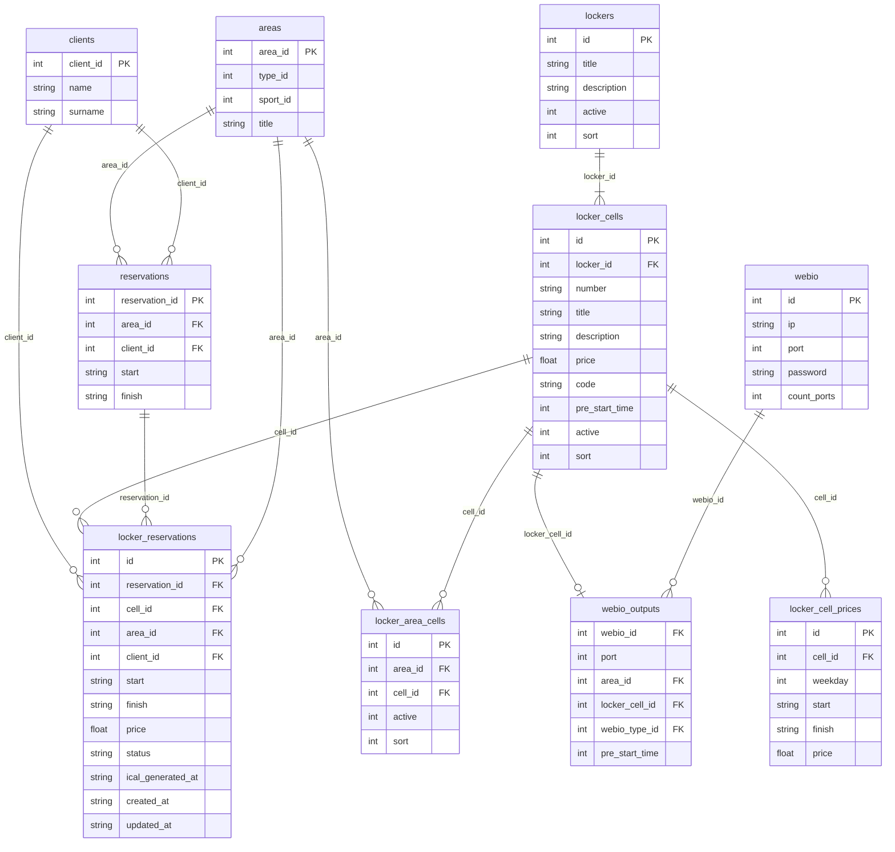
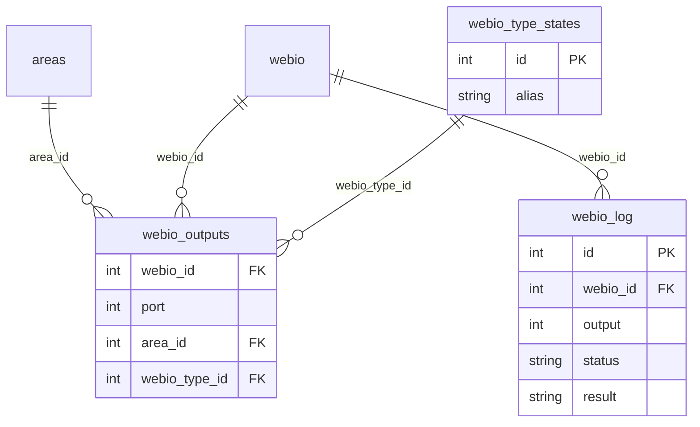
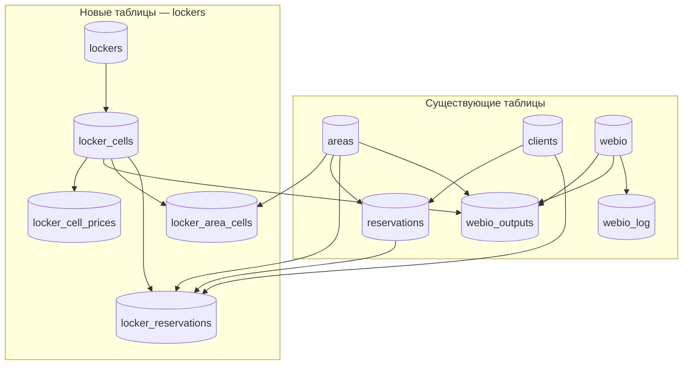
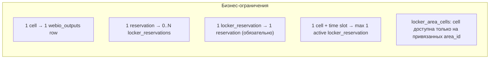

# Схема связей: таблицы и модели системы шкафчиков

**Дата создания:** 2026-06-05  
**Статус:** справочный документ  
**Связанные документы:**

- [locker-system-plan.md](locker-system-plan.md) — основной план
- [locker-webio-integration-visual.md](locker-webio-integration-visual.md) — визуальный поток WebIO
- [webio.md](../../modules/webIo/webio.md) — URL/FTP-режимы WebIO

---

## 1. Обзор

Документ описывает связи между **существующими** таблицами проекта и **новыми** таблицами модуля `lockers`, а также соответствие таблиц PHP-моделям.

Выбираемая клиентом услуга хранится в таблице `locker_cells`: ячейка одновременно является физической сущностью, платной услугой и точкой привязки WebIO.

Базовая цена хранится в `locker_cells.price`. Дополнительные правила цены по дню недели и времени бронирования хранятся отдельно в `locker_cell_prices` и используются только при включенном техническом флаге `USE_LOCKER_CELL_TIME_PRICES`.

---

## 2. ER-диаграмма



## 3. Схема связей (ASCII)

```
                    ┌─────────────┐
                    │   clients   │
                    └──────┬──────┘
                           │
         ┌─────────────────┼─────────────────┐
         │                 │                 │
         ▼                 ▼                 ▼
  ┌─────────────┐  ┌──────────────┐  ┌───────────────────┐
  │    areas    │  │ reservations │  │ locker_reservations │
  └──────┬──────┘  └──────┬───────┘  └─────────┬─────────┘
         │                │                     │
         │    area_id     │ reservation_id      │
         └────────────────┴─────────────────────┘
                          │
              cell_id ────┤
              area_id ────┘

  ┌──────────────────┐
  │ locker_area_cells│
  └────────┬─────────┘
           │ cell_id
           ▼
  ┌─────────────┐         ┌──────────────┐
  │   lockers   │────────►│ locker_cells │
  └─────────────┘         └──────┬───────┘
                                 │
                                 ├────────► locker_cell_prices
                                 │
                                 └────────► locker_reservations

                                 │ locker_cell_id
                                 ▼
                          ┌──────────────┐
  ┌─────────────┐         │ webio_outputs│─── port → Output N
  │    webio    │────────►└──────────────┘
  └─────────────┘ webio_id
```

## 4. Ключевые связи

| От | К | Тип | Назначение |
|----|---|-----|------------|
| `locker_cells.locker_id` | `lockers.id` | N:1 | Ячейка принадлежит шкафчику |
| `webio_outputs.locker_cell_id` | `locker_cells.id` | 1:1 | Порт WebIO для ячейки (модуль webIo) |
| `webio_outputs.webio_id` | `webio.id` | N:1 | Устройство (общее с кортами) |
| `locker_area_cells` | `areas` + `locker_cells` | M:N | Какие ячейки предлагать на площадке |
| `locker_reservations.reservation_id` | `reservations` | N:1 | **Обязательная** связь с бронью |
| `locker_reservations.cell_id` | `locker_cells` | N:1 | Назначенная ячейка (порт через `webio_outputs`) |
| `locker_cell_prices.cell_id` | `locker_cells.id` | N:1 | Дополнительные правила цены по дню недели и времени |

---

## 5. Связь с существующей системой WebIO (корты)



### Корты и шкафчики: единая таблица `webio_outputs`

```
КОРТЫ (существует):
  areas ──► webio_outputs (area_id + type 1/2/3)
  URL:  at/ical_webio_generate.php?area_id=N&type=T
  FTP:  {site}_licht_{area_id}.ical

ШКАФЧИКИ (план):
  locker_cells ──► webio_outputs (locker_cell_id + type locker)
  URL:  at/ical_locker_generate.php?cell_id=N
  FTP:  {site}_locker_{cell_id}.ical
```

> Модуль `lockers` **не хранит** `webio_id` / `webio_port`. Привязка — только в `webio_outputs`.  
> Подробнее: [webio.md](../../modules/webIo/webio.md)

---

## 6. Полная схема (новые + существующие таблицы)



---

## 7. Соответствие таблиц и PHP-моделей

### 7.1. Существующие (используются as-is)

| Таблица | Модель / класс | Модуль | Роль для lockers |
|---------|----------------|--------|------------------|
| `areas` | `AreasModel` | `areas` | Контекст `area_id`, привязка ячеек |
| `clients` | `ClientsModel` | `clients` | Клиент брони и locker_reservation |
| `reservations` | `ReservationsModel`, `ReservationsTable` | `reservations` | Родительская бронь |
| `webio` | `WebIoModel` | `webIo` | Устройство шкафчика |
| `webio_outputs` | `WebIoOutputsModel` | `webIo` | Корты (`area_id`) и шкафчики (`locker_cell_id`) |
| `webio_type_states` | `WebIoTypeSatesModel` | `webIo` | Тип `locker` (новая запись) |
| `webio_log` | `WebIoLogModel` | `webIo` | Логи открытия ячеек |

### 7.2. Модуль `lockers`

| Таблица | Модель | Table class |
|---------|------------------|----------------------|
| `lockers` | `LockersModel` | `LockersTable` |
| `locker_cells` | `LockerCellsModel` | `LockerCellsTable` |
| `locker_cell_prices` | `LockerCellPricesModel` | `LockerCellPricesTable` |
| `locker_area_cells` | `LockerAreaCellsModel` | `LockerAreaCellsTable` |
| `locker_reservations` | `LockerReservationsModel` | `LockerReservationsTable` |

### 7.3. Движки и сервисы

| Класс | Namespace | Таблицы / данные |
|-------|-----------|------------------|
| `LockersEngine` | `AC\core\modules\lockers\engines` | CRUD, reserveCell, processLockerCells |
| `LockerCellsEngine` | `AC\core\modules\lockers\engines` | выбор ячеек, базовые цены, `locker_cell_prices` |
| `LockerAreaCellsEngine` | `AC\core\modules\lockers\engines` | привязка ячеек к площадкам |
| `LockerReservationsEngine` | `AC\core\modules\lockers\engines` | создание и отмена `locker_reservations` |
| `LockerIcalEngine` | `AC\core\modules\lockers\engines` | выборка событий iCal и отметка генерации |
| `LockerInstallEngine` | `AC\core\modules\lockers\engines` | установка таблиц lockers, `webio_outputs.locker_cell_id`, типа `locker` |
| `LockerCellService` | `AC\core\modules\lockers\services` | `locker_area_cells`, `locker_cells`, `locker_cell_prices`, availability |
| `LockerAvailabilityService` | `AC\core\modules\lockers\services` | `locker_reservations`, `locker_cells` |
| `LockerReservationService` | `AC\core\modules\lockers\services` | создание/отмена бронирований ячеек из reservations |
| `LockerInstallService` | `AC\core\modules\lockers\services` | фасад проверки установки модуля |
| `LockerIcalService` | `AC\core\modules\lockers\services` | `locker_reservations` → `.ical` |
| `WebIoOutputsModel` | `AC\core\modules\webIo\models` | привязка output-порта к `locker_cell_id` |
| `WebIoEngine` | `AC\core\engines` | FTP кортов; locker FTP еще не подключен |
| `OrdersModelReservation` | `reservations\models` | хук после insert |
| `ReservationsModel` | `reservations\models` | insert, cancel, цена |

### 7.4. DTO

| DTO | Использование |
|-----|---------------|
| `LockerCellDto` | Элемент блока `_lockers` на show_order |

---

## 8. Кардинальность и ограничения



| Ограничение | Реализация |
|-------------|------------|
| Одна ячейка — один порт | Бизнес-правило; в текущей миграции добавлен индекс `idx_locker_cell_id`, не UNIQUE |
| Один порт — одно назначение | Сохраняется логикой `WebIoOutputsModel::save()` для набора outputs устройства |
| Нет двойного бронирования ячейки | Проверка пересечений по `(cell_id, start, finish, status)` перед INSERT |
| Без брони нет locker_reservation | `reservation_id` NOT NULL |
| Временные цены не влияют на расчет без флага | `USE_LOCKER_CELL_TIME_PRICES` должен быть включен для UI и расчета по `locker_cell_prices` |

---

## 9. Поток данных по таблицам

```
show_order
    │
    ├─► areas.area_id
    ├─► date, times
    │
    ▼
locker_area_cells (area_id → cell_id)
    │
    ▼
locker_cells + locker_availability
    │
    ├─► locker_cell_prices (только если включен USE_LOCKER_CELL_TIME_PRICES)
    │
    ▼  submit
reservations INSERT
    │
    ▼
locker_reservations INSERT
    │   reservation_id, cell_id, area_id, start, finish
    ▼
webio_outputs (locker_cell_id) → webio_id + port
    │
    ▼
URL on-demand → WebIO

FTP-файл site_locker_{cell_id}.ical пока только планируется.
```

---

## 10. Индексы (рекомендации)

| Таблица | Индекс | Назначение |
|---------|--------|------------|
| `locker_reservations` | `(cell_id, start, finish, status)` | Проверка доступности |
| `locker_reservations` | `(reservation_id)` | Отмена по брони |
| `locker_area_cells` | `(area_id, active)` | show_order |
| `locker_area_cells` | `(cell_id, area_id)` | Проверка привязки ячейки к площадке |
| `locker_cell_prices` | `(cell_id, weekday, start)` UNIQUE | Замена правил цены без дублей на один старт интервала |
| `locker_cell_prices` | `(cell_id, weekday, start, finish)` | Расчет цены по времени бронирования |
| `webio_outputs` | `(locker_cell_id)` | Поиск порта по ячейке |
| `webio_outputs` | `(webio_id, port)` | Рекомендуемый индекс для правила один порт — одно назначение; текущий код сохраняет outputs пакетно |

---

## 11. История изменений

| Дата | Изменение |
|------|-----------|
| 2026-06-05 | Первая версия документа |
| 2026-06-05 | Исправлен синтаксис Mermaid erDiagram (FK UK, типы полей) |
| 2026-06-09 | Уточнена схема на отдельном слое `locker_items` |
| 2026-06-09 | WebIO-привязка через `webio_outputs`, убраны `webio_id`/`webio_port` из lockers |
| 2026-07-07 | `locker_items` объединены с `locker_cells`; добавлена `locker_area_cells` |
| 2026-07-09 | Добавлена схема `locker_cell_prices` для отключенных по умолчанию временных цен ячеек |
| 2026-07-09 | Схема сверена с реализацией: убраны `planned` у реализованных классов, уточнены ограничения WebIO и статус locker FTP |
