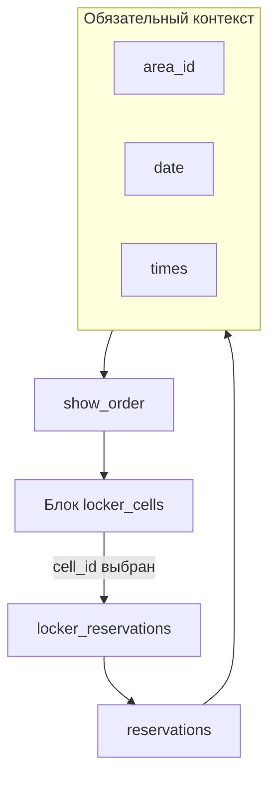
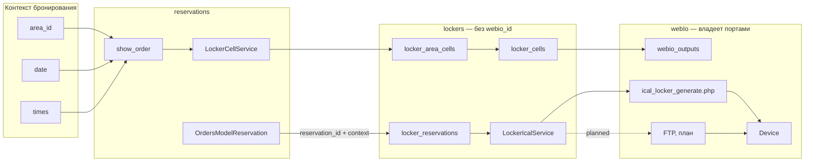
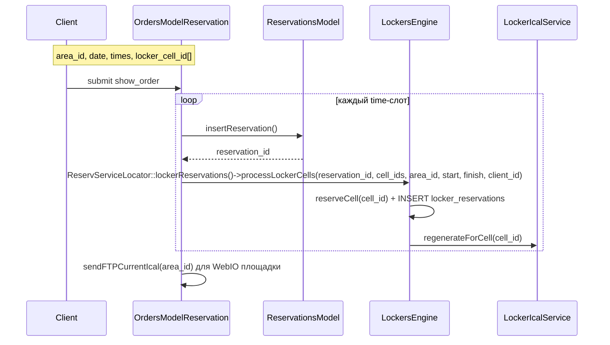

# План разработки системы шкафчиков с ячейками

> **Статус:** частично реализовано; WebIO FTP/cron/ручное открытие и письма остаются в плане  
> **Область:** `lockers`, `reservations`, `webIo`, `clients`  
> **Последняя проверка:** 2026-08-24  
> **Связанный код:** `core/modules/reservations/`, `core/modules/webIo/`  
> **Создан:** 2026-06-05

**Документация WebIO:** [webio.md](../../modules/webIo/webio.md) — URL/FTP-режимы, приоритет on-demand  
**Визуальное описание интеграции с WebIO:** [locker-webio-integration-visual.md](locker-webio-integration-visual.md)  
**Схема таблиц и моделей:** [locker-system-data-schema.md](locker-system-data-schema.md)  
**Возможные правила доступности ячеек:** [locker-cell-availability-rules.md](locker-cell-availability-rules.md)

---

## Попунктный план реализации

- [x] Подготовить БД модуля `lockers`: `lockers`, `locker_cells`, `locker_cell_prices`, `locker_area_cells`, `locker_reservations`.
- [x] Подготовить идемпотентную установку `webio_outputs.locker_cell_id` и типа `webio_type_states.alias = locker` для текущей site DB.
- [x] Реализовать админку шкафчиков: CRUD шкафчиков, ячеек и привязок ячеек к площадкам.
- [x] Расширить админку WebIO: привязка output-порта к `locker_cell_id`, URL/имя FTP-файла в подсказке порта.
- [ ] Добавить тестовое ручное открытие ячейки из админки WebIO.
- [x] Реализовать `LockersEngine`, `LockerAvailabilityService`, `LockerCellService`, `LockerReservationService`, `LockerIcalService`.
- [x] Добавить блок `_lockers.php` на `show_order`: checkbox-выбор нескольких конкретных ячеек, отображение `title (number)`.
- [x] Подключить выбранные `locker_cell_id[]` к модели заказа и расчёту стоимости.
- [x] После успешного `insertReservation()` создавать `locker_reservations` со статусом `active`.
- [x] Перед сохранением выполнять повторную проверку доступности и блокировку от двойного бронирования.
- [x] При отмене основной брони переводить связанные `locker_reservations` в `cancelled` и регенерировать iCal.
- [x] Реализовать URL on-demand `at/ical_locker_generate.php?cell_id={cell_id}`.
- [ ] Реализовать FTP-выгрузку `{site}_locker_{cell_id}.ical`.
- [ ] Настроить cron-регенерацию iCal и логи WebIO.
- [ ] Добавить плейсхолдеры для писем, например `{LOCKER_INFO}`.
- [ ] Покрыть изменения тестами: миграции, доступность, цена, создание/отмена брони, iCal/WebIO. Частично добавлены unit-тесты DTO и iCal.
- [ ] Подготовить документацию модуля `lockers` после реализации MVP.

---

## 1. Описание задачи

Разработать систему шкафчиков с ячейками. Шкафчики — **отдельные сущности** модуля `lockers`.

Клиент **не может** забронировать ячейку отдельно. Доступ возможен **только** при бронировании конкретного:

| Параметр | Описание |
|----------|----------|
| `area_id` | Площадка (корт, зал) |
| **date** | День |
| **time** | Временной слот (один или несколько) |

На шаге `show_order` клиент выбирает ячейку из блока **шкафчиков**. При наступлении времени слота:

1. Формируется iCal для порта WebIO назначенной ячейки.
2. WebIO открывает ячейку в момент `DTSTART`.

---

## 2. Принятые архитектурные решения

| Решение | Статус |
|---------|--------|
| Шкафчики как отдельные сущности (`lockers`, `locker_cells`) | **Принято** |
| Отдельное бронирование ячейки без area/date/time | **Отклонено** |
| Отдельный маршрут `/lockers/book` | **Отклонено** |
| Точка выбора для клиента | Блок на `show_order` в модуле `reservations` |
| Связь с бронью | `locker_reservations.reservation_id` — **обязательно** |
| Время открытия ячейки | = время слота брони (`start` / `finish`) |
| `webio_id` / `webio_port` в таблицах lockers | **Отклонено** — привязка порта только в `webio_outputs` |
| Режим WebIO | URL on-demand (приоритет) + FTP (параллельно), как у кортов |
| Временные цены ячеек | Основа реализуется через `locker_cell_prices`; UI и расчет включаются только флагом `USE_LOCKER_CELL_TIME_PRICES` |

---

## 3. Зависимость от контекста бронирования



### Правила

- Без `area_id + date + times` блок шкафчиков **не отображается**.
- Доступность ячейки проверяется на пересечении с `(area_id, date, start, finish)`.
- `locker_reservations` создаётся **только после** успешного `insertReservation()`.
- Время iCal-события = время слота брони, не произвольный интервал.

### Цепочка для клиента

```
1. Выбор площадки → area_id
2. Выбор date
3. Выбор time (слоты)
4. show_order → блок «Шкафчики» → выбор locker_cell (если доступна)
5. Оплата общего заказа → insertReservation → reserveCell → iCal
```

---

## 4. Существующая инфраструктура

| Компонент | Расположение | Использование |
|-----------|--------------|---------------|
| WebIO URL | `at/ical_webio_generate.php` | Образец on-demand для кортов |
| WebIO URL (шкафчики) | `at/ical_locker_generate.php` | On-demand по `cell_id` |
| iCal | `generateIcalCode()` | Образец для `LockerIcalService` |
| FTP | `WebIoEngine`, `FTPClient` | `{site}_locker_{cell_id}.ical` — план, не завершено |
| Порты | `webio_outputs` + `locker_cell_id` | Единая таблица с кортами |
| Cron | `app/cron/Ical.php` | Регенерация расписаний |
| Бронирование | `OrdersModelReservation`, `ReservationsModel` | Контекст + insert + оплата |
| UI-блоки на show_order | `_webIo.php` | Образец отдельного блока |

## 5. Архитектура



### Разделение ответственности

| Слой | Ответственность |
|------|-----------------|
| **reservations** | Контекст `area_id`, `date`, `times`; форма заказа; insert/cancel; общая оплата |
| **lockers** | Шкафчики, ячейки; привязка к area; резервирование ячейки; генерация данных iCal |
| **webIo** | Привязка порта к ячейке (`webio_outputs`); URL; FTP и `sendSock` для ручного/мгновенного открытия остаются отдельными задачами |

---

## 6. Модуль `lockers`

```
core/modules/lockers/
├── LockersModule.php
├── controllers/
│   └── admin/
│       ├── LockersAdminController.php
│       ├── LockersController.php
│       ├── LockersCellsController.php
│       └── LockersAreaCellsController.php
├── models/
├── engines/
│   ├── LockersEngine.php
│   ├── LockerCellsEngine.php
│   ├── LockerAreaCellsEngine.php
│   ├── LockerReservationsEngine.php
│   ├── LockerIcalEngine.php
│   └── LockerInstallEngine.php
├── services/
│   ├── LockerCellService.php         # доступные ячейки для show_order
│   ├── LockerReservationService.php  # создание/отмена locker_reservations
│   ├── LockerAvailabilityService.php
│   ├── LockerInstallService.php
│   └── LockerIcalService.php
├── dto/LockerCellDto.php
├── tables/
├── views/
│   └── admin/
├── lang/
└── config/
```

UI для клиента — **не в модуле lockers**, а partial в `reservations/views/*/show_order` (как `_webIo.php`).

---

## 7. Модель данных

### 7.1. `lockers` — физические шкафчики

| Поле | Тип | Описание |
|------|-----|----------|
| id | INT PK | |
| title | VARCHAR | Название |
| description | TEXT | Описание |
| active | TINYINT | |
| sort | INT | |

### 7.2. `locker_cells` — ячейки / услуги

Физические ячейки внутри шкафчика. После отказа от отдельной таблицы `locker_items` ячейка одновременно является выбираемой услугой: у неё есть название, описание, цена и код для писем/отчётов. Именно ячейку клиент выбирает на `show_order`, именно она резервируется в `locker_reservations`, и именно к ней привязывается порт WebIO через `webio_outputs.locker_cell_id`.

| Поле | Тип | Описание |
|------|-----|----------|
| id | INT PK | Идентификатор ячейки |
| locker_id | INT FK → `lockers.id` | Шкафчик/блок, в котором находится ячейка |
| number | VARCHAR | Физический номер ячейки на шкафчике: `1`, `A-03`, `12B`. В клиентском UI показывается в скобках после названия, если заполнен |
| title | VARCHAR | Название ячейки в UI: `Ячейка`, `Большая ячейка`, `VIP шкафчик` |
| description | TEXT | Описание для клиента или администратора: размер, расположение, условия использования |
| price | DECIMAL | Цена ячейки, добавляется к заказу бронирования |
| code | VARCHAR NULL | Код для писем, отчётов и интеграций |
| pre_start_time | INT NULL | Поле подготовлено для открытия ячейки заранее. В текущем `LockerIcalService` еще не применяется: `DTSTART` равен `locker_reservations.start` |
| active | TINYINT | Включена ли ячейка в клиентский выбор и резервирование. `0` — не предлагать и не назначать новым броням |
| sort | INT | Сортировка в админке и клиентском блоке |

`active = 0` — административное отключение ячейки из системы.  

### 7.3. `locker_area_cells` — доступность ячейки на площадке

Привязка: **какие ячейки предлагать при бронировании конкретного `area_id`**.

| Поле | Тип | Описание |
|------|-----|----------|
| id | INT PK | |
| area_id | INT FK → areas | |
| cell_id | INT FK → locker_cells | |
| active | TINYINT | |
| sort | INT | |

Опционально: фильтр по `type_id` / `sport_id`, если одна ячейка доступна для группы площадок.

#### Как выглядит в админке

Раздел админки: **Шкафчики → Привязка к площадкам**.

Основной сценарий — администратор выбирает площадку и отмечает, какие ячейки доступны при бронировании этой площадки:

```text
Площадка: [Корт 1 ▼]

Доступные ячейки
┌────┬──────────────┬───────────────┬────────┬──────────┬──────────┐
│ ✓  │ Шкафчик      │ Ячейка        │ Цена   │ Активна  │ Сорт.    │
├────┼──────────────┼───────────────┼────────┼──────────┼──────────┤
│ ☑  │ Раздевалка A │ A-01          │ 5.00   │ да       │ 10       │
│ ☑  │ Раздевалка A │ A-02          │ 5.00   │ да       │ 20       │
│ ☐  │ Раздевалка B │ B-01          │ 7.00   │ да       │ 30       │
└────┴──────────────┴───────────────┴────────┴──────────┴──────────┘

[Сохранить]
```

Вариант списка связей:

```text
┌──────────┬───────────────┬──────────────┬──────────┬──────────┐
│ Площадка │ Ячейка        │ Шкафчик      │ Активна  │ Сорт.    │
├──────────┼───────────────┼──────────────┼──────────┼──────────┤
│ Корт 1   │ A-01          │ Раздевалка A │ да       │ 10       │
│ Корт 1   │ A-02          │ Раздевалка A │ да       │ 20       │
│ Корт 2   │ B-01          │ Раздевалка B │ да       │ 10       │
└──────────┴───────────────┴──────────────┴──────────┴──────────┘
```

`locker_area_cells.active = 0` отключает ячейку только для выбранной площадки. Сама ячейка при этом остаётся активной и может быть доступна на других площадках.

### 7.4. `locker_reservations` — резервирование ячейки

Фиксирует факт, что конкретная ячейка занята под конкретную бронь площадки на конкретный временной интервал. Эта таблица не создаёт самостоятельное бронирование ячейки: каждая запись обязательно связана с записью в `reservations`.

| Поле | Тип | Описание |
|------|-----|----------|
| id | INT PK | Идентификатор резервирования ячейки |
| reservation_id | INT FK → reservations | **Обязательная** связь с основной бронью площадки |
| cell_id | INT FK → locker_cells | Выбранная и зарезервированная ячейка |
| area_id | INT | Snapshot площадки из основной брони; нужен для быстрых выборок, отчётов и проверки контекста |
| client_id | INT FK | Snapshot клиента из основной брони |
| start | DATETIME | Начало доступа к ячейке, обычно равно началу слота брони |
| finish | DATETIME | Окончание доступа к ячейке, обычно равно окончанию слота брони |
| price | DECIMAL | Snapshot цены ячейки на момент бронирования |
| status | ENUM | Статус записи: `active`, `cancelled`, `completed` |
| ical_generated_at | DATETIME NULL | Когда последний раз регенерировали iCal для этой записи/ячейки |
| created_at | DATETIME | Время создания записи резервирования ячейки |
| updated_at | DATETIME NULL | Время последнего изменения статуса или данных записи |

При multi-slot — **запись на каждый `reservation_id`**.

#### Когда создаётся запись

`locker_reservations` создаётся только после успешного создания основной брони:

```text
submit show_order
  → INSERT reservations
  → проверка locker_cells.active + locker_area_cells.active + занятости по времени
  → INSERT locker_reservations
  → регенерация iCal для cell_id
```

Если резервирование ячейки не удалось, заказ должен быть отклонён или откатан вместе с основной бронью, чтобы клиент не оплатил недоступную ячейку.

#### Как проверяется занятость

Ячейка считается занятой, если уже есть активная запись с пересечением интервалов:

```sql
cell_id = :cell_id
AND status = 'active'
AND start < :finish
AND finish > :start
```

Эта проверка выполняется дважды:

1. На `show_order`, чтобы показать только свободные ячейки.
2. Перед `INSERT locker_reservations`, чтобы закрыть гонку между двумя клиентами.

#### Статусы

| Статус | Значение |
|--------|----------|
| `active` | Ставится при создании `locker_reservations` после успешной основной брони; ячейка зарезервирована и должна попадать в iCal |
| `cancelled` | Ставится при отмене основной брони; запись сохраняется для истории, но не попадает в iCal |
| `completed` | Опционально выставляется cron-ом после `finish`; не обязательно для MVP |

Для MVP обязательны переходы:

```text
создание locker_reservations → active
отмена основной брони → cancelled
```

`completed` можно добавить позже для отчётов и очистки активного журнала.

#### Зачем нужны snapshot-поля

`area_id`, `client_id`, `start`, `finish`, `price`, `created_at`, `updated_at` намеренно сохраняются в `locker_reservations`, хотя часть данных есть в `reservations` и `locker_cells`.

Это нужно для:

- стабильной истории после изменения цены ячейки;
- быстрых отчётов по шкафчикам без сложных join;
- генерации iCal по `cell_id`;
- корректной отмены и диагностики спорных случаев;
- понимания, когда ячейка была фактически зарезервирована и когда запись менялась.

Фильтрация по дню выполняется диапазоном по `start`, без отдельного поля `date`:

```sql
start >= :dayStart
AND start < :nextDayStart
```

---

## 8. Интеграция в reservations

### 8.1. Блок на show_order

Новый partial: `reservations/views/{site,touch,admin}/_lockers.php`

По аналогии с `_webIo.php` — отдельный блок на странице заказа.

```php
// В show_order.php
<?php if (!empty($lockerCells['use']) && !empty($lockerCells['cells'])): ?>
  <?= $this->render('_lockers', ['lockerCells' => $lockerCells]) ?>
<?php endif; ?>
```

**Поля формы:**

```html
<input type="checkbox" name="locker_cell_id[]" value="{cell_id}" />
```

Клиент может выбрать несколько ячеек в одном заказе. Все выбранные `locker_cell_id[]` проходят повторную проверку доступности перед сохранением.

Клиент выбирает конкретные ячейки. В блоке `_lockers` отображается название ячейки и номер в скобках, если номер заполнен:

```text
☐ Ячейка (A-01)        +5.00
☐ Большая ячейка (B-03) +7.00
```

### 8.2. `LockerCellService::getCellsForBookingContext()`

Вызывается из контроллера show_order с параметрами `(area_id, date, times, client_id)`:

1. `locker_area_cells` WHERE `area_id = :area_id` AND active.
2. Для каждой `cell_id` — ячейка активна и свободна на `[date, times]`.
3. Вернуть `LockerCellDto[]` (id, number, title, description, price).

```php
public function getCellsForBookingContext(
    int $areaId,
    string $date,
    array $times,
    int $period,
    ?int $clientId = null
): array;
```

### 8.3. Ценообразование

Цена locker_cell добавляется к заказу **в модели бронирования**:

- Расширить `ReservationsModel` / `OrdersModelReservation`: свойство `locker_cell_ids[]`.
- Метод `calculateLockerCellsPrice()` — сумма `locker_cells.price`.
- Включить в `getFullPrice()` / `getTotalCostOrder()` рядом с ценой корта и WebIO.

#### Временные цены ячеек

Заложена основа для цены, зависящей от дня недели и времени бронирования. Правила хранятся отдельно от базовой цены ячейки:

```text
locker_cell_prices:
  cell_id
  weekday
  start
  finish
  price
```

Правило означает: для выбранной ячейки в указанный день недели и интервал времени использовать `locker_cell_prices.price` вместо базового `locker_cells.price`.

Функциональность отключена по умолчанию. Пока константа `USE_LOCKER_CELL_TIME_PRICES` не задана или равна `false`:

- расчет заказа использует только `locker_cells.price`;
- блок редактирования временных цен в форме ячейки не показывается;
- сохранение ячейки не перезаписывает уже сохраненные правила временных цен.

Если флаг будет включен, `LockerCellService` должен использовать правила из `locker_cell_prices` при расчете цены для контекста `date + times + period`. Если для выбранного времени нет подходящего правила, используется базовая цена `locker_cells.price`.

> Альтернатива: хранить выбранные cell_id в metadata/DTO брони (`ReservationDto` + trait `LockersMetaData`).

### 8.4. Сохранение



**Хук в `OrdersModelReservation::runProceed()`** — после `insertReservation()`:

```php
if ($this->insertReservation($error_code)) {
    ReservServiceLocator::lockerReservations()->processLockerCells(
        reservationId: $this->inserted_reservation_id,
        cellIds:       $this->getLockerCellIds(),
        areaId:        $this->area_id,
        start:         $this->start,
        finish:        $this->finish,
        clientId:      $this->current_client->client_id
    );
}
```

**`LockerReservationService::processLockerCells()` → `LockersEngine::processLockerCells()`:**

1. Повторная проверка доступности на `(area_id, date, start, finish)`.
2. Расчет snapshot-цены через `LockerCellService::calculatePricesByCell()`.
3. INSERT `locker_reservations`.
4. `LockerIcalService::regenerateForCell($cellId)` сейчас фиксирует `ical_generated_at`; URL on-demand формирует календарь при запросе.
5. При ошибке `processLockerCells()` возвращает `false`, вызывающий код останавливает сценарий бронирования.

### 8.5. Отмена брони

| Событие | Действие |
|---------|----------|
| Отмена `reservation` | `locker_reservations.status = cancelled`, обновление `ical_generated_at` для ячеек |
| Изменение area/date/time | перепроверка доступности или отмена locker_reservation |

---

## 9. iCal и WebIO

> Полное описание режимов WebIO: [webio.md](../../modules/webIo/webio.md)

Модуль `lockers` **не знает** об устройствах WebIO. Он только формирует содержимое календаря; доставка — через слой `webIo`.

### 9.1. Привязка порта (модуль webIo)

Расширение `webio_outputs`:

| Поле | Значение для шкафчика |
|------|----------------------|
| `webio_id` | Устройство (может совпадать с кортами) |
| `port` | Output 0–11 |
| `locker_cell_id` | FK → `locker_cells.id` |
| `area_id` | NULL |
| `webio_type_id` | тип `locker` (новая запись в `webio_type_states`) |

Настройка в той же админке портов (`config/views/admin/webIo/output.php`), с быстрой ссылкой URL и отображением планового имени FTP-файла.

#### Миграция для мультисайтовой схемы

В проекте работает много сайтов с отдельными базами данных, поэтому изменение `webio_outputs` нужно выполнять для каждой site DB, где используется WebIO/шкафчики. Текущая реализация `LockerInstallEngine` делает это идемпотентно для активной базы сайта при установке модуля.

Рекомендуемый подход:

1. Сделать миграцию идемпотентной: перед `ALTER TABLE` проверять, есть ли колонка `locker_cell_id`.
2. Добавлять колонку nullable, чтобы не ломать существующие сайты и текущие настройки портов.
3. Добавлять обычный индекс по `locker_cell_id`.
4. На первом этапе не добавлять FK: на 200+ базах могут быть отличия в движках, порядке обновления и наличии таблиц нового модуля.
5. При массовом включении на нескольких сайтах запускать установку/миграцию через существующий механизм обновления сайтов, с логом результата по каждой базе.
6. Поддержать повторный запуск миграции без ошибок.

Базовый SQL для одной базы:

```sql
ALTER TABLE webio_outputs
  ADD COLUMN locker_cell_id INT NULL AFTER area_id,
  ADD INDEX idx_locker_cell_id (locker_cell_id);
```

Идемпотентный вариант должен выполнять этот SQL только если поля ещё нет:

```sql
SHOW COLUMNS FROM webio_outputs LIKE 'locker_cell_id';
```

Для кода WebIO правило такое:

- старые записи продолжают работать через `area_id`;
- новые записи для шкафчиков используют `locker_cell_id`;
- `area_id` и `locker_cell_id` не должны быть заполнены одновременно;
- если `locker_cell_id` отсутствует в старой базе до миграции, код должен не падать, а работать в режиме без шкафчиков.

### 9.2. URL-режим (приоритет, как у кортов)

На порту WebIO:

```
{BASE_HREF}at/ical_locker_generate.php?cell_id={cell_id}
```

При опросе URL система генерирует iCal из `locker_reservations` для этой ячейки.

### 9.3. FTP-режим (параллельно)

Статус: запланирован. В админке WebIO уже показывается имя файла, но фактическая выгрузка locker-iCal на FTP еще не реализована.

```
Файл: {site}_locker_{cell_id}.ical

VEVENT:
  SUMMARY: {locker_cell.title} - {client} [area: {area_title}]
  DTSTART: reservation.start
  DTEND:   reservation.finish
```

Планируемое обновление: create/cancel `locker_reservations` + cron (`app/cron/Ical.php`).

`pre_start_time` в `locker_cells` уже хранится, но расчет `DTSTART = reservation.start - pre_start_time` пока не подключен.

### 9.4. Механика открытия WebIO

Открытое решение: режим управления замком зависит от типа установленного замка и настроек WebIO.

#### Вариант A. Импульс

WebIO кратко включает порт в момент открытия:

```text
DTSTART → Output ON
через 1-3 сек → Output OFF
```

Подходит для электромеханических замков, где короткий сигнал открывает защёлку.

Плюсы:

- замок не остаётся постоянно запитанным;
- меньше нагрузка на реле и замок;
- безопаснее для шкафчиков;
- типовой сценарий для дверных/шкафных замков.

Минусы:

- если клиент не успел открыть дверцу в момент импульса, нужен повторный способ открытия.

Возможная настройка:

```text
pulse_duration_sec
```

#### Вариант B. Удержание ON на весь слот

WebIO держит порт включённым весь интервал брони:

```text
DTSTART → Output ON
DTEND   → Output OFF
```

Подходит только если замок должен быть доступен весь слот и его электрическая схема рассчитана на длительное питание.

Плюсы:

- клиент может открыть ячейку в течение всего слота;
- логика похожа на свет/отопление на кортах.

Минусы:

- замок может оставаться открытым весь слот;
- выше нагрузка на железо;
- больше риск с точки зрения безопасности содержимого ячейки.

### 9.5. Мгновенное открытие

План: если `locker_reservation` создаётся на уже идущий слот, слой WebIO должен найти порт через `WebIoOutputsModel::getOutputByLockerCellId(cell_id)` и выполнить `sendSock()` (аналог `switchStateLHN` для кортов). Сейчас есть модельный метод поиска порта, но сценарий мгновенного открытия еще не подключен к бронированию.

### 9.6. Триггеры регенерации

- create / cancel `locker_reservations` → обновление `ical_generated_at` для затронутых ячеек;
- on-demand при каждом опросе URL устройством;
- FTP и cron — планируемые триггеры после реализации выгрузки.

---

## 10. Админка

### Разделы

1. **Шкафчики** — CRUD `lockers` (без WebIO).
2. **Ячейки** — CRUD `locker_cells` (number, title, description, price, active).
3. **Привязка к площадкам** — `locker_area_cells`: area → cells.
4. **WebIO-порты** — в существующей админке WebIO можно выбрать `locker_cell_id` для output-порта.
5. **Журнал** — `locker_reservations`, ручное открытие ячейки: пока не реализовано.

### Тест WebIO

Планируемая кнопка «Открыть ячейку» в админке **webIo**: по `locker_cell_id` из `webio_outputs` найти порт и выполнить `sendSock()`. Сейчас реализована привязка порта к ячейке, но не ручное открытие.

---

## 11. Тестовое покрытие

Все изменения по системе шкафчиков должны покрываться тестами на уровне, соответствующем риску изменения.

Минимальный набор:

| Зона | Что покрыть |
|------|-------------|
| Модель данных | создание/обновление шкафчиков, ячеек, привязок к площадкам |
| Доступность | фильтр по `active`, `locker_area_cells.active`, пересечениям `locker_reservations` |
| Бронирование | создание `locker_reservations` после успешной основной брони |
| Гонки | повторная проверка доступности перед INSERT, запрет двойного бронирования ячейки |
| Цена | сумма выбранных `locker_cells.price` в заказе |
| Отмена | перевод `locker_reservations.status` в `cancelled` и исключение из iCal |
| WebIO/iCal | генерация событий по `cell_id`, отсутствие cancelled-записей |
| Миграции | идемпотентность SQL, повторный запуск без ошибки |

Правило: функциональность не считается завершённой, если для неё не добавлены или не обновлены тесты.

Добавленное покрытие:

- `tests/unit/Lockers/LockerCellDtoTest.php` — формирование DTO ячейки, label `title (number)`, `toArray()`.
- `tests/unit/Lockers/LockerIcalServiceTest.php` — генерация iCal из событий, пустой календарь, экранирование спецсимволов iCal.

Остаётся покрыть отдельно: доступность по БД, расчёт цены в заказе, создание/отмена `locker_reservations`, миграции и WebIO.

---

## 12. Этапы реализации

### Этап 0. Согласование

**Срок:** 1 день | **Статус:** [ ] частично

#### Согласовано

- [x] Зависимость от `area_id + date + time`
- [x] Отдельные сущности модуля `lockers`
- [x] Нет отдельного бронирования ячеек

#### Открытые вопросы

- [x] Checkbox: клиент может выбрать несколько ячеек
- [x] Клиент выбирает конкретные ячейки
- [x] Показывать название ячейки и номер в скобках
- [ ] WebIO: импульс или удержание ON на слот — оба варианта зафиксированы, решение зависит от типа замка
- [x] Фильтр ячеек по расписанию (duration/timetable) — не входит в MVP, возможность описана отдельно

---

### Этап 1. БД + админка lockers

**Срок:** 4–5 дней | **Статус:** [x] базовая часть реализована

- [x] Таблицы: lockers, locker_cells, locker_cell_prices, locker_area_cells, locker_reservations
- [x] CRUD в админке
- [x] Привязка area → cells
- [ ] Тест открытия ячейки
- [ ] Тесты моделей/таблиц и миграций

---

### Этап 2. Движок и сервисы

**Срок:** 3–4 дня | **Статус:** [x] базовые сервисы реализованы

- [x] `LockersEngine`, `LockerAvailabilityService`, `LockerCellService`, `LockerReservationService`, `LockerIcalService`
- [ ] ModComm API — отдельный API для lockers пока не реализован
- [x] Подключение через сервисы и `ReservServiceLocator`; прямой вызов движка из reservations не используется
- [ ] Тесты доступности, резервирования и iCal-сервиса

---

### Этап 3. Интеграция в reservations

**Срок:** 4–5 дней | **Статус:** [x] site/touch и модели бронирования подключены

- [x] `_lockers.php` на site/touch
- [ ] `_lockers.php` на admin — отдельная админ-форма бронирования пока не подключена
- [x] `LockerCellService` в show_order
- [x] `locker_cell_id[]` в OrdersModelReservation/ReservationsModel
- [x] Расчёт цены locker_cells в заказе
- [x] `processLockerCells()` после успешного `insertReservation()`
- [x] Отмена брони → `locker_reservations.status = cancelled`
- [ ] Тесты интеграции с созданием/отменой брони и расчётом цены

---

### Этап 4. iCal + WebIO + cron

**Срок:** 2–3 дня | **Статус:** [ ] частично

- [x] `at/ical_locker_generate.php` (URL on-demand)
- [x] `LockerIcalService` для генерации календаря по `cell_id`
- [ ] FTP-выгрузка locker-календарей
- [x] Расширение `webio_outputs` (`locker_cell_id`) при установке модуля
- [x] Выбор `locker_cell_id` в админке WebIO output-портов
- [ ] Cron
- [ ] Логи webio_log
- [ ] Тесты генерации iCal и идемпотентности миграции

---

### Этап 5. Письма, edge cases, документация

**Срок:** 2–3 дня | **Статус:** [ ] не начат

- [ ] Плейсхолдеры `{LOCKER_INFO}` в письмах
- [ ] Гонки, admin override
- [ ] `.docs/modules/lockers/README.md`
- [ ] Регрессионные тесты edge cases

---

## 13. Оценка сроков

| Этап | Срок |
|------|------|
| 0. Согласование | 1 день |
| 1. БД + админка | 4–5 дней |
| 2. Движок + сервисы | 3–4 дня |
| 3. Интеграция reservations | 4–5 дней |
| 4. iCal + WebIO | 2–3 дня |
| 5. Письма + docs | 2–3 дня |
| **Итого MVP** | **~3–4 недели** |

---

## 14. Порядок MVP

1. Админка: шкафчик → ячейка → привязка к area_id
2. Привязка output-порта WebIO к ячейке
3. Блок `_lockers` на show_order (фильтр по area + date + time)
4. reserveCell при insertReservation
5. URL iCal on-demand
6. FTP + автооткрытие + письма + мониторинг

---

## 15. Риски

| Рisk | Решение |
|------|---------|
| Гонка между show_order и submit | Повторная проверка + lock при insert |
| Дублирование логики цены | Единый `calculateLockerCellsPrice()` в ReservationsModel |
| Конфликт портов WebIO | Единая таблица `webio_outputs`; один порт — одно назначение |
| Multi-slot | locker_reservation на каждый reservation_id |

---

## 16. Открытые решения

| # | Вопрос | Решение | Дата |
|---|--------|---------|------|
| 1 | Сущности lockers | **Принято** | 2026-06-05 |
| 2 | Зависимость area_id + date + time | **Принято** | 2026-06-05 |
| 3 | reservation_id обязателен | **Принято** | 2026-06-05 |
| 4 | Несколько ячеек в заказе | **Принято: checkbox, `locker_cell_id[]`** | 2026-07-07 |
| 5 | Автоназначение vs выбор ячейки | **Принято: клиент выбирает конкретные ячейки** | 2026-07-07 |
| 6 | Показ номера ячейки | **Принято: `title (number)`** | 2026-07-07 |
| 7 | Механика открытия WebIO | На рассмотрении: импульс или удержание ON на слот | |
| 8 | Фильтр ячеек по duration/timetable | Не входит в MVP; возможность описана в `locker-cell-availability-rules.md` | 2026-07-07 |
| 9 | Временные цены ячеек | Основа хранения принята: `locker_cell_prices`; UI и расчет скрыты до включения `USE_LOCKER_CELL_TIME_PRICES` | 2026-07-09 |

---

## 17. Связанные файлы

| Файл | Роль |
|------|------|
| `core/modules/reservations/models/OrdersModelReservation.php` | runProceed, insert |
| `core/modules/reservations/views/site/_lockers.php` | UI-блок шкафчиков на site |
| `core/modules/reservations/views/touch/_lockers.php` | UI-блок шкафчиков на touch |
| `core/modules/reservations/locators/ReservServiceLocator.php` | Подключение locker-сервисов из reservations |
| `at/ical_locker_generate.php` | URL on-demand iCal для WebIO |
| `engines/reservation.light.php` | iCal, sendSock |
| `core/engines/WebIoEngine.php` | FTP |

---

## 18. История изменений

| Дата | Изменение |
|------|-----------|
| 2026-06-05 | Первоначальный черновик |
| 2026-06-05 | Зафиксировано: отдельные сущности lockers; зависимость от area_id, date, time |
| 2026-06-09 | Уточнена терминология модели шкафчиков |
| 2026-06-09 | WebIO: привязка через `webio_outputs`, без `webio_id` в lockers; URL-режим приоритетен ([webio.md](../../modules/webIo/webio.md)) |
| 2026-07-07 | План первоначально принят на реализацию |
| 2026-07-09 | Зафиксирована основа временных цен ячеек: таблица `locker_cell_prices`, отключенный по умолчанию UI/расчет через `USE_LOCKER_CELL_TIME_PRICES` |
| 2026-07-09 | Документация сверена с реализацией: отмечены реализованные URL iCal, WebIO-привязка, сервисы reservations и оставшиеся задачи FTP/cron/ручного открытия |
