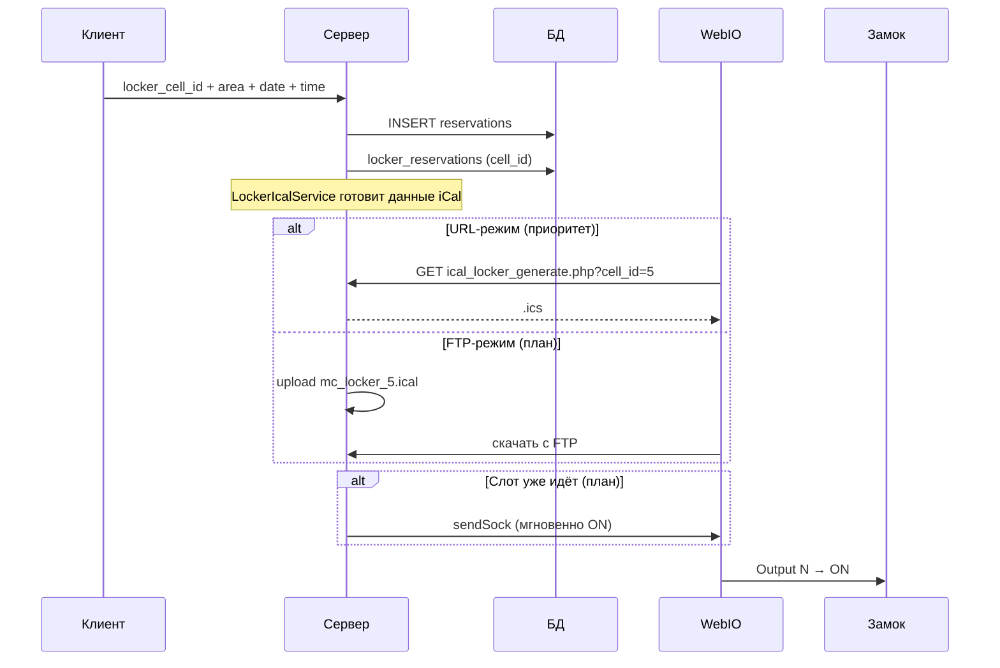

# Интеграция шкафчиков с WebIO: визуальное описание

**Дата создания:** 2026-06-05  
**Последнее обновление:** 2026-07-09  
**Статус:** справочный документ  
**Связанные документы:**

- [locker-system-plan.md](locker-system-plan.md) — основной план
- [locker-system-data-schema.md](locker-system-data-schema.md) — схема таблиц и моделей
- [webio.md](../../modules/webIo/webio.md) — URL/FTP-режимы WebIO (приоритет on-demand)

---

## 1. Общая картина (3 уровня)

Клиент **не работает с WebIO напрямую**. Устройство WebIO **само запрашивает** календарь. URL on-demand для шкафчиков реализован; FTP-выгрузка остается планируемым параллельным режимом.

**бронирование → назначение ячейки → iCal URL → WebIO → порт → замок**

```
┌─────────────────────────────────────────────────────────────────┐
│  УРОВЕНЬ 1: КЛИЕНТ (site / touch)                               │
│  Календарь → area → date → time → show_order → блок «Шкафчики»  │
│  (WebIO здесь не виден)                                         │
└────────────────────────────┬────────────────────────────────────┘
                             │ submit заказа
                             ▼
┌─────────────────────────────────────────────────────────────────┐
│  УРОВЕНЬ 2: СЕРВЕР (PHP)                                        │
│  insertReservation → reserveCell → locker_reservations          │
│  LockerIcalService → ответ на URL                               │
│  FTP-файл — планируемый режим                                   │
│  (модуль lockers НЕ знает webio_id)                             │
└────────────────────────────┬────────────────────────────────────┘
                             │ WebIO опрашивает URL
                             ▼
┌─────────────────────────────────────────────────────────────────┐
│  УРОВЕНЬ 3: ЖЕЛЕЗО                                              │
│  WebIO → Output N ON → реле/замок ячейки                       │
└─────────────────────────────────────────────────────────────────┘
```

Та же модель, что у **света/отопления** на кортах — только iCal привязан к **ячейке** (`cell_id`), а не к `area_id`.

---

## 2. Режимы доставки iCal

### 2.1. URL on-demand (реализовано, приоритет)

На порту WebIO прописывается URL:

```
{BASE_HREF}at/ical_locker_generate.php?cell_id=5
```

Устройство периодически опрашивает URL → система генерирует iCal из `locker_reservations` **в момент запроса**.

Аналог для кортов:

```
at/ical_webio_generate.php?area_id=1&type=1
```

### 2.2. FTP (параллельно / замещающе, план)

Файл на FTP-сервере:

```
{site}_locker_{cell_id}.ical
```

План: обновлять при create/cancel `locker_reservations` + cron раз в сутки. Сейчас в админке WebIO показывается ожидаемое имя файла, но сама выгрузка locker-календаря на FTP еще не подключена.

---

## 3. Админка: привязка порта к ячейке

Привязка — в **единой таблице `webio_outputs`** (модуль webIo), как у кортов.

### Сейчас (корты)

`core/modules/config/views/admin/webIo/output.php`:

```
Output 0 │ [Корт 1]      │ Освещение │ URL: ...ical_webio_generate.php?area_id=1&type=1
Output 1 │ [Корт 3]      │ Отопление │ URL: ...
```

### Реализовано для шкафчиков в той же админке портов

```
Output 4 │ [Ячейка A-01] │ Шкафчик   │ URL: ...ical_locker_generate.php?cell_id=12
Output 5 │ [Ячейка A-02] │ Шкафчик   │ URL: ...ical_locker_generate.php?cell_id=13
```

CRUD шкафчиков и ячеек — отдельный раздел модуля `lockers` (без выбора WebIO):

```
┌─ Шкафчик «Раздевалка A» ─────────────────────────────────────┐
│  Ячейка │ Номер │ Название        │ Цена   │ Активна          │
│    1    │  A-01 │ Ячейка A-01     │ 5.00   │ да               │
│    2    │  A-02 │ Большая ячейка  │ 7.00   │ да               │
└──────────────────────────────────────────────────────────────┘

┌─ Привязка к площадкам (locker_area_cells) ───────────────────┐
│  area_id 12 (Корт 1) → [Ячейка A-01] [Большая ячейка]        │
└──────────────────────────────────────────────────────────────┘
```

Кнопка **«Открыть»** для locker-порта — план. Сейчас реализован выбор ячейки на output-порту и показ URL `at/ical_locker_generate.php?cell_id=...`.

---

## 4. Клиент: что видит пользователь

На `show_order` — блок `_lockers.php` (по образцу `_webIo.php`):

```
┌─ Оформление заказа ───────────────────────────────────────────┐
│  Корт 1  │  05.06.2026  │  14:00 – 15:00                     │
├──────────────────────────────────────────────────────────────┤
│  ☑ Освещение    ☑ Отопление        ← _webIo.php              │
├──────────────────────────────────────────────────────────────┤
│  Шкафчики                         ← _lockers.php             │
│  ☐ Ячейка A-01        +5.00 €                              │
└──────────────────────────────────────────────────────────────┘
```

Клиент не видит: порт, IP, iCal, URL.

---

## 5. После «Забронировать»



---

## 6. Одно устройство на корты и шкафчики

```
WebIO 192.168.1.50 (одна запись в webio)
├── Output 0  → area_id=1, licht      (корты)
├── Output 1  → area_id=1, heizen
├── Output 4  → locker_cell_id=12     (шкафчики)
└── Output 5  → locker_cell_id=13
```

Модуль `lockers` не хранит `webio_id` — всё в `webio_outputs`.

---

## 7. Сравнение: корты vs шкафчики

| | Корты | Шкафчики |
|--|-------|----------|
| Привязка порта | `webio_outputs.area_id` | `webio_outputs.locker_cell_id` |
| URL on-demand | `ical_webio_generate.php?area_id&type` | `ical_locker_generate.php?cell_id` |
| FTP-файл | `{site}_licht_{area_id}.ical` | `{site}_locker_{cell_id}.ical` — план |
| Мгновенное ON | `switchStateLHN()` | `WebIoOutputsModel::getOutputByLockerCellId()` → `sendSock()` — план |
| Модуль знает WebIO? | Нет | **Нет** |

---

## 8. Связанные файлы

| Файл | Роль |
|------|------|
| `.docs/modules/webIo/webio.md` | Полное описание WebIO |
| `at/ical_webio_generate.php` | iCal on-demand (корты) |
| `at/ical_locker_generate.php` | iCal on-demand (шкафчики) |
| `core/modules/config/views/admin/webIo/output.php` | Порты, быстрые ссылки URL |
| `core/modules/webIo/models/WebIoOutputsModel.php` | Хранение `locker_cell_id`, поиск output-порта по ячейке |
| `core/engines/WebIoEngine.php` | FTP-выгрузка кортов; locker FTP еще не подключен |
| `engines/reservation.light.php` | `sendSock`, генерация iCal кортов |

---

## 9. История изменений

| Дата | Изменение |
|------|-----------|
| 2026-06-05 | Первая версия документа |
| 2026-06-09 | URL-режим приоритетен; lockers без webio_id; единая `webio_outputs` |
| 2026-07-07 | Обновлена схема под выбор `locker_cell_id` |
| 2026-07-09 | Сверено с реализацией: URL и привязка WebIO реализованы; FTP и мгновенное открытие отмечены как план |
